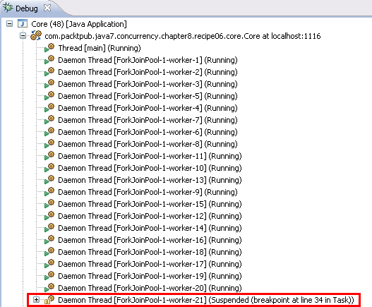
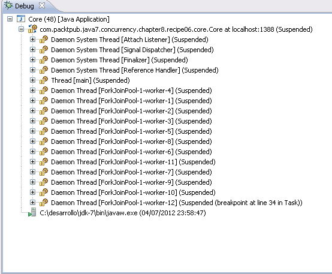

### 结果分析

正如前文所述，在Eclipse的默认设置下，线程执行到断点时仅暂停当前线程而不影响其他执行线程，如下图所示。

可以看到，只有线程 **worker-21** 被暂停了，而其他线程仍然正在执行。此时把选项 **Default suspend policy for new breakpoints** 的值改成 **Suspend VM** 后，其他线程也会因为某一线程执行到断点处暂停。此时的情形如下图所示。

修改配置后，可以观察到所有线程都暂停了，此时可以选择继续调试任意线程。开发者需要根据自己的需求来选择不同的暂停策略。

