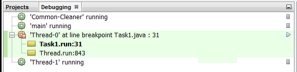
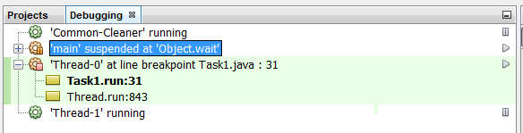

### 案例实现

根据如下步骤来实现本案例。

1．创建 `Task1` 类，该类实现了 `Runnable` 接口：

```css
public class Task1 implements Runnable {
```

2．添加两个 `Lock` 类型的私有属性 `lock1` 和 `lock2` ：

```css
private Lock lock1, lock2;
```

3．实现类的构造函数，初始化上述对象：

```css
public Task1 (Lock lock1, Lock lock2) {
  this.lock1=lock1;
  this.lock2=lock2;
}
```

4．实现 `run()` 方法，在方法中通过 `lock()` 方法获得 `lock1` 对象，然后在控制台中输出信息，以表示当前线程已经获得了锁：

```css
@Override
public void run() {
  lock1.lock();
  System.out.printf("Task 1: Lock 1 locked\n");
```

5．通过 `lock()` 方法获得 `lock2` 的控制权，并输出信息，以表示当前线程已经成功获得了锁：

```css
lock2.lock();
System.out.printf("Task 1: Lock 2 locked\n");
```

6．按照先 `lock2` 后 `lock1` 的顺序，分别释放锁：

```css
  lock2.unlock();
  lock1.unlock();
}
```

7．创建 `Task2` 类，该类实现了 `Runnable` 方法：

```css
public class Task2 implements Runnable{
```

8．添加两个 `Lock` 类型的私有属性，将其分别命名为 `lock1` 和 `lock2` ：

```css
private Lock lock1, lock2;
```

9．实现类的构造函数，并完成属性的初始化：

```css
public Task2(Lock lock1, Lock lock2) {
  this.lock1=lock1;
  this.lock2=lock2;
}
```

10．实现 `run()` 方法。首先，通过 `lock()` 方法获得锁 `lock2` ，在控制台中输出信息以表示当前线程已经获得了锁：

```css
@Override
public void run() {
  lock2.lock();
  System.out.printf("Task 2: Lock 2 locked\n");
```

11．通过 `lock()` 获得 `lock1` 的控制权，在控制台中输出信息以表示当前线程已经获得了锁：

```css
lock1.lock();
System.out.printf("Task 2: Lock 1 locked\n");
```

12．按照先 `lock1` 后 `lock2` 的顺序，分别释放锁：

```css
  lock1.unlock();
  lock2.unlock();
}
```

13．实现本案例的主类，新建 `Main` 类和 `main()` 方法：

```css
public class Main {
```

14．分别创建两个锁对象，即 `lock1` 和 `lock2` ：

```css
Lock lock1, lock2;
lock1=new ReentrantLock();
lock2=new ReentrantLock();
```

15．创建 `Task1` 类型的对象 `task1` ：

```css
Task1 task1=new Task1(lock1, lock2);
```

16．创建 `Task2` 类型的对象 `task2` ：

```css
Task2 task2=new Task2(lock1, lock2);
```

17．使用两个线程分别执行不同的任务：

```css
Thread thread1=new Thread(task1);
Thread thread2=new Thread(task2);
thread1.start();
thread2.start();
```

18．在两项任务执行完成后，每隔500ms打印一条消息到控制台上。用 `isAlive()` 方法来检查一个线程是否完成了执行：

```css
while ((thread1.isAlive()) &&(thread2.isAlive())) {
  System.out.println("Main: The example is"+ "running");
  try {
    TimeUnit.MILLISECONDS.sleep(500);
  } catch (InterruptedException ex) {
    ex.printStackTrace();
  }
}
```

19．在 `Task` 类的 `run()` 方法中的第一个 `printf()` 方法的调用处添加断点。

20．调试上述应用代码，在NetBeans窗口的左上角看到 **Debugging** 窗口。执行 `Task1` 对象的线程时的情形如下图所示，当前线程暂停在断点处，而其他线程仍然正常运行：


21．暂停主线程。单击右键，选中该线程，选择 **Suspend** 。修改成功后， **Debugging** 面板如下图所示。


22．重启暂停的两个线程，分别选中它们并通过 **Resume** 选项重启线程。

