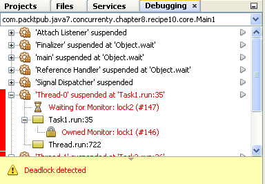

### 结果分析

在通过NetBeans调试并发应用代码时，程序将会暂停执行到断点处的线程，而其他线程仍然正常执行，并在当前正在运行线程的左上角显示 **Debugging** 窗口。可以使用窗口上的 **Pause** 或者 **Resume** 选项选择暂停或者重启对应的线程。也可以在 **Variables** 面板中查看变量或者属性值。

NetBeans工具还包含了死锁检测器，选择 **Debug** 菜单下的 **Check for Deadlock** 选项，NetBeans将会开始检测当前正在调试的应用是否存在死锁。本案例有一个非常明显的死锁。一个线程按照先 `lock1` 后 `lock2` 的顺序获取锁，而另外一个线程按照相反的顺序获得锁。虽然断点的插入带来了死锁，但是通过NetBeans中的死锁探测器进行探查却一无所获，因此需要谨慎使用这一选项。修改代码，把代码中的锁都替换成 `synchronized` 关键词，再次调试应用代码。 `Task1` 的代码如下所示：

```css
@Override
public void run() {
  synchronized(lock1) {
    System.out.printf("Task 1: Lock 1 locked\n");
    synchronized(lock2) {
      System.out.printf("Task 1: Lock 2 locked\n");
    }
  }
}
```

对于 `Task2` 的代码有所不同的是，它修改了调用锁的顺序。再次调试应用后，程序将会再次陷入死锁。这时再用死锁探测器就会检测到存在死锁，如下图所示。


