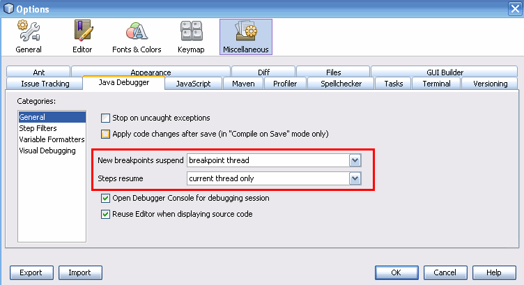

### 其他说明

调试器中还包含了其他设置。从 **Tools** 目录找到 **Options** ，选择 **Miscellaneous** 选项并选中 **Java Debugger** 选项卡，界面如下图所示。

窗口中有两个选项可控制前面描述的行为：

+ **New breakpoints suspend：** 该配置可以设定当工作线程执行到断点时，是反暂停当前工作线程还是暂停应用全部线程。
+ **Steps resume：** 该配置可以设定当选择重启线程时，是重启当前线程还是全部线程。

