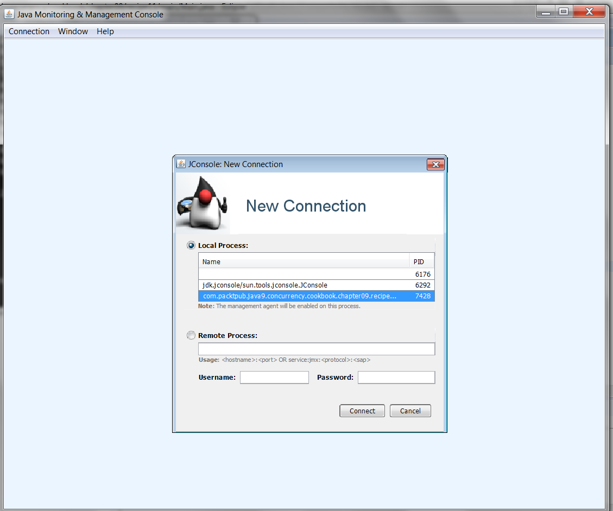
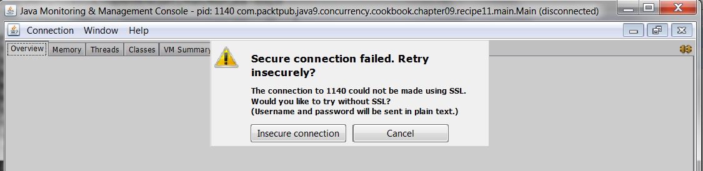

### 结果分析

在本节中，我们实现了一个非常简单的并发应用案例：运行10个线程100s，并向控制台中写入消息。

在执行JConsole后，你会看到一个窗口上面显示了当前系统中所有正在运行的Java应用程序，你可以选择监视其中一个。窗口将与下图所示的类似。

在本案例中，我们需要选择刚才开发的应用并单击 **Connect** 按钮。此时系统会弹出一个窗口询问是否跟当前选择的应用建立一个不安全的链接，提示窗口如下图所示。

单击 **Insecure connection** 按钮。JConsole窗口将会通过以下6个选项提供相关信息。

+ 选项 **Overview** 展示了一个内存的总体使用情况、应用中线程的运行数、对象创建数，以及应用占用CPU的情况。
+ 选项 **Memory** 展示了当前应用占用内存的总量。开发者可以使用该选项提供的列表框，选择希望查看的内存信息（堆、非堆或者对象池）。
+ 选项 **Threads** 展示了当前应用的线程数以及每个线程的详细信息。
+ 选项 **Classes** 展示了应用中对象的加载数。
+ 选项 **VM Summary** 展示了执行当前应用的JVM的总体情况。
+ 选项 **MBeans** 展示了应用管理Bean的信息。

选项Threads如下图所示。

该选项包含了两部分信息，在上半部分中，可以获得线程数的 **峰值（Peak）** 中标出）以及 **实时线程数（Live thread）** 。下半部分描述了当前活跃的线程列表。选择任意一个线程，可以看到所选线程的详细信息，它包含当前线程的状态以及实际的堆栈情况。

