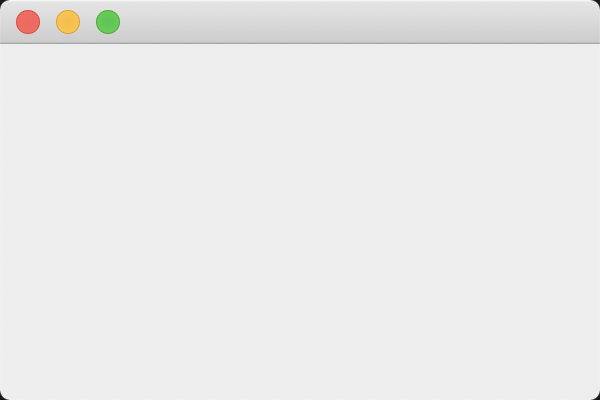

### 10.2 创建框架

在Java中，顶层窗口（就是没有包含在其他窗口中的窗口）被称为框架（frame）。在AWT库中有一个称为Frame的类，用于描述顶层窗口。这个类的Swing版本名为JFrame，它扩展于Frame类。JFrame是极少数几个不绘制在画布上的Swing组件之一。因此，它的修饰部件（按钮、标题栏、图标等）由用户的窗口系统绘制，而不是由Swing绘制。

> 警告：绝大多数Swing组件类都以“J”开头，例如，JButton、JFrame等。在Java中有Button和Frame这样的类，但它们属于AWT组件。

程序清单10-1给出了一个在屏幕中显示一个空框架的简单程序，如图105所示。



**程序清单101　simpleframe/SimpleFrameTest.java**

```java
import javax.swing.*;
import java.awt.*;

public class SimpleFrameTest {

    public static void main(String[] args) {
        EventQueue.invokeLater(() -> {
            SimpleFrame frame = new SimpleFrame();
            frame.setDefaultCloseOperation(JFrame.EXIT_ON_CLOSE);
            frame.setVisible(true);
        });
    }
}

class SimpleFrame extends JFrame {

    private static final int DEFAULT_WIDTH = 300;
    private static final int DEFAULT_HEIGHT = 200;

    public SimpleFrame() {
        setSize(DEFAULT_WIDTH, DEFAULT_HEIGHT);
    }
}
```

在每个Swing程序中，有两个技术问题需要强调。

首先，所有的Swing组件必须由事件分派线程（eventdispatchthread）进行配置，线程将鼠标点击和按键控制转移到用户接口组件。下面的代码片断是事件分派线程中的执行代码：

```java
EventQueue.invokeLater(() -> {
	statements
});
```

接下来，定义一个用户关闭这个框架时的响应动作。对于这个程序而言，只让程序简单地退出即可。选择这个响应动作的语句是:

```java
frame.setDefaultCloseOperation(JFrame.EXIT_ON_CLOSE);
```

简单地构造框架是不会自动地显示出来的，框架起初是不可见的。这就给程序员了一个机会，可以在框架第一次显示之前往其中添加组件。为了显示框架，main方法需要调用框架的setVisible方法。

> 注释：在JavaSE5.0以前的版本中，可以使用JFrame类从超类Window继承show方法。Window类的超类是Component，其中也有一个show方法。在JavaSE1.2中不提倡使用Component.show。如果想要显示一个组件，建议调用setVisible（true）。然而，JavaSE1.4以前的版本，并没有反对使用Window.show方法。事实上，这个方法很实用，它可以让窗口可见，且置于其他窗口的前面。遗憾的是，由于不提倡使用它，随之也失去了这一好处，JavaSE5.0也不赞成使用show显示窗口。
>

需要注意，退出main并没有终止程序，终止的只是主线程。事件分派线程保持程序处于激活状态，直到关闭框架或调用System.exit方法终止程序。

> 注释：可以调用frame.setUndecorated（true）关闭所有框架装饰。

