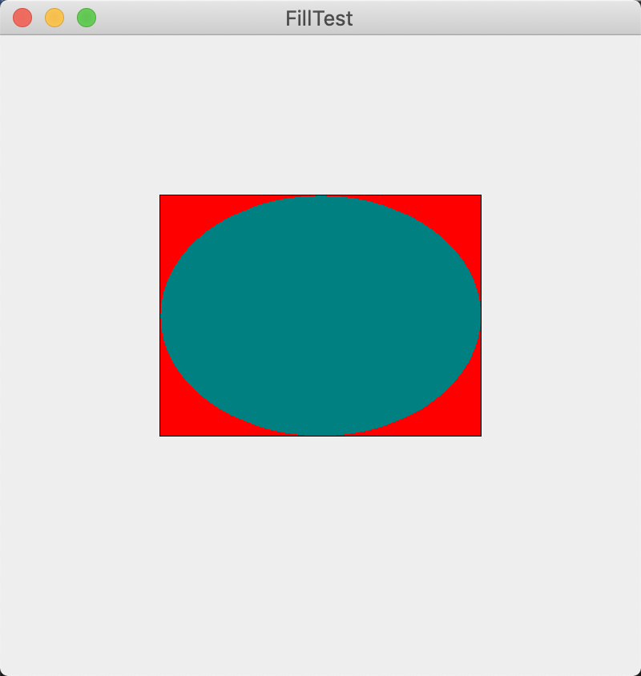

### 10.6 使用颜色

使用Graphics2D类的setPaint方法可以为图形环境上的所有后续的绘制操作选择颜色。例如：

```java
g2.setPaint(Color.RED);
g2.drawString("Warning!", 100, 100);
```

只需要将调用draw替换为调用fill就可以用一种颜色填充一个封闭图形（例如：矩形或椭圆）的内部：

```java
Rectangle2D rect = ...;
g2.setPaint(Color.RED);
g2.fill(rect);	// fills rect with red
```

> 注释：fill方法会在右侧和下方少绘制一个像素。例如，如果绘制一个newRectangle2D.Double（0，0，10，20），绘制的矩形将包括x=10和y=20的像素。如果填充这个矩形，则不会绘制x=10和y=20的像素。

Color类用于定义颜色。在java.awt.Color类中提供了13个预定义的常量，它们分别表示13种标准颜色。

```java
WHITE、LIGHT_GRAY、GRAY、DARK_GRAY、BLACK、RED、PINK、ORANGE、YELLOW、GREEN、MAGENTA、CYAN、BLUE
```

可以通过提供红、绿和蓝三色成分来创建一个Color对象，以达到定制颜色的目的。三种颜色都是用0~255（也就是一个字节）之间的整型数值表示，调用Color的构造器格式为：

```java
Color(int redness, int greeness, int blueness)
```

下面是一个定制颜色的例子：

```java
g2.setPaint(new Color(0, 128, 128)); // a dull blue-green
g2.drawString("Welcome!", 75, 125);
```

要想设置背景颜色，就需要使用Component类中的setBackground方法。Component类是JComponent类的祖先。

```java
MyComponent p = new MyComponent();
p.setBackground(Color.PINK());
```

另外，还有一个setForeground方法，它是用来设定在组件上进行绘制时使用的默认颜色。

>  提示：从名字就可以看出，Color类中的brighter（）方法和darker（）方法的功能，它们分别加亮或变暗当前的颜色。使用brighter方法也是加亮条目的好办法。实际上，brighter（）只微微地加亮一点。要达到耀眼的效果，需要调用三次这个方法：c.brighter（）.brighter（）.brighter（）。

Java在SystemColor类中预定义了很多颜色的名字。在这个类中的常量，封装了用户系统的各个元素的颜色。例如，

```java
p.setBackground(SystemColor.window);
```

**程序清单　fill/FillTest.java**

```java
import javax.swing.*;
import java.awt.*;
import java.awt.geom.Ellipse2D;
import java.awt.geom.Rectangle2D;

public class FillTest {
    public static void main(String[] args) {
        EventQueue.invokeLater(() -> {
            JFrame frame = new FillFrame();
            frame.setTitle("FillTest");
            frame.setDefaultCloseOperation(JFrame.EXIT_ON_CLOSE);
            frame.setVisible(true);
        });
    }
}

/**
 * A frame that contains a component with drawings
 */
class FillFrame extends JFrame {
    public FillFrame() {
        add(new FillComponent());
        pack();
    }
}

/**
 * A component that displays filled rectangles and ellipses
 */
class FillComponent extends JComponent {
    private static final int DEFAULT_WIDTH = 400;
    private static final int DEFAULT_HEIGHT = 400;

    public void paintComponent(Graphics g) {
        Graphics2D g2 = (Graphics2D) g;

        // draw a rectangle

        double leftX = 100;
        double topY = 100;
        double width = 200;
        double height = 150;

        Rectangle2D rect = new Rectangle2D.Double(leftX, topY, width, height);
        g2.setPaint(Color.BLACK);
        g2.draw(rect);
        g2.setPaint(Color.RED);
        g2.fill(rect); // Note that the right and bottom edge are not painted over

        // draw the enclosed ellipse

        Ellipse2D ellipse = new Ellipse2D.Double();
        ellipse.setFrame(rect);
        g2.setPaint(new Color(0, 128, 128)); // a dull blue-green
        g2.fill(ellipse);
    }

    public Dimension getPreferredSize() {
        return new Dimension(DEFAULT_WIDTH, DEFAULT_HEIGHT);
    }
}
```




<center><b>表10-1 系统颜色</b></center>

| 颜色名称              | 颜色说明             | 颜色名称         | 颜色说明         |
| --------------------- | -------------------- | ---------------- | ---------------- |
| desktop               | 桌面的背景颜色       | window           | 窗口的背景       |
| activeCaption         | 标题的背景颜色       | windowBorder     | 窗口边框的颜色   |
| activeCaptionText     | 标题的文本颜色       | windowText       | 窗口内的文本颜色 |
| activeCaptionBorder   | 标题文本的边框颜色   | menu             | 菜单的背景颜色   |
| inactiveCaption       | 非活动标题的背景颜色 | menuText         | 菜单的文本颜色   |
| inactiveCaptionText   | 非活动标题的文本颜色 | text             | 文本的背景颜色   |
| inactiveCaptionBorder | 非活动标题的边框颜色 | textText         | 文本的前景颜色   |
| textInactiveText      | 非活动控件的文本颜色 | controlHighlight | 控件的高亮度颜色 |
| textHighlight         | 高亮度文本的背景颜色 | controlShadow    | 控件的阴影颜色   |
| textHightlightText    | 高亮度文本的文本颜色 | controlDkShadow  | 控件的暗阴影颜色 |
| control               | 控件的背景颜色       | scrollbar        | 滚动条的背景颜色 |
| controlText           | 控件的文本颜色       | info             | 帮助区文本的颜色 |
| controlLtHightlight   | 控件的浅高亮度颜色   | infoText         | 帮助区的文本颜色 |

