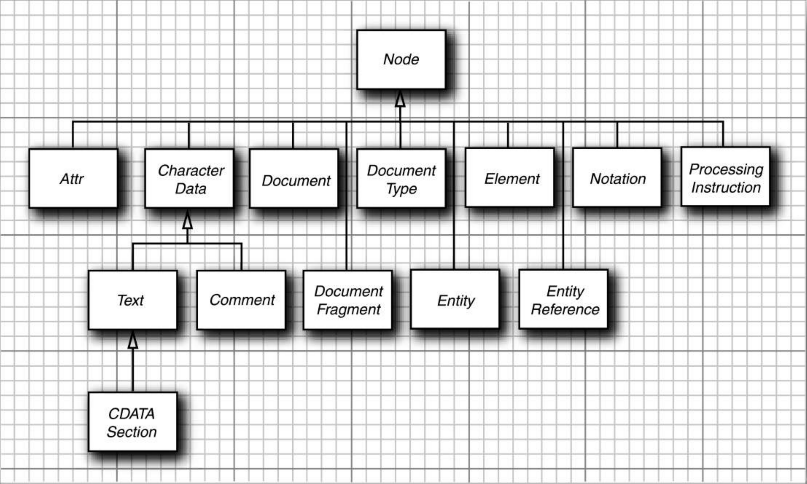

Java 库提供了两种 XML 解析器：

+ 像文档对象模型（Document Object Model, DOM）解析器这样的树型解析器，它们将读入的 XML 文档转换成树结构。
+ 像 XML 简单 API（Simple API for XML, SAX）解析器这样的流机制解析器，它们在读入 XML 文档时生成相应的事件。

要读入一个 XML 文档，首先需要一个 `DocumentBuilder` 对象，可以从 `DocumentBuilder Factory` 中得到这个对象，例如：

```java
DocumentBuilderFactory factory = DocumentBuilderFactory.newInstance();
DocumentBuilder builder = factory.newDocumentBuilder();
```

现在，可以从文件中读入某个文档：

```java
File f = ...;
Document doc = builder.parse(f);
```

或者，可以用一个 URL：

```java
URL u = ...;
Document doc = builder.parse(u);
```

甚至可以指定一个任意的输入流：

```java
InputStream in = ...;
Document doc = builder.parse(in);
```

> 注意：如果使用输入流作为输入源，那么对于那些以该文档的位置为相对路径而被引用的文档，解析器将无法定位，比如在同一个目录中的 DTD。但是，可以通过安装一个 “实体解析器” 来解决这个问题。请查阅 <www.xml.com/pub/a/2004/03/03/catalogs.html> 或 <www.ibm.com/developerworks/xml/library/x-mxd3.html>，以了解更多信息。



<center>Node 接口及其子接口</center>

可以通过调用 `getDocumentElement` 方法来启动对文档内容的分析，它将返回根元素：

```java
Element root = doc.getDocumentElement();
```

例如，如果要处理下面的文档：

```xml
<?xml version="1.0"?>
<font>
	...
</font>
```

那么，调用 `getDocumentElement` 方法可以返回 `font` 元素。`getTagName` 方法可以返回元素的标签名。在上面例子中，`root.getTagName()` 返回字符串 "font"。

如果要得到该元素的子元素（可能是子元素、文本、注释或其他节点），请使用 `getChildNodes` 方法，这个方法返回一个类型为 `NodeList` 的集合。

```java
NodeList children = root.getChildNodes();
for (int i = 0; i < children.getLength(); i++) {
    Node child = children.item(i);
}
```

分析子元素时要很仔细。例如，假设你正在处理以下文档：

```xml
<font>
	<name>Helvetica</name>
    <size>36</size>
</font>
```

你预期 font 有两个子元素，但是解析器却报告说有 5 个：

+ `<font>` 和 `<name>` 之间的空白字符
+ name 元素
+ `</name>` 和 `<size>` 之间的空白字符
+ size 元素
+ `</size>` 和 `</font>` 之间的空白字符。

如果只希望得到子元素，那么可以忽略空白字符：

```java
for (int i = 0; i < children.getLength(); i++) {
    Node child = children.item(i);
    if (child instanceof Element) {
        Element childElement = (Element) child;
        ...
    }
}
```

在分析 name 和 size 元素时，你肯定项获取它们包含的文本字符串。这些文本字符串本身都包含在 `Text` 类型的子节点中。既然知道了这些 Text 节点是唯一的子元素，就可以用 `getFirstChild` 方法而不用再遍历另一个 `NodeList`。然后可以用 `getData` 方法获取存储在 Text 节点中的字符串。

```java
for (int i = 0; i < children.getLength(); i++) {
    Node child = children.item(i);
    if (child instanceof Element) {
        Element childElement = (Element) child;
        Text textNode = (Text) childElement.getFirstChild();
        String text = textNode.getData().trim();
        if (childElement.getTagName().equals("name")) {
            name = text;
        } else if (childElement.getTagName().equals("size")) {
            size = Integer.parseInt(text);
        }
    }
}
```

也可以用 `getLastChild` 方法得到最后一项子元素，用 `getNextSibling` 得到下一个兄弟节点。这样，另一种遍历子节点集的方法就是：

```java
for (Node childNode = element.getFirstChild(); childNode != null; childNode = childNode.getNextSibling()) {
    ...
}
```

如果要枚举节点的属性，可以调用 `getAttributes` 方法。它返回一个 `NamedNodeMap` 对象，其中包含了描述属性的 `Node` 对象。然后，调用 `getNodeName` 和 `getNodeValue` 方法可以得到属性名和属性值：

```java
NamedNodeMap attributes = element.getAttributes();
for (int i = 0; i < attributes.getLength(); i++) {
    Node attribute = attributes.item(i);
    String name = attribute.getNodeName();
    String value = attribute.getNodeValue();
    ...
}
```

或者，如果知道属性名，则可以直接获取相应的属性值：

```java
String unit = element.getAttribute("unit");
```

**示例代码：**

```java
import java.awt.Component;
import java.awt.EventQueue;
import java.io.File;

import javax.swing.JFileChooser;
import javax.swing.JFrame;
import javax.swing.JLabel;
import javax.swing.JMenu;
import javax.swing.JMenuBar;
import javax.swing.JMenuItem;
import javax.swing.JOptionPane;
import javax.swing.JPanel;
import javax.swing.JScrollPane;
import javax.swing.JTable;
import javax.swing.JTree;
import javax.swing.SwingWorker;
import javax.swing.event.TreeModelListener;
import javax.swing.filechooser.FileNameExtensionFilter;
import javax.swing.table.AbstractTableModel;
import javax.swing.tree.DefaultTreeCellRenderer;
import javax.swing.tree.TreeModel;
import javax.swing.tree.TreePath;
import javax.xml.parsers.DocumentBuilder;
import javax.xml.parsers.DocumentBuilderFactory;

import org.w3c.dom.CDATASection;
import org.w3c.dom.Comment;
import org.w3c.dom.Document;
import org.w3c.dom.Element;
import org.w3c.dom.NamedNodeMap;
import org.w3c.dom.Node;
import org.w3c.dom.NodeList;
import org.w3c.dom.Text;

public class TreeViewer {

	public static void main(String[] args) {
		EventQueue.invokeLater(() -> {
			JFrame frame = new DOMTreeFrame();
			frame.setTitle("TreeViewer");
			frame.setDefaultCloseOperation(JFrame.EXIT_ON_CLOSE);
			frame.setVisible(true);
		});
	}
	
}

class DOMTreeFrame extends JFrame {
	
	private static final int DEFAULT_WIDTH = 400;
	private static final int DEFAULT_HEIGHT = 400;
	
	private DocumentBuilder builder;
	
	public DOMTreeFrame() {
		setSize(DEFAULT_WIDTH, DEFAULT_HEIGHT);
		
		JMenu fileMenu = new JMenu("File");
		JMenuItem openItem = new JMenuItem("Open");
		openItem.addActionListener(event -> openFile());
		fileMenu.add(openItem);
		
		JMenuItem exitItem = new JMenuItem("Exit");
		exitItem.addActionListener(event -> System.exit(0));
		fileMenu.add(exitItem);
		
		JMenuBar menuBar = new JMenuBar();
		menuBar.add(fileMenu);
		setJMenuBar(menuBar);
	}
	
	/**
	 * Open a file and load the document.
	 */
	public void openFile() {
		JFileChooser chooser = new JFileChooser();
		chooser.setCurrentDirectory(new File("."));
		chooser.setFileFilter(new FileNameExtensionFilter("XML files", "xml"));
		int r = chooser.showOpenDialog(this);
		if (r != JFileChooser.APPROVE_OPTION) return;
		final File file = chooser.getSelectedFile();
		
		new SwingWorker<Document, Void>() {

			@Override
			protected Document doInBackground() throws Exception {
				if (builder == null) {
					DocumentBuilderFactory factory = DocumentBuilderFactory.newInstance();
					builder = factory.newDocumentBuilder();
				}
				return builder.parse(file);
			}
			
			@Override
			protected void done() {
				try {
					Document doc = get();
					JTree tree = new JTree(new DOMTreeModel(doc));
					tree.setCellRenderer(new DOMTreeCellRenderer());
					
					setContentPane(new JScrollPane(tree));
					validate();
				} catch (Exception e) {
					JOptionPane.showMessageDialog(DOMTreeFrame.this, e);
				}
			};
			
		}.execute();
	}
}

class DOMTreeModel implements TreeModel {
	
	private Document doc;
	
	public DOMTreeModel(Document doc) {
		this.doc = doc;
	}
	
	public Object getRoot() {
		return doc.getDocumentElement();
	}
	
	public int getChildCount(Object parent) {
		Node node = (Node) parent;
		NodeList list = node.getChildNodes();
		return list.getLength();
	}
	
	public Object getChild(Object parent, int index) {
		Node node = (Node) parent;
		NodeList list = node.getChildNodes();
		return list.item(index);
	}
	
	public int getIndexOfChild(Object parent, Object child) {
		Node node = (Node) parent;
		NodeList list = node.getChildNodes();
		for (int i = 0; i < list.getLength(); i++) {
			if (getChild(node, i) == child) return i;
		}
		return -1;
	}
	
	public boolean isLeaf(Object node) {
		return getChildCount(node) == 0;
	}
	
	public void valueForPathChanged(TreePath path, Object newValue) {
		
	}

	@Override
	public void addTreeModelListener(TreeModelListener l) {
		// TODO Auto-generated method stub
		
	}

	@Override
	public void removeTreeModelListener(TreeModelListener l) {
		// TODO Auto-generated method stub
		
	}
}

class DOMTreeCellRenderer extends DefaultTreeCellRenderer {
	
	public Component getTreeCellRendererComponent(JTree tree, Object value, boolean selected, boolean expanded, boolean leaf, int row, boolean hasFocus) {
		Node node = (Node) value;
		if (node instanceof Element) return elementPanel((Element) node);
		
		super.getTreeCellRendererComponent(tree, value, selected, expanded, leaf, row, hasFocus);
		if (node instanceof org.w3c.dom.CharacterData) setText(characterString((org.w3c.dom.CharacterData) node));
		else setText(node.getClass() + ": " + node.toString());
		return this;
	}
	
	public static JPanel elementPanel(Element e) {
		JPanel panel = new JPanel();
		panel.add(new JLabel("Element: " + e.getTagName()));
		final NamedNodeMap map = e.getAttributes();
		panel.add(new JTable(new AbstractTableModel() {
			@Override
			public int getRowCount() {
				return map.getLength();
			}
			
			@Override
			public int getColumnCount() {
				return 2;
			}
			
			@Override
			public Object getValueAt(int r, int c) {
				return c == 0 ? map.item(r).getNodeName() : map.item(r).getNodeValue();
			}
		}));
		return panel;
	}
	
	private static String characterString(org.w3c.dom.CharacterData node) {
		StringBuilder builder = new StringBuilder(node.getData());
		for (int i = 0; i < builder.length(); i++) {
			if (builder.charAt(i) == '\r') {
				builder.replace(i, i + 1, "\\r");
				i++;
			} else if (builder.charAt(i) == '\n') {
				builder.replace(i, i + 1, "\\n");
				i++;
			} else if (builder.charAt(i) == '\t') {
				builder.replace(i, i + 1, "\\t");
				i++;
			}
		}
		if (node instanceof CDATASection) builder.insert(0, "CDATASection: ");
		else if (node instanceof Text) builder.insert(0, "Text: ");
		else if (node instanceof Comment) builder.insert(0, "Comment: ");
		return builder.toString();
	}
}