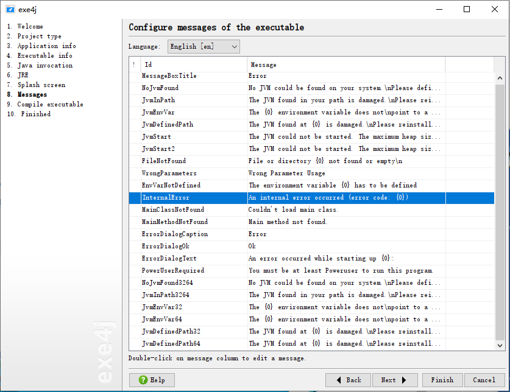

1. 第一步不用管，如果保存有上次配置信息的文件，可以通过 `reopen` 或 `open` 按钮加载该配置文件。

   

2. 第二步，如果需要创建一个自包含 `Java` 运行时的 `exe` 文件，选择 `"JAR in EXE" mode` ；否则选择 `Regular mode`。

   

3. 第三步，在 `General` 中的 `Short name of your application` 栏填写你的应用简称；在 `Directories` 中的 `Distribution source directory` 栏填写你的分发源目录，分发源目录是相关目录的参考点。 如有必要，在文件选择器中选择的目录将被转换为相关目录。如果项目不是类似 maven 分发源项目，可以随便选择一个目录。在 `Executable directory` 栏中选择生成的可执行 exe 文件存放目录，该目录必须位于 `Distribution source directory` 目录及其子目录中。生成的可执行文件将被复制到可执行目录。可执行目录必须在分发源目录下。 如果可执行目录为空，它将与分发源目录相同。

   

4. 第四步，在 `Executable type` 中，如果你的应用是图形应用，则勾选 `GUI application`，如果该图形应用同时支持命令行，则同时勾选下方的 `Allow -console parameter`；如果应用是命令行应用，则勾选 `Console application`；如果应用是一个服务，则勾选 `Service`。在 `Executable name` 栏填入可执行文件名。如果需要给应用添加图标，则需要勾选 `Icon File`，并在后面输入框中选择图标路径。如果一次只允许运行一个实例，则勾选 `Allow only a single running instance of the application`；如果希望当程序抛出异常后停止运行，可以勾选 `Fail if an exception in the main thread is thrown`；如果希望修改程序运行时的工作目录，可以勾选 `Change working directory to` 项，并在后面选择工作目录，默认目录为当前运行应用的目录；如果希望指定生成 32 位或 64 位的程序，需要点击 `Advanced Options` 按钮，在下拉列表中选择 `32-bit or 64-bit` 项，并在弹出的界面中勾选 `Generate 64-bit executable` 项表示生成 64 位程序，去掉勾选表示生成 32 位程序。

   

   

5. 第五步，在 `VM Parameters` 栏添加 `-Dfile.encoding=UTF-8` 参数，防止应用乱码，如果还有其他参数自行添加；点击右边的加号，选择要运行的 `jar` 文件，如果该 `jar` 文件依赖于其他 `jar` 文件，那这些依赖文件也需要添加进来；在 `Main class from` 栏中填入启动类的全名。

   

6. 第六步，在 `Minimum version` 中填入生成 `jar` 时所用的 `Java` 版本，`Maximum version` 不用填，勾选 `Allow JREs with a beta version number` 允许使用 beta 版本的 Java 运行时运行应用。

   

7. 第七步，保持默认

   

8. 第八步，保持默认

   

9. 第九步，编译应用，不用管

10. 第十步，生成可执行文件完成