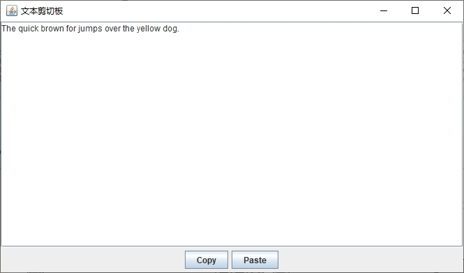

首先，获取一个系统剪贴板的引用：

```java
Clipboard clipbord = Toolkit.getDefaultToolkit().getSystemClipboard();
```

传递给剪贴板的字符串，必须被包装在 `StringSelection` 对象中：

```java
String text = ...;
StringSelection selection = new StringSelection(text);
```

实际的传递操作是通过调用 `setContents` 方法来实现的，该方法将一个 `StringSelection` 对象和一个 `ClipBoardOwner` 作为参数。如果不想指定剪贴板所有者的话，可以把第二个参数设置为 `null`。

```JAVA
clipboard.setContents(selection, null);
```

下面是反过来的操作：从剪贴板中读取一个字符串：

```java
DataFlavor flavor = DataFlavor.stringFlavor;
if (clipboard.isDataFlavorAvailable(flavor)) {
    String text = (String) clipboard.getData(flavor);
}
```

**示例程序：**

**TextTransferFrame.java**

```java
package com.qty;

import javax.sound.sampled.Clip;
import javax.swing.*;
import java.awt.*;
import java.awt.datatransfer.Clipboard;
import java.awt.datatransfer.DataFlavor;
import java.awt.datatransfer.StringSelection;
import java.awt.datatransfer.UnsupportedFlavorException;
import java.io.IOException;

/**
 * This frame has a text area and buttons for copying and pasting text.
 */
public class TextTransferFrame extends JFrame {

    private static final int TEXT_ROWS = 20;
    private static final int TEXT_COLUMNS = 60;
    private JTextArea textArea;

    public TextTransferFrame() {
        textArea = new JTextArea(TEXT_ROWS, TEXT_COLUMNS);
        add(new JScrollPane(textArea), BorderLayout.CENTER);
        JPanel panel = new JPanel();

        JButton copyButton = new JButton("Copy");
        panel.add(copyButton);
        copyButton.addActionListener(event -> copy());

        JButton pasteButton = new JButton("Paste");
        panel.add(pasteButton);
        pasteButton.addActionListener(event -> paste());

        add(panel, BorderLayout.SOUTH);
        pack();
    }

    /**
     * Copies the selected text to the system clipboard.
     */
    private void copy() {
        Clipboard clipboard = Toolkit.getDefaultToolkit().getSystemClipboard();
        String text = textArea.getSelectedText();
        if (text == null) {
            text = textArea.getText();
        }
        StringSelection selection = new StringSelection(text);
        clipboard.setContents(selection, null);
    }

    /**
     * Pastes the text from the system clipboard into the text area.
     */
    private void paste() {
        Clipboard clipboard = Toolkit.getDefaultToolkit().getSystemClipboard();
        DataFlavor flavor = DataFlavor.stringFlavor;
        if (clipboard.isDataFlavorAvailable(flavor)) {
            try {
                String text = (String) clipboard.getData(flavor);
                textArea.replaceSelection(text);
            } catch (UnsupportedFlavorException | IOException ex) {
                JOptionPane.showMessageDialog(this, ex);
            }
        }
    }
}
```

**TextTransferTest.java**

```java
package com.qty;

import javax.swing.*;
import java.awt.*;

public class TextTransferTest {
    public static void main(String[] args) {
        EventQueue.invokeLater(() -> {
            JFrame frame = new TextTransferFrame();
            frame.setTitle("文本剪切板");
            frame.setDefaultCloseOperation(JFrame.EXIT_ON_CLOSE);
            frame.setVisible(true);
        });
    }
}
```

**运行效果如下：**


