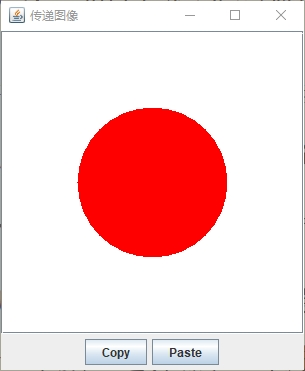

想要通过剪贴板传递对象就必须实现 `Transferable` 接口。`StringSelection` 类是目前 `Java` 标准库中唯一一个实现了 `Transferable` 接口的公有类。

因为 `Java` 并没有提供传递图像的类，所以读者必须自己去实现它。这个类其实只是一个非常普通的类。它直接告诉其唯一可用的数据格式是 `DataFlavor.imageFlavor`，并且它持有一个 `image` 对象。

**示例程序：**

**ImageTransferable.java**

```java
package com.qty;

import javax.swing.*;
import java.awt.*;
import java.awt.datatransfer.Clipboard;
import java.awt.datatransfer.DataFlavor;
import java.awt.datatransfer.UnsupportedFlavorException;
import java.awt.image.BufferedImage;
import java.io.IOException;

/**
 * This frame has an image label and buttons for copying and pasting an image.
 */
public class ImageTransferFrame extends JFrame {

    private static final int IMAGE_WIDTH = 300;
    private static final int IMAGE_HEIGHT = 300;

    private JLabel label;
    private Image image;

    public ImageTransferFrame() {
        label = new JLabel();
        image = new BufferedImage(IMAGE_WIDTH, IMAGE_HEIGHT, BufferedImage.TYPE_INT_ARGB);
        Graphics g = image.getGraphics();
        g.setColor(Color.WHITE);
        g.fillRect(0, 0, IMAGE_WIDTH, IMAGE_HEIGHT);
        g.setColor(Color.RED);
        g.fillOval(IMAGE_WIDTH / 4, IMAGE_HEIGHT / 4, IMAGE_WIDTH / 2, IMAGE_HEIGHT / 2);

        label.setIcon(new ImageIcon(image));
        add(new JScrollPane(label), BorderLayout.CENTER);
        JPanel panel = new JPanel();

        JButton copyButton = new JButton("Copy");
        panel.add(copyButton);
        copyButton.addActionListener(event -> copy());

        JButton pasteButton = new JButton("Paste");
        panel.add(pasteButton);
        pasteButton.addActionListener(event -> paste());

        add(panel, BorderLayout.SOUTH);
        pack();
    }

    /**
     * Copies the current image to the system clipboard.
     */
    private void copy() {
        Clipboard clipboard = Toolkit.getDefaultToolkit().getSystemClipboard();;
        ImageTransferable selection = new ImageTransferable(image);
        clipboard.setContents(selection, null);
    }

    /**
     * Pastes the image from system clipboard into the image label.
     */
    private void paste() {
        Clipboard clipboard = Toolkit.getDefaultToolkit().getSystemClipboard();
        DataFlavor flavor = DataFlavor.imageFlavor;
        if (clipboard.isDataFlavorAvailable(flavor)) {
            try {
                image = (Image) clipboard.getData(flavor);
                label.setIcon(new ImageIcon(image));
            } catch (UnsupportedFlavorException | IOException e) {
                JOptionPane.showMessageDialog(this, e);
            }
        }
    }
}
```

**ImageTransferFrame.java**

```java
package com.qty;

import java.awt.*;
import java.awt.datatransfer.DataFlavor;
import java.awt.datatransfer.Transferable;
import java.awt.datatransfer.UnsupportedFlavorException;
import java.io.IOException;

public class ImageTransferable implements Transferable {

    private Image theImage;

    public ImageTransferable(Image image) {
        theImage = image;
    }

    @Override
    public DataFlavor[] getTransferDataFlavors() {
        return new DataFlavor[] { DataFlavor.imageFlavor };
    }

    @Override
    public boolean isDataFlavorSupported(DataFlavor flavor) {
        return flavor.equals(DataFlavor.imageFlavor);
    }

    @Override
    public Object getTransferData(DataFlavor flavor) throws UnsupportedFlavorException, IOException {
        if (flavor.equals(DataFlavor.imageFlavor)) {
            return theImage;
        } else {
            throw new UnsupportedFlavorException(flavor);
        }
    }
}
```

**ImageTransferTest.java**

```java
package com.qty;

import javax.swing.*;

public class ImageTransferTest {
    public static void main(String[] args) {
        JFrame frame = new ImageTransferFrame();
        frame.setTitle("传递图像");
        frame.setDefaultCloseOperation(JFrame.EXIT_ON_CLOSE);
        frame.setVisible(true);
    }
}
```

**运行效果如下：**

