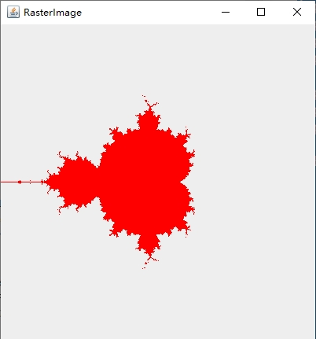
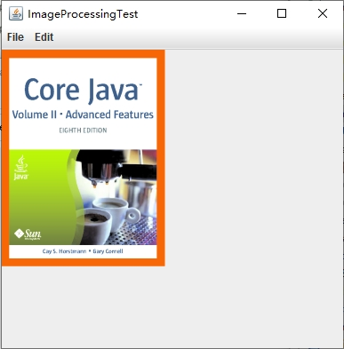

[toc]

`BufferedImage` 类提供了对图像中像素的控制能力，而实现了 `BufferedImageOP` 接口的类都可以对图像进行变换操作。

### 1. 构建光栅图像

下面将介绍一种不同的构建图像技术，也就是每次为图像增加一个像素。为了创建一个图像，需要以通常的方法构建一个 `BufferedImage` 对象：

```java
BufferedImage image = new BufferedImage(width, height, BufferedImage.TYPE_INT_ARGB);
```

现在，调用 `getRaster` 方法来获得一个类型为 `WritableRaster` 的对象，后面将使用这个对象来访问和修改改图像的各个像素：

```java
WritableRaster raster = image.getRaster();
```

使用 `setPixel` 方法可以设置一个单独的像素。这项操作的复杂性在于不能只是为该像素设置一个 `Color` 值，还必须知道存放在缓冲区中的图像是如何设定颜色的，这依赖于图像的类型。如果图像有一个 `TYPE_INT_ARGB` 类型，那么每一个像素都用四个值来描述，即：红、绿、蓝和透明度（alpha），每个值的取值范围都介于 0 和 255 之间，这需要以包含四个整数值的一个数组的形式给出：

```java
int[] black = { 0, 0, 0, 255 };
raster.setPixel(i, j, black);
```

> 提示：还有一些参数值是 `float[]` 和 `double[]` 类型的 `setPixel` 方法，然而，需要在这些数组中放置的值并不是介于 0.0 和 1.0 之间的规格化的颜色值：
>
> ```java
> float[] red = { 1.0F, 0.0F, 0.0F, 1.0F };
> raster.setPixel(i, j, red);	// ERROR
> ```
>
> 无论数组属于什么类型，都必须提供介于 0 和 255 之间的某个值。

可以使用 `setPixels` 方法提供批量的像素。需要设置矩形的起始像素的位置和矩形的宽度和高度。接着，提供一个包含所有像素的样本值的一个数组。

```java
int[] pixels = new int[4 * width * height];
pixels[0] = ...;	// red value for first pixel
pixels[1] = ...;	// green value for first pixel
pixels[2] = ...;	// blue value for first pixel
pixels[3] = ...;	// alpha value for first pixel
pixels[4] = ...;	// red value for second pixel
......
raster.setPixels(x, y, width, height, pixels);
```

反过来，如果要读入一个像素，可以使用 `getPixel` 方法。这需要提供一个含有四个整数的数组，用以存放各个样本值：

```java
int[] sample = new int[4];
raster.getPixel(x, y, sample);
Color c = new Color(sample[0], sample[1], sample[2], sample[3]);
```

可以使用 `getPixels` 方法来读取多个像素：

```java
raster.getPixels(x, y, width, height, samples);
```

如果需要对任意未知类型的图像进行处理，那么你就要费神了。每一个图像类型都有一个颜色模型，它能够在样本值数组和标准的 `RGB` 颜色模型之间进行转换。

>注意：RGB 颜色模型并不像你想象中的那么标准。颜色值的确切样子依赖于成像设备的特性。数码相机、扫描仪、控制器和 LCD 显示器等都有它们独有的特点。结果是，同样的 RGB 值在不同的设备上看上去就存在很大的差别。国际配色联盟（<https://www.color.org/index.xalter>）推荐，所有的颜色数据都应该配有一个 ICC 配置特性，它用以设定各种颜色是如何映射到标准格式的，比如 1931 CIE XYZ 颜色技术规范。该规范是由国际照明委员会即 CIE（Commission Internationale de I' Eclairage， 其网址为：<https://cie.co.at/>）指定。它采用称为 X、Y、Z 三元组坐标的方式来显示颜色。

ICC 配置特性非常复杂。然而，我们建议使用一个相对简单的标准，称为 sRGB（请访问其网址 <http://www.w3.org/Graphics/Color/sRGB.html>）。当需要在 RGB 与其他颜色空间之间进行转换的时候，Java 2D API 就使用这种转换方式。

`getColorModel` 方法返回一个颜色模型：

```java
ColorModel model = image.getColorModel();
```

为了了解一个像素的颜色值，可以调用 `Raster` 类的 `getDataElements` 方法。这个方法返回一个 `Object`，它包含了有关该颜色值与特定颜色模型相关的描述：

```java
Object data = raster.getDataElements(x, y, null);
```

> 注意：`getDataElements` 方法返回的对象实际上是一个样本值的数组。在处理这个对象时，不必要了解到这些。但是，它却解释了为什么这个方法名叫做 `getDataElements` 的原因。

颜色模型能够将该对象转换成标准的 ARGB 的值。`getRGB` 方法返回一个 `int` 类型的值，它把透明度（alpha）、红、绿和蓝的值打包成四个块，每块包含 8 位。也可以使用 `Color(int argb, boolean hasAlpha)` 构造其来构建一个颜色的值：

```java
int argb = model.getRGB(data);
Color color = new Color(argb, true);
```

如果要把一个像素设置为某个特定的颜色值，需要按与上述相反的步骤进行操作。`Color` 类的 `getRGB` 方法会产生一个包含透明度、红、绿和蓝值的 `int` 型值。把这个值提供给 `ColorModel` 类的 `getDataElements` 方法，其返回值是一个包含了该颜色值的特定颜色模型描述的 `Object`。再将这个对象传递个 `WritableRaster` 了的 `setDataElements` 方法：

```java
int argb = color.getRGB();
Object data = model.getDataElements(argb, null);
raster.setDataElements(x, y, data);
```

下面示例绘制了一个 Mandelbrot 集。Mandelbrot 集的思想就是把平面上的每一点和一个数字序列关联在一起。如果数字序列是收敛的，该点就被着色。如果数字序列是发散的，该点就处于透明状态。

下面就是构建简单 Manderbrot 集的方法。对于每一个点 (a, b)，你都能按照如下的公式得到一个点集序列，其开始于点 (x, y) = (0, 0)，反复进行迭代：

$$
x_{new}=x^{2}-y^{2}+a \\
y_{new}=2\cdot x \cdot y+b
$$
**程序清单 rasterImage/RasterImageFrame.java**

```java
package rasterImage;

import java.awt.Color;
import java.awt.image.BufferedImage;
import java.awt.image.ColorModel;
import java.awt.image.WritableRaster;

import javax.swing.ImageIcon;
import javax.swing.JFrame;
import javax.swing.JLabel;

public class RasterImageFrame extends JFrame {
	
	private static final double XMIN = -2;
	private static final double XMAX = 2;
	private static final double YMIN = -2;
	private static final double YMAX = 2;
	private static final int MAX_ITERATIONS = 16;
	private static final int IMAGE_WIDTH = 400;
	private static final int IMAGE_HEIGHT = 400;
	
	public RasterImageFrame() {
		BufferedImage image = makeMandelbrot(IMAGE_WIDTH, IMAGE_HEIGHT);
		add(new JLabel(new ImageIcon(image)));
		pack();
	}
	
	/**
	 * Makes the Mandelbrot image.
	 * @param width	the width
	 * @param height the height
	 * @return the image
	 */
	public BufferedImage makeMandelbrot(int width, int height) {
		BufferedImage image = new BufferedImage(width, height, BufferedImage.TYPE_INT_ARGB);;
		WritableRaster raster = image.getRaster();
		ColorModel model = image.getColorModel();
		
		Color fractalColor = Color.red;
		int argb = fractalColor.getRGB();
		Object colorData = model.getDataElements(argb, null);
		
		for (int i = 0; i < width; i++) {
			for (int j = 0; j < height; j++) {
				double a = XMIN + i * (XMAX - XMIN) / width;
				double b = YMIN + j * (YMAX - YMIN) / height;
				if (!escapesToInfinity(a, b)) {
					raster.setDataElements(i, j, colorData);
				}
			}
		}
		return image;
	}

	private boolean escapesToInfinity(double a, double b) {
		double x = 0.0;
		double y = 0.0;
		int iterations = 0;
		while (x <= 2 && y <= 2 && iterations < MAX_ITERATIONS) {
			double xnew = x * x - y * y + a;
			double ynew = 2 * x * y + b;
			x = xnew;
			y = ynew;
			iterations++;
		}
		return x > 2 || y > 2;
	}
}
```

运行效果如下：



### 2. 图像过滤

图像处理都实现了 `BufferedImageOp` 接口。构建了图像处理的操作之后，只需调用 `filter` 方法，就可以把该图像转换成另一个图像。

```java
BufferedImageOp op = ...;
BufferedImage filterImage = new BufferedImage(image.getWidth(), image.getHeight, image.getType());
op.filter(image, filterImage);
```

有些图像操作可以恰当地（通过 `op.filter(image, image)` 方法）转换一个图像，但是大多数的图像操作都做不到这一点。

以下五个类实现了 `BufferedImageOp` 接口：

```
AffineTransformOp
RescaleOp
LookupOp
ColorCnvertOp
ConvolveOp
```

`AffineTransformOp` 类用于对各个像素执行仿射变换。例如，下面的代码就说明了如何使一个图像围绕着它的中心旋转：

```java
AffineTransform transform = AffineTransform.getRotateInstance(Math.toRadians(angle), image.getWidth() / 2, image.getHeight() / 2);
AffineTransformOp op = new AffineTransformOp(transform, interpolation);
op.filter(image, filterImage);
```

`AffineTransformOp` 构造器需要一个仿射变换和一个渐变变换策略。如果源像素在目标像素之间的某处会发生变换的话，那么就必须使用渐变变换策略来确定目标图像的像素。例如，如果旋转源像素，那么通常它们不会精确地落在目标像素上。有两种渐变变换策略：`AffineTransformOp.TYPE_BILINEAR` 和 `AffineTransformOp.TYPE_NEAREST_NEIGHBOR`。双线性（ Bilinear ）渐变变换需要的时间较长，但是变换的效果却更好。

`RescaleOp` 用于为图像中的所有的颜色构件执行一个调整其大小的变换操作（透明度构件不受影响）：
$$
x_{new} = a \cdot x + b
$$
用 `a > 1` 进行调整，那么调整后的效果是使图像变亮。可以通过设定调整大小的参数和可选的绘图提示来构建 `RescaleOp`：

```java
float a = 1.1f;
float b = 20.0f;
RescaleOp op = new RescaleOp(a, b, null);
```

也可以为每个颜色构件提供单独的缩放值，参见 API 说明。

使用 `LookupOp` 操作，可以为样本值设定任意的映射操作。你提供一张表格，用于设定每一个样本值应该如何进行映射操作。

`LookupOp` 构造器需要一个类型是 `LookupTable` 的对象和一个选项提示映射表。`LookupTable` 是抽象类，其有两个实体子类：`ByteLookupTable` 和 `ShortLookupTable`。因为 RGB 颜色值是由字节组成的，所以 `ByteLookupTable` 类应该就够用了。但是，考虑到 <https://bugs.java.com/bugdatabase/view_bug.do?bug_id=6183251> 中描述的缺陷，我们将使用 `ShortLookupTable`。下面的代码说明了我们在程序清单中是如何构建一个 `LookupOp` 类的：

```java
short negative[] = new short[256];
for (int i = 0; i < 256; i++) {
    negative[i] = (short) (255 - i);
}
ShortLookupTable table = new ShortLookupTable(0, negative);
LookupOp op = new LookupOp(table, null);
```

此项操作可以分别应用于每个颜色构件，但是不能应用于透明度值。也可以为每个颜色构件提供单独的查找表，参见 API 说明。

> 注意：不能将 `LookupOp` 用于带有索引颜色模型的图像。（在这些图像中，每个样本值都是调色板中的一个偏移量。）

`ColorConvertOp` 对于颜色空间的转换非常有用。`ConvolveOp` 是功能最强大的转换操作，它用于执行卷积变化。我们不像过分深入地介绍卷积变换的详尽细节。不过，其基本概念还是比较简单的。我们不妨看一下模糊过滤器的例子。

这种模糊的效果是通过用像素和该像素临近的 8 哥像素的平均值来取代每一个像素而达到的。凭借直观感觉，就可以知道为什么这种变换操作能使得图像变模糊了。从数学理论上来说，这种平均法可以表示为一个以下面这个矩阵为内核的卷积变换操作：
$$
\left[
	\begin{matrix}
		1/9 & 1/9 & 1/9	\\
		1/9 & 1/9 & 1/9	\\
		1/9 & 1/9 & 1/9
	\end{matrix}
\right]
$$
卷积变换操作的内核是一个矩阵，用以说明在临近的像素点上应用的加权值。应用上面的内核进行卷积变换，就会产生一个模糊图像。下面这个不同的内核用以进行图像的边缘检测，查找图像颜色变化的区域：
$$
\left[
	\begin{matrix}
		0 & -1 & 0	\\
		-1 & 4 & -1	\\
		0 & -1 & 0
	\end{matrix}
\right]
$$
如果要构建一个卷积变换操作，首先应为矩阵内核建立一个含有内核值的数组，并且构建一个 `Kernel` 对象。接着，根据内核对象建立一个 `ConvolveOp` 对象，进而执行过滤操作。

```java
float[] elements = {
    0.0f, -1.0f, 0.0f,
    -1.0f, 4.0f, -1.0f,
    0.0f, -1.0f, 0.0f,
};
Kernel kernel = new Kernel(3, 3, elements);
ConvolveOp op = new ConvolveOp(kernel);
op.filter(image, filterImage);
```

**程序清单 imageProcessing/ImageProcessingFrame.java**

```java
package imageProcessing;

import java.awt.Graphics;
import java.awt.Image;
import java.awt.geom.AffineTransform;
import java.awt.image.AffineTransformOp;
import java.awt.image.BufferedImage;
import java.awt.image.BufferedImageOp;
import java.awt.image.ConvolveOp;
import java.awt.image.Kernel;
import java.awt.image.LookupOp;
import java.awt.image.RescaleOp;
import java.awt.image.ShortLookupTable;
import java.io.File;
import java.io.IOException;

import javax.imageio.ImageIO;
import javax.swing.JComponent;
import javax.swing.JFileChooser;
import javax.swing.JFrame;
import javax.swing.JMenu;
import javax.swing.JMenuBar;
import javax.swing.JMenuItem;
import javax.swing.JOptionPane;
import javax.swing.filechooser.FileNameExtensionFilter;

public class ImageProcessingFrame extends JFrame {
	
	private static final int DEFAULT_WIDTH = 400;
	private static final int DEFAULT_HEIGHT = 400;
	
	private BufferedImage image;
	
	public ImageProcessingFrame() {
		setTitle("ImageProcessingTest");
		setSize(DEFAULT_WIDTH, DEFAULT_HEIGHT);
		
		add(new JComponent() {
			@Override
			protected void paintComponent(Graphics g) {
				if (image != null) {
					g.drawImage(image, 0, 0, null);
				}
			}
		});
		
		JMenu fileMenu = new JMenu("File");
		JMenuItem openItem = new JMenuItem("Open");
		openItem.addActionListener(event -> openFile());
		fileMenu.add(openItem);
		
		JMenuItem exitItem = new JMenuItem("Exit");
		exitItem.addActionListener(event -> System.exit(0));
		fileMenu.add(exitItem);
		
		JMenu editMenu = new JMenu("Edit");
		JMenuItem blurItem = new JMenuItem("Blur");
		blurItem.addActionListener(event -> {
			float weight = 1.0f / 9.0f;
			float[] elements = new float[9];
			for (int i = 0; i < 9; i++) {
				elements[i] = weight;
			}
			convolve(elements);
		});
		editMenu.add(blurItem);
		
		JMenuItem sharpenItem = new JMenuItem("Sharpen");
		sharpenItem.addActionListener(event -> {
			float[] elements = { 0.0f, -1.0f, 0.0f, -1.0f, 5.0f, -1.0f, 0.0f, -1.0f, 0.0f };
			convolve(elements);
		});
		editMenu.add(sharpenItem);
		
		JMenuItem brightenItem = new JMenuItem("Brighten");
		brightenItem.addActionListener(event -> {
			float a = 1.1f;
			float b = 20.0f;
			RescaleOp op = new RescaleOp(a, b, null);
			filter(op);
		});
		editMenu.add(brightenItem);
		
		JMenuItem edgeDetectItem = new JMenuItem("Edge detect");
		edgeDetectItem.addActionListener(event -> {
			float[] elements = { 0.0f, -1.0f, 0.0f, -1.0f, 4.0f, -1.0f, 0.0f, -1.0f, 0.0f };
			convolve(elements);
		});
		editMenu.add(edgeDetectItem);
		
		JMenuItem negativeItem = new JMenuItem("Negative");
		negativeItem.addActionListener(event -> {
			short[] negative = new short[256 * 1];
			for (int i = 0; i < 256; i++) {
				negative[i] = (short)(255 - i);
			}
			ShortLookupTable table = new ShortLookupTable(0, negative);
			LookupOp op = new LookupOp(table, null);
			filter(op);
		});
		editMenu.add(negativeItem);
		
		JMenuItem rotateItem = new JMenuItem("Rotate");
		rotateItem.addActionListener(event -> {
			if (image == null) {
				return;
			}
			AffineTransform transform = AffineTransform.getRotateInstance(Math.toRadians(5),
					image.getWidth() / 2, image.getHeight() / 2);
			AffineTransformOp op = new AffineTransformOp(transform, AffineTransformOp.TYPE_BICUBIC);
			filter(op);
		});
		editMenu.add(rotateItem);
		
		JMenuBar menuBar = new JMenuBar();
		menuBar.add(fileMenu);
		menuBar.add(editMenu);
		setJMenuBar(menuBar);
	}
	
	/**
	 * Open a file and load the image.
	 */
	public void openFile() {
		JFileChooser chooser = new JFileChooser(".");
		chooser.setCurrentDirectory(new File(getClass().getPackage().getName()));
		String[] extensions = ImageIO.getReaderFileSuffixes();
		chooser.setFileFilter(new FileNameExtensionFilter("Image files", extensions));
		int r = chooser.showOpenDialog(this);
		if (r != JFileChooser.APPROVE_OPTION) {
			return;
		}
		
		try {
			Image img = ImageIO.read(chooser.getSelectedFile());
			image = new BufferedImage(img.getWidth(null), img.getHeight(null), BufferedImage.TYPE_INT_RGB);
			image.getGraphics().drawImage(img, 0, 0, null);
		} catch (IOException e) {
			JOptionPane.showMessageDialog(this, e);
		}
		repaint();
	}

	
	/**
	 * Apply a filter and repaint
	 * @param op the image operation to apply
	 */
	private void filter(BufferedImageOp op) {
		if (image == null) {
			return ;
		}
		image = op.filter(image, null);
		repaint();
	}
	
	private void convolve(float[] elements) {
		Kernel kernel = new Kernel(3, 3, elements);
		ConvolveOp op = new ConvolveOp(kernel);
		filter(op);
	}
}
```

运行效果如下：


