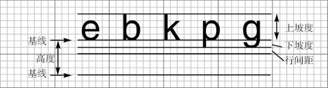

[toc]

人们可以通过字体名指定一种字体。字体名由 "Helvetica" 这样的字体家族名和一个可选的 "Bold" 后缀组成。例如， "Helvetica" 和 "Helvetica Bold" 属于 "Helvetica" 家族的字体。

### 1. 获取设备可用字体

要想知道某台特定计算机上允许使用的字体，就需要调用 `GraphicsEnvironment` 类中的 `getAvailableFontFamilyNames` 方法。这个方法将返回一个字符型数组，其中包含了所有可用的字体名。

`GraphicsEnvironment` 类描述了用户系统的图形环境，为了得到这个类的对象，需要调用静态的 `getLocalGraphicsEnvironment` 方法。下面这个程序将打印出系统上的所有字体名：

```java
import java.awt.GraphicsEnvironment;

public class ListFonts {

	public static void main(String[] args) {
		String[] fontNames = GraphicsEnvironment
				.getLocalGraphicsEnvironment()
				.getAvailableFontFamilyNames();
		for (String fontName : fontNames) {
			System.out.println(fontName);
		}
	}
}
```

为了创建一个公共基准，AWT 定义了五个逻辑字体名：

```
SansSerif
Serif
Monospaced
Dialog
DialogInput
```

### 2. 创建 Font 对象

要想使用某种字体绘制字符，必须首先利用指定的字体名、字体风格和字体大小来创建一个 `Font` 类对象。下面是构建一个 `Font` 对象的例子：

```java
Font f = new Font("Serif", Font.BOLD, 36);
```

在 `Font` 构造器中，提供字体名的位置也可以给出逻辑字体名称。另外，利用 `Font` 构造器的第二个参数可以指定字体风格（常规、加粗、斜体或加粗斜体）：

```
Font.PLAIN
Font.BOLD
Font.ITALIC
Font.BOLD + Font.ITALIC
```

第三个参数是以点数目计算的字体大小。点数目是排版中普遍使用的表示字体大小的单位，每英寸包含 72 个点。

> 提示：字体映射定义在 Java 安装的 `jre/lib` 子目录中的 `fontconfig.properties` 文件中。有关这个文件的详细内容请参看 <http://docs.oracle.com/javase/8/docs/technotes/guides/intl/fontconfig.html>。

可以读取 `TrueType` 或 `PostScriot Type 1` 格式的字体文件。这需要一个字体输入流——通常从磁盘文件或者 URL 读取。然后调用静态方法 `Font.createFont`：

```java
URL url = new URL("http://www.fonts.com/Wingbats.ttf");
InputStream in = url.openStream();
Font f1 = font.createFont(Font.TRUETYPE_FONT, in);
```

上面定义的字体为常规字体，大小为 1。可以使用 `deriveFont` 方法得到希望大小的字体：

```java
Font f = f1.deriveFont(14.0F);
```

> 警告：`deriveFont` 方法有两个重载版本。一个（有一个 `float` 参数）设置字体的大小；另一个（有一个 `int` 参数）设置字体风格。所以 `f.deriveFont(14)` 设置的是字体风格，而不是大小（其结果为斜体，因为 14 的二进制表示的是 `ITALIC`，而不是 `BOLD`。

### 3. 获取字符串的字体属性

要想得到屏幕设备字体属性的描述性对象，需要调用 `Graphics2D` 类中的 `getFontRenderContext` 方法。它将返回一个 `FontRenderContext` 类对象。可以直接将这个对象传递给 `Font` 类的 `getStringBounds` 方法：

```java
FontRenderContext context = g2.getFontRenderContext();
Rectangle2D bounds = f.getStringBounds(message, context);
```

为了解释这个矩形的大小，需要清楚几个排版的相关术语。如下图所示。基线（baseline）是一条虚构的线，例如，字母 'e' 所在的底线。上坡度（ascent）是从基线到坡顶（ascenter）的距离。例如，'b' 和 'k' 以及大写字母的上面部分。下坡度（descent）是从基线到坡底（descenter）的距离，坡底是 'p' 和 'g' 这种字母的底线。



行间距（leading）是某一行的坡底与其下一行的坡顶之间的空隙。字体的高度是连续两个基线之间的距离，它等于下坡度 + 行间距 + 上坡度。

`getStringBounds` 方法返回的矩形宽度和字符串水平方向的宽度。矩形的高度是上坡度、下坡度、行间距的总和。

### 4. 示例代码

```java
import java.awt.Color;
import java.awt.Dimension;
import java.awt.EventQueue;
import java.awt.Font;
import java.awt.Graphics;
import java.awt.Graphics2D;
import java.awt.font.FontRenderContext;
import java.awt.geom.Line2D;
import java.awt.geom.Rectangle2D;
import java.awt.geom.Rectangle2D.Double;

import javax.swing.JComponent;
import javax.swing.JFrame;

public class FontTest {
	
	public static void main(String[] args) {
		EventQueue.invokeLater(() -> {
			JFrame frame = new FontFrame();
			frame.setTitle("FontTest");
			frame.setDefaultCloseOperation(JFrame.EXIT_ON_CLOSE);
			frame.setVisible(true);
		});
	}

}

class FontFrame extends JFrame {
	
	public FontFrame() {
		add(new FontComponent());
		pack();
	}
	
}

class FontComponent extends JComponent {
	
	private static final int DEFAULT_WIDTH = 300;
	private static final int DEFAULT_HEIGHT = 200;
	
	public void paintComponent(Graphics g) {
		Graphics2D g2 = (Graphics2D) g;
		
		String message = "Hello, World!";
		
		Font f = new Font("Serif", Font.BOLD, 36);
		g2.setFont(f);
		
		// measure the size of the message
		
		FontRenderContext context = g2.getFontRenderContext();
		Rectangle2D bounds = f.getStringBounds(message, context);
		
		// set (x,y) = top left corner of text
		double x = (getWidth() - bounds.getWidth()) / 2;
		double y = (getHeight() - bounds.getHeight()) / 2;
		
		// add ascent to y to reach the baseline
		
		double ascent = -bounds.getY();
		double baseY = y + ascent;
		
		// draw the message
		g2.drawString(message, (int)x, (int) baseY);
		
		g2.setPaint(Color.LIGHT_GRAY);
		
		// draw the baseline
		
		g2.draw(new Line2D.Double(x, baseY, x + bounds.getWidth(), baseY));
		
		// draw the enclosing rectangle
		
		Rectangle2D rect = new Rectangle2D.Double(x, y, bounds.getWidth(), bounds.getHeight());
		g2.draw(rect);
	}
	
	@Override
	public Dimension getPreferredSize() {
		return new Dimension(DEFAULT_WIDTH, DEFAULT_HEIGHT);
	}
	
}
```

