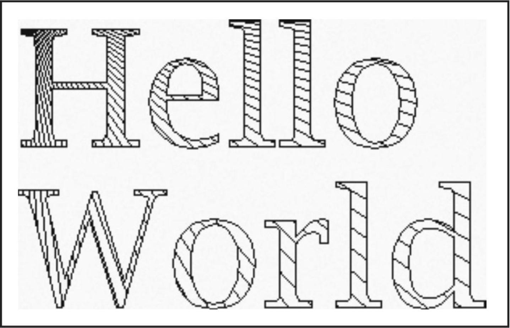

通过在图形上下文中设置一个剪切形状，就可以将所有的绘图操作限制在该剪切形状内部来进行。

```java
g2.setClip(clipShape);	// but see below
g2.draw(shape);	// draws only the part that falls inside the clipping shape
```

但是，在实际应用中，不应该调用这个 `setClip` 操作，因为它会取代图形上下文中可能存在的任何剪切形状。例如，正如在本章的后面部分所看到的那样，用于打印操作的图形上下文就具有一个剪切矩形，以确保你不会在页边距上绘图。相反，你应该调用 `clip` 方法。

```java
g2.clip(clipShape);	// better
```

如果只想临时地使用一个剪切区域的话，那么应该首先获得旧的剪切形状，然后添加新的剪切形状，最后，在完成操作时，再还原旧的剪切形状：

```java
Shape oldClip = g2.getClip();	// save old clip
g2.clip(clipShape);	// apply temporary clip
// draw on g2
g2.setClip(oldClip);	// restore old clip
```

在下图的例子中，我们炫耀了一下剪切的功能，它绘制了一个按照复杂形状进行剪切的相当出色的线条图案，即一组字符的轮廓。



如果要获得字符的外形，需要一个字体渲染上下文（ `font render context` ）。请使用 `Graphics2D` 类的 `getFontRenderContext` 方法：

```java
FontRenderContext context = context = g2.getFontRenderContext();
```

接着，使用某个字符串、某种字体和字体渲染上下文来创建一个 `TextLayout` 对象：

```java
TextLayout layout = new TextLayout("Hello", font, context);
```

对我们当前的应用来说，更重要的是，`getOutline` 方法将会返回一个 `Shape` 对象，这个 `Shape` 对象用以描述在文本布局中的各个字符轮廓的形状。字符轮廓的形状从原点（0，0）开始，这并不适合大多数的绘图操作。因此，必须为 `getOutline` 操作提供一个仿射变换操作，以便设定想要的字体轮廓所显示的位置：

```java
AffineTransform transform = AffineTransform.getTranslateInstance(0, 100);
Shape outline = layout.getOutline(transform);
```

接着，我们把字体的轮廓附加给剪切的形状：

```java
GeneralPath clipShape = new GeneralPath();
clipShape.append(outline, false);
```

最后，我们设置剪切形状，并且绘制一组线条。线条仅仅在字符边界的内部显示：

```java
g.setClip(clipShape);
Point2D p = new Point2D.Double(0, 0);
for (int i = 0; i < NLINES; i++) {
    double x = ...;
    double y = ...;
    Point2D q = new Point2D.Double(x, y);
    g2.draw(new Line2D.Double(p, q));	// lines are clipped
}
```

