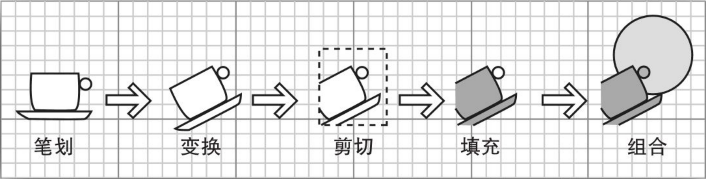

有时候，使用各种不同形状的区域，比如矩形、多边形和椭圆形来建立形状，可能会更加容易描述。`Java 2D API`支持四种区域几何作图（ `constructive area geometry` ）操作，用于将两个区域组合成一个区域。 

+   `add`：组合区域包含了所有位于第一个区域或第二个区域内的点。 

+   `subtract`：组合区域包含了所有位于第一个区域内的点，但是不包括任何位于第二个区域内的点。 

+   `intersect`：组合区域包含了所有既位于第一个区域内，又位于第二个区域内的点。 

+   `exclusiveOr`：组合区域包含了所有位于第一个区域内，或者是位于第二个区域内的所有点，但是这些点不能同时位于两个区域内。



<center><b>区域几何作图操作</b></center>

如果要构建一个复杂的区域，可以使用下面的方法先创建一个默认的区域对象。

```java
Area a = new Area();
```

然后，将该区域和其他的形状组合起来：

```java
a.add(new Rectangle2D.Double(...));
a.subtract(path);
...
```

`Area` 类实现了`Shape` 接口。可以用 `draw` 方法勾勒出该区域的边界，或者使用 `Graphics2D` 类的fill方法给区域的内部着色。

