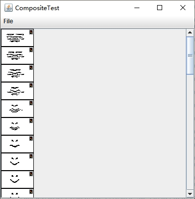

[toc]

`javax.imageio` 包包含了对读取和写入书中常用文件格式进行支持的 "附加" 特性。同时还包含了一个框架，使得第三方能够为其他图像格式的文件添加读取器和写入器。`GIF`、`JPEG`、`PNG`、`BMP`（ `Windows` 位图）和 `WBMP` （无线位图）等文件格式都得到了支持。

该类库的基本应用是极其直接的。要想装载一个图像，可以使用 `ImageIO` 类的静态 `read` 方法。

```java
File f = ...;
BufferedImage image = ImageIO.read(f);
```

`ImageIO` 类会根据文件的类型，选择一个合适的读取器。它可以参考文件的扩展名和文件开头的专用于此目的的 "幻数"（magic number）来选择读取器。如果没有找到合适的读取器或者读取器不能解码文件的内容，那么 `read` 方法将返回 `null`。

把图像写入到文件中也是一样地简单。

```java
File f = ...;
String format = ...;
ImageIO.write(image, format, f);
```

### 1. 获取合适图像文件类型的读取器和写入器

对于那些超出 `ImageIO` 类的静态 `read` 和 `write` 方法能力范围的高级图像读取和写入操作来说，首先需要获得合适的 `ImageReader` 和 `ImageWriter` 对象。`ImageIO` 类枚举了匹配下列条件之一的读取器和写入器：

+ 图像格式（比如 "JPEG"）
+ 文件后缀（比如 "jpg"）
+ MIME 类型（比如 "image/jpeg"）

例如，可以用下面的代码来获取一个 `JPEG` 格式文件的读取器：
```java
ImageReader reader = null;
Iterator<ImageReader> iter = ImageIO.getImageReadersByFormatName("JPEG");
if (iter.hasNext()) {
    reader = iter.next();
}
```

`getImageReadersBySuffix` 和 `getImageReadersByMIMEType` 这两个方法用于枚举与文件扩展名或 `MIME` 类型相匹配的读取器。

`ImageIO` 类可能会找到多个读取器，而它们都能够读取某一特殊类型的图像文件。在这种情况下，必须从中选择一个，但是也许你不清楚怎样才能选择一个最好的。如果要了解更多的关于读取器的信息，就要获取它的服务提供者接口：

```java
ImageReaderSpi spi = reader.getOriginatingProvider();
```

然后，可以获得供应商的名字和版本号：

```java
String vendor = spi.getVendor();
String version = spi.getVersion();
```

当我们想查找所有可获得的读取器能够处理的文件的所有后缀，这样我们就可以在文件过滤器中使用它们。我么可以使用静态的 `ImageIO.getReaderFileSuffixes` 方法来达到此目的：

```java
String[] extensions = ImageIO.getWriterFileSuffixes();
chooser.setFileFilter(new FileNameExtensionFilter("Image files", extensions));
```

对于保存文件，相对来说更麻烦一些：我们希望为用户展示一个支持所有图像类型的菜单。可惜， `IOImage` 类的 `getWriterFormateNames` 方法返回了一个相当奇怪的列表，里边包含了许多冗余的名字，比如：

```
jpg, BMP, bmp, JPG, jpeg, wbmp, png, JPEG, PNG, WBMP, GIF, gif
```

在末尾示例程序中，我们提供了一个用于此目的的助手方法 `getWriterFormats`。

### 2. 读取和写入带有多个图像的文件

有些文件，特别是 GIF 动画文件，都包含了多个图像。`ImageIO` 类的 `read` 方法只能够读取单个图像。为了读取多个图像，应该将输入源转换成一个 `ImageInputStream`。

```java
InputStream in = ...;
ImageInputStream imageIn = ImageIO.createImageInputStream(in);
```

接着把图像输入流作为参数传递给读取器的 `setInput` 方法：

```java
reader.setInput(imageIn, true);
```

方法中的第二个参数值表示输入的方式是 "只向前搜索"，否则，就采用随机访问的方式，要么是在读取时缓冲输入流，要么是使用随机文件访问。对于某些操作来说，必须使用随机访问的方法。

只有当从一个流中读取图像，并且输入流中包含多个图像，而且在文件头中的图像格式部分没有所需要的信息时，考虑使用生面的方法才是合适的。如果要从一个文件中读取图像信息的话，可直接使用下面的方法：

```java
File f = ...;
ImageInputStream imageIn = ImageIO.createImageInputStream(f);
reader.setInput(imageIn);
```

一旦拥有了一个读取器后，就可以通过调用下面的方法来读取输入流中的图像。

```java
BufferedImage image = reader.read(index);
```

其中 `index` 是图像的索引，其值从 0 开始。

如果输入流采用 "只向前搜索" 的方式，那么应该持续不断地读取图像，直到 `read` 方法抛出一个 `IndexOutOfBoundsException` 为止。否则，可以调用 `getNumImages` 方法：

```java
int n = reader.getNumImages(true);
```

在该方法中，它的参数表示允许搜索输入流以确定图像的数目。如果输入流采用 "只向前搜索" 的方式，那么该方法将抛出一个 `IllegalStateException` 异常。要不然，可以把是否 "允许搜索" 参数设置为 `false`。如果 `getNumImages` 方法在不搜索输入流的情况下无法确定图像的数目，那么它将返回 -1。在这种情况下，必须转换到 B 方案，那就是持续不断地读取图像，直到获得一个 `IndexOutOfBoundsException` 异常为止。

有些文件包含一些缩略图，也就是图像用来预览的小版本。可以通过调用下面的方法来获得某个图像的缩略图数量：

```java
int count = reader.getNumThumbnails(index);
```

然后可以按如下方式得到一个特定索引：

```java
BufferedImage thumbnail = reader.getThumbnail(index, thumbnailIndex);
```

另一个问题是，有时你想在实际获得图像之前，了解该图像的大小。那么请使用下面的方法：

```java
int width = reader.getWidth(index);
int height = reader.getHeight(index);
```

如果要将多个图像写入到一个文件中，首先需要一个 `ImageWriter` 。`ImageIO` 类能够枚举可以 写入某种特定图像格式的所有写入器。

```java
String format = ...;
ImageWriter writer = null;
Iterator<ImageWriter> iter = ImageIO.getImageWritersByFormatName(format);
if (iter.hasNext()) {
    writer = iter.next();
}
```

接着，将一个输出流或者输出文件转换成 `ImageOutputStream`，并且将其作为参数传给写入器。例如：

```java
File f = ...;
ImageOutputStream imageOut = ImageIO.createImageOutputStream(f);
writer.setOutput(imageOut);
```

必须将每一个图像都包装到 `IIOImage` 对象中。可以根据情况提供一个缩略图和图像元数据的列表：

```java
IIOImage iioImage = new IIOImage(images[i], null, null);
```

使用 `write` 方法，可以写出第一个图像：

```java
writer.write(new IIOImage(images[i], null, null));
```

对于后续的图像，使用下面的方法：

```java
if (writer.canInsertImage(i)) {
    writer.writeInsert(i, iioImage, null);
}
```

### 3. 示例程序：imageIO/ImageIOFrame.java

```java
package imageIO;

import java.awt.image.BufferedImage;
import java.io.File;
import java.io.IOException;
import java.util.Arrays;
import java.util.Iterator;
import java.util.Set;
import java.util.TreeSet;

import javax.imageio.IIOImage;
import javax.imageio.ImageIO;
import javax.imageio.ImageReader;
import javax.imageio.ImageWriter;
import javax.imageio.stream.ImageInputStream;
import javax.imageio.stream.ImageOutputStream;
import javax.swing.Box;
import javax.swing.ImageIcon;
import javax.swing.JFileChooser;
import javax.swing.JFrame;
import javax.swing.JLabel;
import javax.swing.JMenu;
import javax.swing.JMenuBar;
import javax.swing.JMenuItem;
import javax.swing.JOptionPane;
import javax.swing.JScrollPane;
import javax.swing.filechooser.FileNameExtensionFilter;

/**
 * This frame displays the loaded images. The menu has items for loading and
 * saving files.
 */
public class ImageIOFrame extends JFrame {
	private static final int DEFAULT_WIDTH = 400;
	private static final int DEFAULT_HEIGHT = 400;

	private static Set<String> writerFormats = getWriterFormats();

	private BufferedImage[] images;

	public ImageIOFrame() {
		setSize(DEFAULT_WIDTH, DEFAULT_HEIGHT);

		JMenu fileMenu = new JMenu("File");
		JMenuItem openItem = new JMenuItem("Open");
		openItem.addActionListener(event -> openFile());
		fileMenu.add(openItem);

		JMenu saveMenu = new JMenu("Save");
		fileMenu.add(saveMenu);
		Iterator<String> iter = writerFormats.iterator();
		while (iter.hasNext()) {
			final String formatName = iter.next();
			JMenuItem formatItem = new JMenuItem(formatName);
			saveMenu.add(formatItem);
			formatItem.addActionListener(event -> saveFile(formatName));
		}

		JMenuItem exitItem = new JMenuItem("Exit");
		exitItem.addActionListener(event -> System.exit(0));
		fileMenu.add(exitItem);

		JMenuBar menuBar = new JMenuBar();
		menuBar.add(fileMenu);
		setJMenuBar(menuBar);
	}

	/**
	 * Open a file and load the images.
	 */
	public void openFile() {
		JFileChooser chooser = new JFileChooser();
		chooser.setCurrentDirectory(new File("."));
		String[] extensions = ImageIO.getReaderFileSuffixes();
		chooser.setFileFilter(new FileNameExtensionFilter("Image files", extensions));
		int r = chooser.showOpenDialog(this);
		if (r != JFileChooser.APPROVE_OPTION)
			return;
		File f = chooser.getSelectedFile();
		Box box = Box.createVerticalBox();
		try {
			String name = f.getName();
			String suffix = name.substring(name.lastIndexOf('.') + 1);
			Iterator<ImageReader> iter = ImageIO.getImageReadersBySuffix(suffix);
			ImageReader reader = iter.next();
			ImageInputStream imageIn = ImageIO.createImageInputStream(f);
			reader.setInput(imageIn);
			int count = reader.getNumImages(true);
			images = new BufferedImage[count];
			for (int i = 0; i < count; i++) {
				images[i] = reader.read(i);
				box.add(new JLabel(new ImageIcon(images[i])));
			}
		} catch (IOException e) {
			JOptionPane.showMessageDialog(this, e);
		}
		setContentPane(new JScrollPane(box));
		validate();
	}

	/**
	 * Save the current image in a file.
	 * 
	 * @param formatName the file format
	 */
	public void saveFile(final String formatName) {
		if (images == null)
			return;
		Iterator<ImageWriter> iter = ImageIO.getImageWritersByFormatName(formatName);
		ImageWriter writer = iter.next();
		JFileChooser chooser = new JFileChooser();
		chooser.setCurrentDirectory(new File("."));
		String[] extensions = writer.getOriginatingProvider().getFileSuffixes();
		chooser.setFileFilter(new FileNameExtensionFilter("Image files", extensions));

		int r = chooser.showSaveDialog(this);
		if (r != JFileChooser.APPROVE_OPTION)
			return;
		File f = chooser.getSelectedFile();
		try {
			ImageOutputStream imageOut = ImageIO.createImageOutputStream(f);
			writer.setOutput(imageOut);

			writer.write(new IIOImage(images[0], null, null));
			for (int i = 1; i < images.length; i++) {
				IIOImage iioImage = new IIOImage(images[i], null, null);
				if (writer.canInsertImage(i))
					writer.writeInsert(i, iioImage, null);
			}
		} catch (IOException e) {
			JOptionPane.showMessageDialog(this, e);
		}
	}

	/**
	 * Gets a set of "preferred" format names of all image writers. The preferred
	 * format name is the first format name that a writer specifies.
	 * 
	 * @return the format name set
	 */
	public static Set<String> getWriterFormats() {
		Set<String> writerFormats = new TreeSet<>();
		Set<String> formatNames = new TreeSet<>(Arrays.asList(ImageIO.getWriterFormatNames()));
		while (formatNames.size() > 0) {
			String name = formatNames.iterator().next();
			Iterator<ImageWriter> iter = ImageIO.getImageWritersByFormatName(name);
			ImageWriter writer = iter.next();
			String[] names = writer.getOriginatingProvider().getFormatNames();
			String format = names[0];
			if (format.equals(format.toLowerCase()))
				format = format.toUpperCase();
			writerFormats.add(format);
			formatNames.removeAll(Arrays.asList(names));
		}
		return writerFormats;
	}
}
```

运行效果如下：

