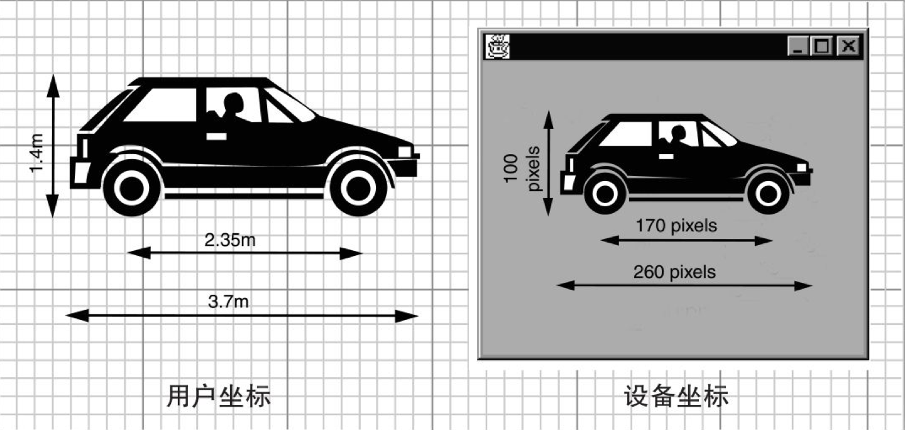
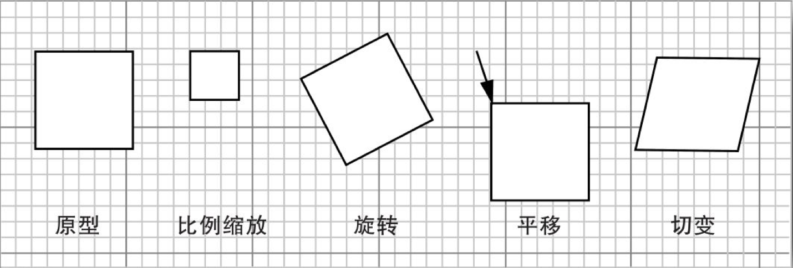
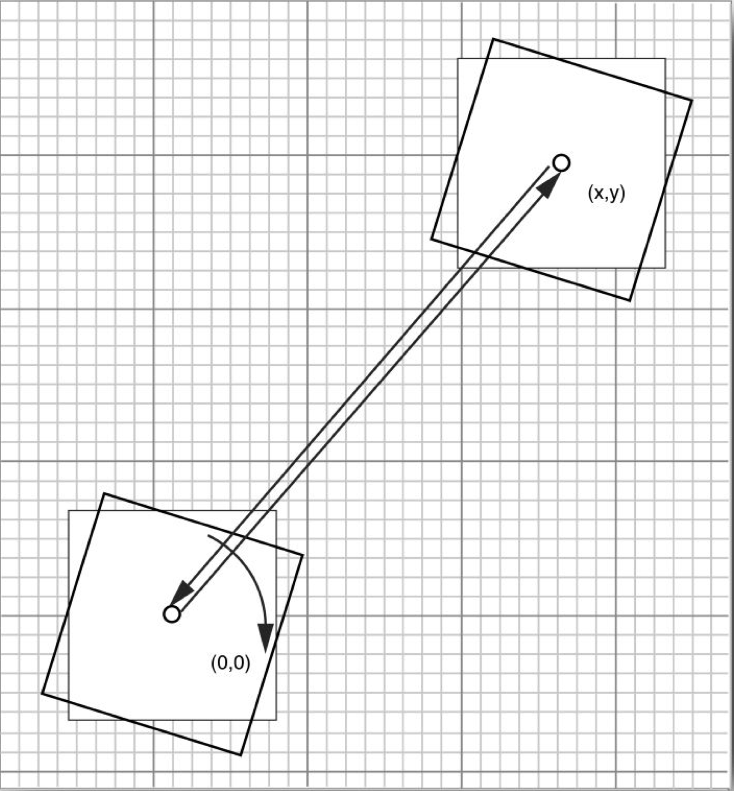
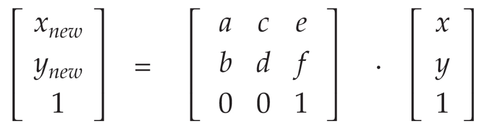
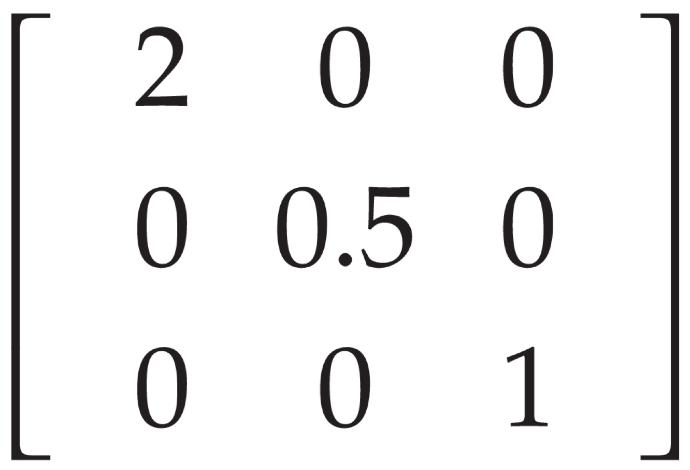

假设我们要绘制一个对象，比如汽车。从制造商的规格说明书中可以了解到汽车的高度、轴距和整个车身的长度。如果设定了每米的像素个数，当然就可以计算出所有像素的位置。但是，可以使用更加容易的方法：让图形上下文来执行这种转换。

```java
g2.scale(pixelsPerMeter, pixelsPerMeter);
g2.draw(new Line2D.Double(coordinates in meters));	// converts to pixels and draws scaled line
```

`Graphics2D` 类的 `scale` 方法可以将图形上下文中的坐标变换设置为一个比例变换。这种变换能够将用户坐标（用户设定的单元）转换成设备坐标（`pixel`，即像素）。



这里有四种基本的变换： 

+   比例缩放：放大和缩小从一个固定点出发的所有距离。 

+   旋转：环绕着一个固定中心旋转所有点。 

+   平移：将所有的点移动一个固定量。 

+   切变：使一个线条固定不变，再按照与该固定线条之间的距离，成比例地将与该线条平行的各个线条“滑动”一个距离量。



`Graphics2D` 类的 `scale`、`rotate`、`translate` 和 `shear` 等方法用以将图形上下文中的坐标变换设置成为以上这些基本变换中的一种。 

可以组合不同的变换操作。例如，你可能想对图形进行旋转和两倍尺寸放大的操作，这时，可以同时提供旋转和比例缩放的变换：

```java
g2.rotate(angle);
g2.scale(2, 2);
g2.draw(...);
```

可以根据你的需要提供任意多的变换操作。例如，假设你提供了下面这个变换操作序列：

```java
g2.translate(x, y);
g2.rotate(a);
g2.translate(-x, -y);
```

围绕着原点之外的任意点进行旋转是一个很常见的操作，所以我们采用下面的快捷方法：

```java
g2.rotate(a, x, y);
```



如果对矩阵论有所了解，那么就会知道所有操作（诸如旋转、平移、缩放、切变）和由这些操作组合起来的操作都能够以如下矩阵变换的形式表示出来：



这种变换称为仿射变换（affine transformation）。Java 2D API中的 `AffineTransform` 类就是用于描述这种变换的。如果你知道某个特定变换矩阵的组成元素，就可以用下面的方法直接构造它：

```java
AffineTransform t = new AffineTransform(a, b, c, d, e, f);
```

另外，工厂方法 `getRotateInstance`、`getScaleInstance`、`getTranslateInstance` 和 `getShearInstance` 能够构建出表示相应变换类型的矩阵。例如，调用下面的方法：

```java
t =AffineTransform.getScaleInstance(2.0F, 0.5F);
```

将返回一个与下面这个矩阵相一致的变换：



最后，实例方法 `setToRotation`、`setToScale`、`setToTranslation` 和 `setToShear` 用于将变换对象设置为一个新的类型。下面是一个例子：

```java
t.setToRotaion(angle); // sets t to a rotation
```

可以把图形上下文的坐标变换设置为一个 `AffineTransform` 对象：

```java
g2.setTransform(t);	// replaces current transformation
```

不过，在实际运用中，不要调用 `setTransform` 操作，因为它会取代图形上下文中可能存在的任何现有的变换。例如，一个用以横向打印的图形上下文已经有了一个 90° 的旋转变换，如果调用方法 `setTransfrom`，就会删除这样的旋转操作。可以调用 `transform` 方法作为替代方案：

```java
g2.transform(t);	// composes current transformation with t
```

如果只想临时应用某个变换操作，那么应该首先获得旧的变换操作，然后和新的变换操作组合起来，最后当你完成操作时，再还原旧的变换操作：

```java
AffineTransform oldTransform = g2.getTransform();	// save old transform
g2.transform(t);	// apply temporary transform
// draw on g2
g2.setTransform(oldTransform);	// restore old transform
```

