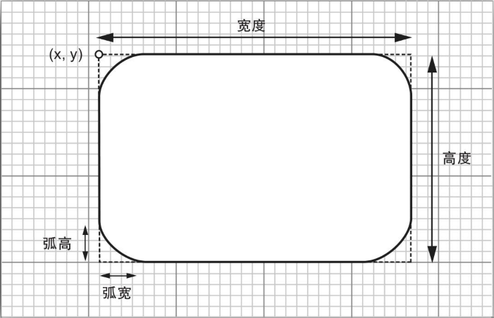

`Graphics2D` 类的 `draw` 操作通过使用当前选定的笔划来绘制一个形状的边界。在默认的情况下，笔划是一条宽度为一个像素的实线。可以通过调用 `setStroke` 方法来选定不同的笔划，此时要提供一个实现了 `Stroke` 接口的类的对象。Java 2D API 只定义了一个这样的类，即 `BasicStroke` 类。

你可以构建任意粗细的笔划。例如，下面的方法就绘制了一条粗细为10个像素的线条。

```java
g2.setStroke(new BasicStroke(10.0F));
g2.draw(new Line2D.Double(...));
```

当一个笔划的粗细大于一个像素的宽度时，笔划的末端可采用不同的样式。下图显示了这些所谓的端头样式。端头样式有下面三种： 

+   平头样式（butt cap）在笔划的末端处就结束了； 

+   圆头样式（round cap）在笔划的末端处加了一个半圆； 

+   方头样式（square cap）在笔划的末端处加了半个方块。 


<center><b>笔划的端头样式</b><center>

当两个较粗的笔划相遇时，有三种笔划的连接样式可供选择：

+   斜连接（bevel join），用一条直线将两个笔划连接起来，该直线与两个笔划之间的夹角的平分线相垂直。 

+   圆连接（round join），延长了每个笔划，并使其带有一个圆头。 

+   斜尖连接（miter join），通过增加一个尖峰，从而同时延长了两个笔划。



<center><b>笔划的连接样式</b></center>

斜尖连接不适合小角度连接的线条。如果两条线连接后的角度小于斜尖连接的最小角度，那么应该使用斜连接。斜连接的使用，可以防止出现太长的尖峰。默认情况下，斜尖连接的最小角度是10度。 

可以在 `BasicStroke` 构造器中设定这些选择，例如：

```java
g2.setStroke(new BasicStroke(10.0F, BasicStroke.CAP_ROUND, BasicStroke.JOIN_ROUND));
g2.setStroke(new BasicStroke(10.0F, BasicStroke.CAP_BUTT, BasicStorke.JOIN_MITER, 15.0F /* miter limit */));
```

当构建 `BasicStroke` 时，可以指定虚线模式和虚线相位（ `dash phase` ）。虚线相位用来表示每条线应该从虚线模式的何处开始。通常情况下，应该把它的值设置为 0。

```java
float[] dashPattern = { 10, 10, 10, 10, 10, 10, 30, 10, 30, ...};
g2.setStroke(new BasicStroke(10.0F, BasicStroke.CAP_BUTT, BasicStroke.JOIN_MITER, 10.0F /* miter limit */, dashPattern, 0 /*dash phase */));
```


<center><b>一种虚线图案</b></center>

>   提示：在虚线模式中，每一条虚线的末端都可以应用端头样式。

**示例代码：stroke/StrokeTest.java**

```java
package stroke;

import java.awt.*;
import java.awt.event.*;
import java.awt.geom.*;
import javax.swing.*;

/**
 * This program demonstrates different stroke types.
 * 
 * @version 1.04 2016-05-10
 * @author Cay Horstmann
 */
public class StrokeTest {
	public static void main(String[] args) {
		EventQueue.invokeLater(() -> {
			JFrame frame = new StrokeTestFrame();
			frame.setTitle("StrokeTest");
			frame.setDefaultCloseOperation(JFrame.EXIT_ON_CLOSE);
			frame.setVisible(true);
		});
	}
}

/**
 * This frame lets the user choose the cap, join, and line style, and shows the
 * resulting stroke.
 */
class StrokeTestFrame extends JFrame {
	private StrokeComponent canvas;
	private JPanel buttonPanel;

	public StrokeTestFrame() {
		canvas = new StrokeComponent();
		add(canvas, BorderLayout.CENTER);

		buttonPanel = new JPanel();
		buttonPanel.setLayout(new GridLayout(3, 3));
		add(buttonPanel, BorderLayout.NORTH);

		ButtonGroup group1 = new ButtonGroup();
		makeCapButton("Butt Cap", BasicStroke.CAP_BUTT, group1);
		makeCapButton("Round Cap", BasicStroke.CAP_ROUND, group1);
		makeCapButton("Square Cap", BasicStroke.CAP_SQUARE, group1);

		ButtonGroup group2 = new ButtonGroup();
		makeJoinButton("Miter Join", BasicStroke.JOIN_MITER, group2);
		makeJoinButton("Bevel Join", BasicStroke.JOIN_BEVEL, group2);
		makeJoinButton("Round Join", BasicStroke.JOIN_ROUND, group2);

		ButtonGroup group3 = new ButtonGroup();
		makeDashButton("Solid Line", false, group3);
		makeDashButton("Dashed Line", true, group3);
	}

	/**
	 * Makes a radio button to change the cap style.
	 * 
	 * @param label the button label
	 * @param style the cap style
	 * @param group the radio button group
	 */
	private void makeCapButton(String label, final int style, ButtonGroup group) {
		// select first button in group
		boolean selected = group.getButtonCount() == 0;
		JRadioButton button = new JRadioButton(label, selected);
		buttonPanel.add(button);
		group.add(button);
		button.addActionListener(event -> canvas.setCap(style));
		pack();
	}

	/**
	 * Makes a radio button to change the join style.
	 * 
	 * @param label the button label
	 * @param style the join style
	 * @param group the radio button group
	 */
	private void makeJoinButton(String label, final int style, ButtonGroup group) {
		// select first button in group
		boolean selected = group.getButtonCount() == 0;
		JRadioButton button = new JRadioButton(label, selected);
		buttonPanel.add(button);
		group.add(button);
		button.addActionListener(event -> canvas.setJoin(style));
	}

	/**
	 * Makes a radio button to set solid or dashed lines
	 * 
	 * @param label the button label
	 * @param style false for solid, true for dashed lines
	 * @param group the radio button group
	 */
	private void makeDashButton(String label, final boolean style, ButtonGroup group) {
		// select first button in group
		boolean selected = group.getButtonCount() == 0;
		JRadioButton button = new JRadioButton(label, selected);
		buttonPanel.add(button);
		group.add(button);
		button.addActionListener(event -> canvas.setDash(style));
	}
}

/**
 * This component draws two joined lines, using different stroke objects, and
 * allows the user to drag the three points defining the lines.
 */
class StrokeComponent extends JComponent {
	private static final Dimension PREFERRED_SIZE = new Dimension(400, 400);
	private static int SIZE = 10;

	private Point2D[] points;
	private int current;
	private float width;
	private int cap;
	private int join;
	private boolean dash;

	public StrokeComponent() {
		addMouseListener(new MouseAdapter() {
			public void mousePressed(MouseEvent event) {
				Point p = event.getPoint();
				for (int i = 0; i < points.length; i++) {
					double x = points[i].getX() - SIZE / 2;
					double y = points[i].getY() - SIZE / 2;
					Rectangle2D r = new Rectangle2D.Double(x, y, SIZE, SIZE);
					if (r.contains(p)) {
						current = i;
						return;
					}
				}
			}

			public void mouseReleased(MouseEvent event) {
				current = -1;
			}
		});

		addMouseMotionListener(new MouseMotionAdapter() {
			public void mouseDragged(MouseEvent event) {
				if (current == -1)
					return;
				points[current] = event.getPoint();
				repaint();
			}
		});

		points = new Point2D[3];
		points[0] = new Point2D.Double(200, 100);
		points[1] = new Point2D.Double(100, 200);
		points[2] = new Point2D.Double(200, 200);
		current = -1;
		width = 8.0F;
	}

	public void paintComponent(Graphics g) {
		Graphics2D g2 = (Graphics2D) g;
		GeneralPath path = new GeneralPath();
		path.moveTo((float) points[0].getX(), (float) points[0].getY());
		for (int i = 1; i < points.length; i++)
			path.lineTo((float) points[i].getX(), (float) points[i].getY());
		BasicStroke stroke;
		if (dash) {
			float miterLimit = 10.0F;
			float[] dashPattern = { 10F, 10F, 10F, 10F, 10F, 10F, 30F, 10F, 30F, 10F, 30F, 10F, 10F, 10F, 10F, 10F, 10F,
					30F };
			float dashPhase = 0;
			stroke = new BasicStroke(width, cap, join, miterLimit, dashPattern, dashPhase);
		} else
			stroke = new BasicStroke(width, cap, join);
		g2.setStroke(stroke);
		g2.draw(path);
	}

	/**
	 * Sets the join style.
	 * 
	 * @param j the join style
	 */
	public void setJoin(int j) {
		join = j;
		repaint();
	}

	/**
	 * Sets the cap style.
	 * 
	 * @param c the cap style
	 */
	public void setCap(int c) {
		cap = c;
		repaint();
	}

	/**
	 * Sets solid or dashed lines.
	 * 
	 * @param d false for solid, true for dashed lines
	 */
	public void setDash(boolean d) {
		dash = d;
		repaint();
	}

	public Dimension getPreferredSize() {
		return PREFERRED_SIZE;
	}
}
```

运行效果如下：

