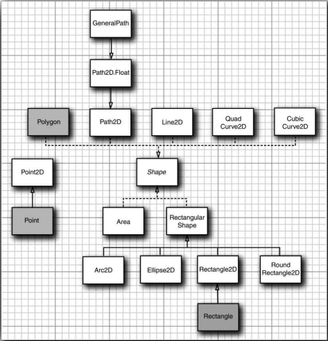
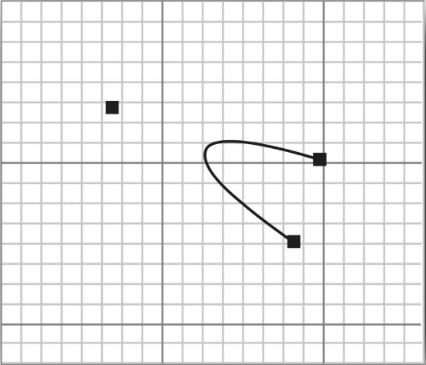

[toc]

下面是 `Graphics` 类中绘制形状的若干方法：

```
drawLine
drawRectangle
drawRoundRect
draw3DRect
drawPolygon
drawPolyline
drawOval
drawArc
```

`Java 2D API` 使用了一套完全不同的面向对象的处理方法，即不再使用方法，而是使用下面的这些类：

```
Line2D
Rectangle2D
RoundRectangle2D
Ellipse2D
Arc2D
QuadCurve2D
CubicCurve2D
GeneralPath
```

### 1. 形状类层次结构

如果要绘制一个形状，首先要创建一个实现了 `Shape` 接口的类的对象，然后调用 `Graphics2D` 类的 `draw` 方法。

下面这些类：

```
Rectangle2D
RoundRectangle2D
Ellipse2D
Arc2D
```

都是从一个公共超类 `RectangularShape` 继承而来的。

名字以 `2D` 结尾的每个类都有两个子类，用于指定坐标是 `float` 类型的还是 `double` 类型的，例如：`Rectangle2D.Float` 和 `Rectangle2D.Double`。

`Java` 编程语言使得对 `float` 类型的数的操作要稍微复杂些。由于这个原因，图形类的大多数方法使用的都是 `double` 类型的参数和返回值。只有在创建一个 `2D` 对象的时候，才需要选择究竟是使用带有 `float` 类型坐标的构造器，还是使用带有 `double` 类型坐标的构造器。例如：

```java
Rectangle2D floatRect = new Rectangle2D.Float(5F, 10F, 7.5F, 15F);
Rectangle2D doubleRect = new Rectangle2D.Double(5, 10, 7.5, 15);
```



<center><b>形状类之间的关系</b></center>

### 2. 使用形状类

如果要建立一个 `RoundRectangle2D` 形状，应该设定左上角、宽度、高度及应该变成圆角的边角区的 `x` 和 `y` 的坐标尺寸。

```java
RoundRectangle2D r = new RoundRectangle2D.Double(150, 200, 100, 50, 20, 20);
```


<center><b>构建一个 RoundRectangle2D</b></center>

如果要建立一个弧形，首先应该设定边界框，接着设定它的起始角度和弧度跨越的角度，并且设定弧形闭合的类型，即 `Arc2D.OPEN`、`Arc2D.PIE` 或者 `Arc2D.CHORD` 这几种类型中的一个。

```java
Arc2D a = new Arc2D(x, y, width, height, startAngle, arcAngle, closureType);
```


<center><b>构建一个椭圆弧形</b></center>


<center><b>弧形的类型</b></center>

> 警告：如果弧形是椭圆的，那么弧形角的计算就不是很直接了。API 文档中描述到：“角是相对于非正方形的矩形边框指定的，以使得 45 度总是落到了从椭圆中心指向矩形边框右上角的方向上。因此，如果矩形比那款的一条轴比另一条轴明显长许多，那么弧形段的起始点和终止点就会与边框中的长轴斜交。” 但是，文档中并没有说明如何计算这种 “斜交”。下面是其细节：
>
> 假设弧形的中心是原点，而且点`(x, y)` 在弧形上。那么我们可以用下面的公式来获得这个斜交角：
>
> ```java
> skewedAngle = Math.toDegrees(Math.atan2(-y * height, x * width));
> ```

`Java 2D API` 提供了对二次曲线和三次曲线的支持。如果要构建二次曲线和三次曲线，需要给出两个端点和控制点的坐标。例如：

```java
QuadCurve2D 1 = new QuadCurve2D.Double(startX, startY, controlX, controlY, endX, endY);
CubicCurve2D c = new CubicCurve2D.Double(startX, startY, control1X, control1Y, control2X, control2Y, endX, endY);
```



<center><b>二次曲线</b></center>


<center><b>三次曲线</b></center>

可以建立线段、二次曲线和三次曲线的任意序列，并把它们存放到一个 `GeneralPath` 对象中去。可以用 `moveTo` 方法来指定路径的第一个坐标，例如：

```java
GeneralPath path = new GeneralPath();
path.move(10, 20);
```

然后，可以通过调用 `lineTo`、`quadTo` 或 `curveTo` 三种方法之一来扩展路径，这些方法分别用线条、二次曲线或者三次曲线来扩展路径。如果要调用 `lineTo` 方法，需要提供它的端点。而对两个曲线方法的调用，应该先提供控制点，然后提供端点。例如：

```java
path.lineTo(20, 30);
path.curveTo(control1X, control1Y, control2X, control2Y, endX, endY);
```

可以调用 `closePath` 方法来闭合路径，它能够绘制一条回到路径起始点的线段。

最后，可以使用 `append` 方法，向普通路径添加任意个 `Shape` 对象。如果新建的形状应该连接到路径的最后一个端点，那么 `append` 方法的第二个参数值就是 `true`，如果不应该连接，那么该参数值就是 `false`。

```java
Rectangle2D r = ...;
path.append(r, false);
```

### 3. 示例代码：shape/ShapeTest.java

```java
package shape;

import java.awt.BorderLayout;
import java.awt.Dimension;
import java.awt.EventQueue;
import java.awt.Graphics;
import java.awt.Graphics2D;
import java.awt.Point;
import java.awt.Shape;
import java.awt.event.MouseAdapter;
import java.awt.event.MouseEvent;
import java.awt.event.MouseMotionAdapter;
import java.awt.geom.Arc2D;
import java.awt.geom.CubicCurve2D;
import java.awt.geom.Ellipse2D;
import java.awt.geom.GeneralPath;
import java.awt.geom.Line2D;
import java.awt.geom.Point2D;
import java.awt.geom.QuadCurve2D;
import java.awt.geom.Rectangle2D;
import java.awt.geom.RoundRectangle2D;
import java.util.Random;

import javax.swing.JComboBox;
import javax.swing.JComponent;
import javax.swing.JFrame;

public class ShapeTest {
	
	public static void main(String[] args) {
		EventQueue.invokeLater(() -> {
			JFrame frame = new ShapeTestFrame();
			frame.setTitle("ShapeTest");
			frame.setDefaultCloseOperation(JFrame.EXIT_ON_CLOSE);
			frame.setVisible(true);
		});
	}

}

class ShapeTestFrame extends JFrame {
	
	public ShapeTestFrame() {
		final ShapeComponent comp = new ShapeComponent();
		add(comp, BorderLayout.CENTER);
		final JComboBox<ShapeMaker> comboBox = new JComboBox<>();
		comboBox.addItem(new LineMaker());
		comboBox.addItem(new RectangleMaker());
		comboBox.addItem(new RoundRectangleMaker());
		comboBox.addItem(new EllipseMaker());
		comboBox.addItem(new ArcMaker());
		comboBox.addItem(new PolygonMaker());
		comboBox.addItem(new QuadCurveMaker());
		comboBox.addItem(new CubicCurveMaker());
		comboBox.addActionListener(event -> {
			ShapeMaker shapeMaker = comboBox.getItemAt(comboBox.getSelectedIndex());
			comp.setShapeMaker(shapeMaker);
		});
		add(comboBox, BorderLayout.NORTH);
		comp.setShapeMaker((ShapeMaker) comboBox.getItemAt(0));
		pack();
	}
}

class ShapeComponent extends JComponent {
	private static final Dimension PREFERRED_SIZE = new Dimension(300, 200);
	private Point2D[] points;
	private static Random generator = new Random();
	private static int SIZE = 10;
	private int current;
	private ShapeMaker shapeMaker;
	
	public ShapeComponent() {
		addMouseListener(new MouseAdapter() {
			@Override
			public void mousePressed(MouseEvent e) {
				Point p = e.getPoint();
				for (int i = 0; i < points.length; i++) {
					double x = points[i].getX() - SIZE / 2;
					double y = points[i].getY() - SIZE / 2;
					Rectangle2D r = new Rectangle2D.Double(x, y, SIZE, SIZE);
					if (r.contains(p)) {
						current = i;
						return;
					}
				}
			}
			
			@Override
			public void mouseReleased(MouseEvent e) {
				current = -1;
			}
		});
		
		addMouseMotionListener(new MouseMotionAdapter() {
		
			@Override
			public void mouseDragged(MouseEvent e) {
				if (current == -1) return;
				points[current] = e.getPoint();
				repaint();
			}
			
		});
		
		current = -1;
	}
	
	public void setShapeMaker(ShapeMaker aShapeMaker) {
		shapeMaker = aShapeMaker;
		int n = shapeMaker.getPointCount();
		points = new Point2D[n];
		for (int i = 0; i < n; i++) {
			double x = generator.nextDouble() * getWidth();
			double y = generator.nextDouble() * getHeight();
			points[i] = new Point2D.Double(x, y);
		}
		repaint();
	}
	
	@Override
	public void paintComponent(Graphics g) {
		if (points == null) return;
		Graphics2D g2 = (Graphics2D) g;
		for (int i = 0; i < points.length; i++) {
			double x = points[i].getX() - SIZE / 2;
			double y = points[i].getY() - SIZE / 2;
			g2.fill(new Rectangle2D.Double(x, y, SIZE, SIZE));
		}
		
		g2.draw(shapeMaker.makeShape(points));
	}
	
	public Dimension getPreferredSize() {
		return PREFERRED_SIZE;
	}
}

abstract class ShapeMaker {
	
	private int pointCount;
	
	public ShapeMaker(int pointCount) {
		this.pointCount = pointCount;
	}
	
	public int getPointCount() {
		return pointCount;
	}
	
	public abstract Shape makeShape(Point2D[] p);
	
	public String toString() {
		return getClass().getName();
	}
}

class LineMaker extends ShapeMaker {
	
	public LineMaker() {
		super(2);
	}
	
	public Shape makeShape(Point2D[] p) {
		return new Line2D.Double(p[0], p[1]);
	}
}

class RectangleMaker extends ShapeMaker {
	
	public RectangleMaker() {
		super(2);
	}
	
	public Shape makeShape(Point2D[] p) {
		Rectangle2D s = new Rectangle2D.Double();
		s.setFrameFromDiagonal(p[0], p[1]);
		return s;
	}
}

class RoundRectangleMaker extends ShapeMaker {
	
	public RoundRectangleMaker() {
		super(2);
	}
	
	public Shape makeShape(Point2D[] p) {
		RoundRectangle2D s = new RoundRectangle2D.Double(0, 0, 0, 0, 20, 20);
		s.setFrameFromDiagonal(p[0], p[1]);
		return s;
	}
}

class EllipseMaker extends ShapeMaker {
	
	public EllipseMaker() {
		super(2);
	}
	
	public Shape makeShape(Point2D[] p) {
		Ellipse2D s = new Ellipse2D.Double();
		s.setFrameFromDiagonal(p[0], p[1]);
		return s;
	}
}

class ArcMaker extends ShapeMaker {
	
	public ArcMaker() {
		super(4);
	}
	
	public Shape makeShape(Point2D[] p) {
		double centerX = (p[0].getX() + p[1].getX()) / 2;
		double centerY = (p[0].getY() + p[1].getY()) / 2;
		double width = Math.abs(p[1].getX() - p[0].getX());
		double height = Math.abs(p[1].getY() - p[0].getY());
		
		double skewedStartAngle = Math.toDegrees(Math.atan2(-(p[2].getY() - centerY) * width, (p[2].getX() - centerX) * height));
		double skewedEndAngle = Math.toDegrees(Math.atan2(-(p[3].getY() - centerY) * width, (p[3].getX() - centerX) * height));
		double skewedAngleDifference = skewedEndAngle - skewedStartAngle;
		if (skewedStartAngle < 0) skewedStartAngle += 360;
		if (skewedAngleDifference < 0) skewedAngleDifference += 360;
		
		Arc2D s = new Arc2D.Double(0, 0, 0, 0, skewedStartAngle, skewedAngleDifference, Arc2D.OPEN);
		s.setFrameFromDiagonal(p[0],  p[1]);
		
		GeneralPath g = new GeneralPath();
		g.append(s, false);
		Rectangle2D r = new Rectangle2D.Double();
		r.setFrameFromDiagonal(p[0], p[1]);
		g.append(r, false);
		Point2D center = new Point2D.Double(centerX, centerY);
		g.append(new Line2D.Double(center, p[2]), false);
		g.append(new Line2D.Double(center, p[3]), false);
		return g;
	}
}

class PolygonMaker extends ShapeMaker {
	
	public PolygonMaker() {
		super(6);
	}
	
	public Shape makeShape(Point2D[] p) {
		GeneralPath s = new GeneralPath();
		s.moveTo((float) p[0].getX(), (float) p[0].getY());
		for (int i = 1; i < p.length; i++) {
			s.lineTo((float) p[i].getX(), (float) p[i].getY());
		}
		s.closePath();
		return s;
	}
}

class QuadCurveMaker extends ShapeMaker {
	
	public QuadCurveMaker() {
		super(3);
	}
	
	public Shape makeShape(Point2D[] p) {
		return new QuadCurve2D.Double(p[0].getX(), p[0].getY(), p[1].getX(), p[1].getY(),
				p[2].getX(), p[2].getY());
	}
}

class CubicCurveMaker extends ShapeMaker {
	
	public CubicCurveMaker() {
		super(4);
	}
	
	public Shape makeShape(Point2D[] p) {
		return new CubicCurve2D.Double(p[0].getX(), p[0].getY(), p[1].getX(), 
				p[1].getY(), p[2].getX(), p[2].getY(), p[3].getX(), p[3].getY());
	}
}
```

