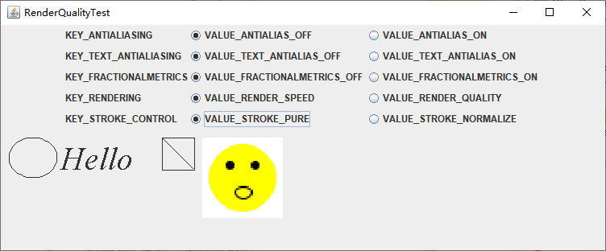

虽然在大多数情况下 `Java 2D API` 的运行速度奇快，但是在某些情况下，你可能希望控制绘图的速度和质量之间的平衡关系。可以通过设置绘图提示来达到此目的。使用 `Graphics2D` 类的 `setRenderingHint` 方法，可以设置一条单一的绘图提示，提示的键和值是在 `RenderingHints` 类中声明。下表会中了可以使用的选项。以 `_DEFAULT` 结尾的值表示某种特定实现将其作为性能与质量之间的良好平衡而所选择的默认值。

| 键                      | 值                                                           | 解释                                                         |
| ----------------------- | ------------------------------------------------------------ | ------------------------------------------------------------ |
| KEY_ANTIALIASING        | VALUE_ANTIALIAS_ON<br />VALUE_ANTIALIAS_OFF<br />VALUE_ANTIALIAS_DEFAULT | 打开或者关闭形状的消除图形锯齿状的特性                       |
| KEY_TEXT_ANTIALIASING   | VALUE_TEXT_ANTIALIAS_ON<br />VALUE_TEXT_ANTIALIAS_OFF<br />VALUE_TEXT_ANTIALIAS_DEFAULT<br />VALUE_TEXT_ANTIALIAS_GASP<br />VALUE_TEXT_ANTIALIAS_LCD_HRGB<br />VALUE_TEXT_ANTIALIAS_LCD_HBGR<br />VALUE_TEXT_ANTIALIAS_LCD_VRGB<br />VALUE_TEXT_ANTIALIAS_LCD_VBGR | 打开或者关闭字体的消除图形锯齿状的特性。当使用 VALUE_TEXT_ANTIALIAS_GASP 这个值时，会查询字体 "派生表" 以确定字体的某种特定自豪是否应该消除图形的锯齿状。LCD 值强制对某种特定显示类型进行子像素绘制 |
| KEY_FRACTIONALMETRICS   | VALUE_FRACTIONALMETRICS_ON<br />VALUE_FRACTIONALMETRICS_OFF<br />VALUE_FRACTIONALMETRICS_DEFAULT | 打开或者关闭小数字符尺寸计算的功能。使用小数字符尺寸的计算功能，将会更好地安排字符的位置 |
| KEY_RENDERING           | VALUE_RENDER_QUALITY<br />VALUE_RENDER_SPEED<br />VALUE_RENDER_DEFAULT | 当其可用时，选定相应的绘图算法，以便获得更高的质量或速度     |
| KEY_STROKE_CONTROL      | VALUE_STROKE_NORMALIZE<br />VALUE_STROKE_PURE<br />VALUE_STROKE_DEFAULT | 选定笔划的位置是由图形加速器（它也许会将笔划的位置调整最多半个像素）控制，还是由强制笔划穿越像素中心的 "纯" 规划计算出来 |
| KEY_DITHERING           | VALUE_DITHER_ENABLE<br />VALUE_DITHER_DISABLE<br />VALUE_DITHER_DEFAULT | 打开或者关闭颜色的浓淡处理功能。通过绘制相似颜色的许多像素组，浓淡处理功能就可以稳定颜色的近似值。（注意，消除锯齿功能可能会与浓淡处理功能相干） |
| KEY_ALPHA_INTERPOLATION | VALUE_ALPHA_INTERPOLATION_QUALITY<br />VALUE_ALPHA_INTERPOLATION_SPEED<br />VALUE_ALPHA_INTERPOLATION_DEFAULT | 打开或者关闭透明度值组合的精确计算功能                       |
| KEY_COLOR_RENDERING     | VALUE_COLOR_RENDER_QUALITY<br />VALUE_COLOR_RENDER_SPEED<br />VALUE_COLOR_RENDER_DEFAULT | 选定颜色渲染的质量或速度。只有在使用了不同的颜色空间时，才会涉及此问题 |
| KEY_INTERPOLATION       | VALUE_INTERPOLATION_NEAREST_NEIGHBOR<br />VALUE_INTERPOLATION_BILINEAR<br />VALUE_INTERPOLATION_BICUBIC | 当对形状进行缩放或者旋转操作时，为像素的插换选择一个规则     |

这些设置中最有用的是消除图形锯齿现象的技术，这种技术消除了斜线和曲线中的 "锯齿"。例如，下面的代码说明了应该如何请求使用消除图形锯齿状功能。

```java
g2.setRenderingHint(RenderingHints.KEY_ANTIALIASING, RenderingHints.VALUE_ANTIALIAS_ON);
```

使用消除图形锯齿状技术对字体的绘制同样是有意义的。

```java
g2.setRenderingHint(RenderingHints.KEY_TEXT_ANTIALIASING, RenderingHints.VALUE_TEXT_ANTIALIAS_ON);
```

可以把一组键/值提示信息对放入映射表中，并且通过调用 `setRenderingHints` 方法一次性地将它们全部设置好。也可以使用任何实现了映射表接口的集合类，当然还可以使用 `RenderingHints` 类本身，它实现了 `Map` 接口，并且在用无参数的构造器来创建对象时，它会提供一个默认的映射表实现。例如：

```java
RenderingHints hints = new RenderingHints(null);
hints.put(RenderingHints.KEY_ANTIALIASING, RenderingHints.VALUE_ANTIALIAS_ON);
hints.put(RenderingHints.KEY_TEXT_ANTIALIASING, RenderingHints.VALUE_TEXT_ANTIALIAS_ON);
g2.setRenderingHints(hints);
```

**示例程序：renderQuality/RenderQualityTestFrame.java**

```java
package renderQuality;

import java.awt.BorderLayout;
import java.awt.Dimension;
import java.awt.Font;
import java.awt.Graphics;
import java.awt.Graphics2D;
import java.awt.GridBagConstraints;
import java.awt.GridBagLayout;
import java.awt.Image;
import java.awt.Insets;
import java.awt.RenderingHints;
import java.awt.geom.Ellipse2D;
import java.awt.geom.Line2D;
import java.awt.geom.Rectangle2D;

import javax.swing.ButtonGroup;
import javax.swing.ImageIcon;
import javax.swing.JComponent;
import javax.swing.JFrame;
import javax.swing.JLabel;
import javax.swing.JPanel;
import javax.swing.JRadioButton;

public class RenderQualityTestFrame extends JFrame {

	private RenderQualityComponent canvas;
	private JPanel buttonBox;
	private RenderingHints hints;
	private int r;
	
	public RenderQualityTestFrame() {
		buttonBox = new JPanel();
		buttonBox.setLayout(new GridBagLayout());
		hints = new RenderingHints(null);
		
		makeButtons("KEY_ANTIALIASING", "VALUE_ANTIALIAS_OFF", "VALUE_ANTIALIAS_ON");
		makeButtons("KEY_TEXT_ANTIALIASING", "VALUE_TEXT_ANTIALIAS_OFF","VALUE_TEXT_ANTIALIAS_ON");
		makeButtons("KEY_FRACTIONALMETRICS", "VALUE_FRACTIONALMETRICS_OFF", "VALUE_FRACTIONALMETRICS_ON");
		makeButtons("KEY_RENDERING", "VALUE_RENDER_SPEED", "VALUE_RENDER_QUALITY");
		makeButtons("KEY_STROKE_CONTROL", "VALUE_STROKE_PURE", "VALUE_STROKE_NORMALIZE");
		canvas = new RenderQualityComponent();
		canvas.setRenderingHints(hints);
		add(canvas, BorderLayout.CENTER);
		add(buttonBox, BorderLayout.NORTH);
		pack();
	}
	
	/**
	 * Makes a set of buttons for a rendering hint key and values.
	 * @param key the key name
	 * @param value1 the name of the first value for the key
	 * @param value2 the name of the second value for the key
	 */
	void makeButtons(String key, String value1, String value2) {
		try {
			final RenderingHints.Key k = (RenderingHints.Key) RenderingHints.class.getField(key).get(null);
			final Object v1 = RenderingHints.class.getField(value1).get(null);
			final Object v2 = RenderingHints.class.getField(value2).get(null);
			JLabel label = new JLabel(key);
			
			buttonBox.add(label, new GBC(0, r).setAnchor(GBC.WEST));
			ButtonGroup group = new ButtonGroup();
			JRadioButton b1 = new JRadioButton(value1, true);
			
			buttonBox.add(b1, new GBC(1, r).setAnchor(GBC.WEST));
			group.add(b1);
			b1.addActionListener(event -> {
				hints.put(k,  v1);
				canvas.setRenderingHints(hints);
			});
			JRadioButton b2 = new JRadioButton(value2, false);
			
			buttonBox.add(b2, new GBC(2, r).setAnchor(GBC.WEST));
			group.add(b2);
			b2.addActionListener(event -> {
				hints.put(k, v2);
				canvas.setRenderingHints(hints);
			});
			hints.put(k, v1);
			r++;
		} catch (Exception e) {
			e.printStackTrace();
		}
	}
}

/**
 * This component produces a drawing that shows the effect of rendering hints.
 */
class RenderQualityComponent extends JComponent {
	
	private static final Dimension PREFERRED_SIZE = new Dimension(750, 150);
	private RenderingHints hints = new RenderingHints(null);
	private Image image;
	
	public RenderQualityComponent() {
		image = new ImageIcon(getClass().getResource("face.gif")).getImage();
	}
	
	@Override
	protected void paintComponent(Graphics g) {
		Graphics2D g2 = (Graphics2D) g;
		g2.setRenderingHints(hints);
		
		g2.draw(new Ellipse2D.Double(10, 10, 60, 50));
		g2.setFont(new Font("Serif", Font.ITALIC, 40));
		g2.drawString("Hello", 75, 50);
		
		g2.draw(new Rectangle2D.Double(200, 10, 40, 40));
		g2.draw(new Line2D.Double(201, 11, 239, 49));
		
		g2.drawImage(image, 250, 10, 100, 100, null);
	}
	
	/**
	 * Sets the hints and repaints.
	 * @param h the rendering hints
	 */
	public void setRenderingHints(RenderingHints h) {
		hints = h;
		repaint();
	}
	
	@Override
	public Dimension getPreferredSize() {
		return PREFERRED_SIZE;
	}
}

class GBC extends GridBagConstraints {
	
	public GBC(int gridx, int gridy) {
		this.gridx = gridx;
		this.gridy = gridy;
	}
	
	public GBC(int gridx, int gridy, int gridwidth, int gridheight) {
		this.gridx = gridx;
		this.gridy = gridy;
		this.gridwidth = gridwidth;
		this.gridheight = gridheight;
	}
	
	public GBC setAnchor(int anchor) {
		this.anchor = anchor;
		return this;
	}
	
	public GBC setFill(int fill) {
		this.fill = fill;
		return this;
	}
	
	public GBC setWeight(double weightx, double weighty) {
		this.weightx = weightx;
		this.weighty = weighty;
		return this;
	}
	
	public GBC setInsets(int distance) {
		this.insets = new Insets(distance, distance, distance, distance);
		return this;
	}
	
	public GBC setInsets(int top, int left, int bottom, int right) {
		this.insets = new Insets(top, left, bottom, right);
		return this;
	}
	
	public GBC setIpad(int ipadx, int ipady) {
		this.ipadx = ipadx;
		this.ipady = ipady;
		return this;
	}
}
```

运行效果如下：

