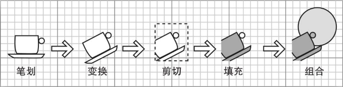

如果要绘制一个形状，可以按照如下步骤操作：

1）获得一个 `Graphics2D` 类的对象，该类是 `Graphics` 类的子类。自 `Java SE 1.2` 以来，`paint` 和 `paintComponent` 等方法就能够自动地接收一个 `Graphics2D` 类的对象，这时可以直接使用如下的转型：

```java
public void paintComponent(Graphics g) {
    Graphics2D g2 = (Graphics2D) g;
    ...
}
```

2）使用 `setRenderingHints` 方法来设置绘图提示，它提供了速度与绘图质量之间的一种平衡。

```java
RendderingHints hints = ...;
g2.setRenderingHints(hints);
```

3）使用 `setStroke` 方法来设置笔划，笔划用于绘制形状的边框。可以选择边框的粗细和线段的虚实。

```java
Stroke stroke = ...;
g2.setStroke(stroke);
```

4）使用 `setPaint` 方法来设置着色，着色法用于填充诸如笔划路径或者形状内部等区域的颜色。可以创建单色、渐变色或者平铺的填充模式。

```java
Paint paint = ...;
g2.setPaint(paint);
```

5）使用 `clip` 方法来设置剪切区域。

```java
Shape clip = ...;
g2.clip(clip);
```

6）使用 `transform` 方法设置一个从用户控件到设备控件的变换方式。如果使用变换方式比使用像素坐标更容易定义在坐标系统中的形状，那么就可以使用变化方式。

```java
AffineTransform transform = ...;
g2.transform(transform);
```

7）使用 `setComposite` 方法设置一个组合规则，用来描述如何将新像素与现有的像素组合起来。

```java
Composite composite = ...;
g2.setComposite(composite);
```

8）建立一个形状，`Java 2D API` 提供了用来组合各种形状的许多形状对象和方法。

```java
Shape shape = ...;
```

9）绘制或者填充该形状。如果要绘制该形状，那么它的边框就会用笔划画出来。如果要填充该形状，那么它的内部就会被着色。

```java
g2.draw(shape);
g2.fill(shape);
```

各种不同的 `set` 方法只是用于设置 `2D` 图形上下文的状态，它们并不进行任何实际的绘图操作。同样，在构建 `shape` 对象时，也不进行任何绘图操作。只有在调用 `draw` 或者 `fill` 方法时，才会绘制出图形的形状，而就在此刻，这个新的图形由绘图操作流程计算出来。



<center><b>绘图操作流程</b></center>

在绘图流程中，需要以下这些操作步骤来绘制一个形状：

1）用笔划画出形状的线条；

2）对形状进行变换操作；

3）对形状进行剪切。如果形状与剪切区域之间没有任何相交的地方，那么就不用执行该操作；

4）对剪切后的形状进行填充；

5）把填充后的形状与已有的形状进行组合。