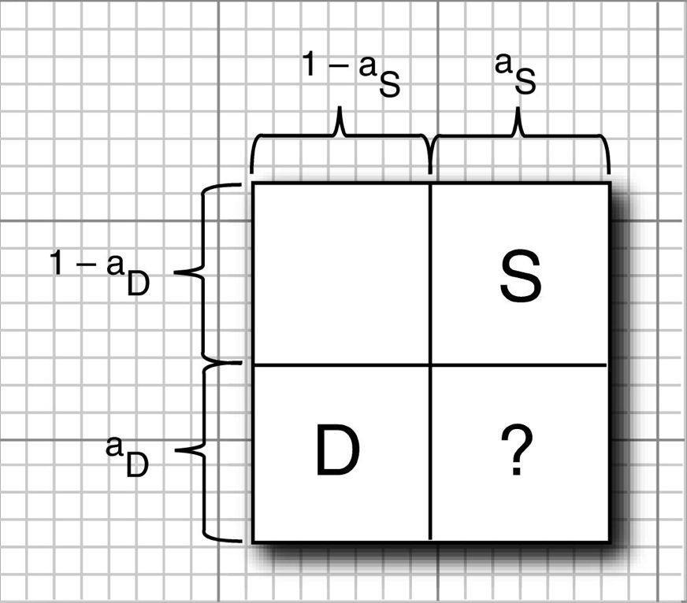

在 Java 2D API 中，透明是由一个透明度通道（alpha channel）来描述的。每个像素，除了它的红、绿和蓝色部分外，还有一个介于0（完全透明）和1（部分透明）之间的透明度（alpha）值。例如，图11-21中的矩形填充了一种淡黄色，透明度为50%：

```java
new Color(0.7F, 0.7F, 0.0F, 0.5F);
```

现在让我们看一看如果将两个形状重叠在一起时将会出现什么情况。必须把源像素和目标像素的颜色和透明度值混合或者组合起来。从事计算机图形学研究的 `Porter` 和 `Duff` 已经阐明了在这个混合过程中的12种可能的组合原则，Java 2D API 实现了所有的这些原则。在继续介绍这个问题之前，需要指出的是，这些原则中只有两个原则有实际的意义。如果你发现这些原则晦涩难懂或者难以搞清楚，那么只使用 `SRC_OVER` 原则就可以了。它是 `Graphics2D` 对象的默认原则，并且它产生的结果最直接。 

下面是这些规则的原理。假设你有了一个透明度值为 aS 的源像素，在该图像中，已经存在了一个透明度值为 aD 的目标像素，你想把两个像素组合起来。下图的示意图显示了如何设计一个像素的组合原则。



Porter 和 Duff 将透明度值作为像素颜色将被使用的概率。从源像素的角度来看，存在一个概率 aS，它是源像素颜色被使用的概率；还存在一个概率 1－aS，它是不在乎是否使用该像素颜色的概率。同样的原则也适用于目标像素。当组合颜色时，我们假设源像素的概率和目标像素的概率是不相关的。那么正如上图所示，有四种组合情况。如果源像素想要使用它的颜色，而目标像素也不在乎，那么很自然的，我们就只使用源像素的颜色。这也是为什么右上角的矩形框用 “S” 来标志的原因了，这种情况的概率为 aS·（1－aD）。同理，左下角的矩形框用 “D” 来标志。如果源像素和目标像素都想选择自己的颜色，那该怎么办才好呢？这里就要应用 Porter-Duff 原则了。如果我们认为源像素比较重要，那么我们在右下角的矩形框内也标志上一个 “S”。这个规则被称为 SRC_OVER。在这个规则中，我们赋予源像素颜色的权值 aS，目标像素颜色的权值为（1－aS）·aD，然后将它们组合起来。 

这样产生的视觉效果是源像素与目标像素相混合的结果，并且优先选择给定的源像素的颜色。特别是，如果 aS 为 1，那么根本就不用考虑目标像素的颜色。如果 aS 为 0，那么源像素将是完全透明的，而目标像素颜色则是不变的。 

还有其他的规则，可以根据置于概率示意图各个框中的字母来理解这些规则的概念。下表和下图显示了 Java 2D API 支持的所有这些规则。下图中的各个图像显示了当你使用透明度值为 0.75 的矩形源区域和透明度值为1.0 的椭圆目标区域组合时，所显示的各种组合效果。


<center><b>Porter-Duff 组合规则</b></center>

| 规则       | 解释                                                         |
| ---------- | ------------------------------------------------------------ |
| `CLEAR`    | 源像素清除目标像素                                           |
| `SRC`      | 源像素覆盖目标像素和空像素                                   |
| `DST`      | 源像素不影响目标像素                                         |
| `SRC_OVER` | 源像素和目标像素混合，并且覆盖空像素                         |
| `DST_OVER` | 源像素不影响目标像素，并且不覆盖空像素                       |
| `SRC_IN`   | 原像素覆盖目标像素                                           |
| `SRC_OUT`  | 源像素清除目标像素，并且覆盖空像素                           |
| `DTS_IN`   | 源像素的透明度值修改目标像素的透明度值                       |
| `DST_OUT`  | 源像素的透明度值取反修改目标像素的透明度值                   |
| `SRC_ATOP` | 源像素和目标像素相混合                                       |
| `DST_ATOP` | 源像素的透明度值修改目标像素的透明度值。源像素覆盖空像素     |
| `XOR`      | 源像素的透明度值取反修改目标像素的透明度值。源像素覆盖空像素。 |

<center><b>Porter-Duff 组合规则</b></center>

你可以使用 `Graphics2D` 类的 `setComposite` 方法安装一个实现了 `Composite` 接口的类的对象。Java 2D API 提供了这样的一个类，即 `AlphaComposite` 它实现了上图中的所有的 Porter-Duff 规则。

`AlphaComposite` 类的工厂方法 `getInstance` 用来产生 `AlphaComposite` 对象，此时需要提供用于源像素的规则和透明度值。例如，可以考虑使用下面的代码：

```java
int rule = AlphaComposite.SRC_OVER;
float alpha = 0.5f;
g2.setCoposite(AlphaComposite.getInstance(rule, alpha));
g2.setPaint(Color.blue);
g2.fill(rectangle);
```

该程序有一个重要的缺陷：它不能保证和屏幕相对应的图形上下文一定具有透明通道。（实际上，它通常没有这个透明通道）。当像素被放到没有透明通道的目标像素之上的时候，这些像素的颜色会与目标像素的透明度值相乘，而其透明度值却被弃用了。因为许多 Porter-Duff 规则都使用目标像素的透明度值，因此目标像素的透明通道是很重要的。由于这个原因，我们使用了一个采用 ARGB 颜色模型的缓存图像来组合各种形状。在图像被组合后，我们就将产生的图像在屏幕上绘制出来：

```java
BufferedImage image = new BufferedImage(getWidth(), getHeight(), BufferedImage.TYPE_INT_ARGB);
Graphics2D gImage = image.createGraphics();
// now draw to gImage
g2.drawImage(image, null, 0, 0);
```

**示例程序：**

1.   composite/CompositeTestFrame.java

     ```java
     package composite;
     
     import java.awt.BorderLayout;
     
     import javax.swing.JComboBox;
     import javax.swing.JFrame;
     import javax.swing.JLabel;
     import javax.swing.JPanel;
     import javax.swing.JSlider;
     import javax.swing.JTextField;
     
     /**
      * This frame contains a combo box to choose a composition rule, a slider to
      * change the source alpha channel, and a component that shows the composition.
      */
     class CompositeTestFrame extends JFrame {
     	private static final int DEFAULT_WIDTH = 400;
     	private static final int DEFAULT_HEIGHT = 400;
     
     	private CompositeComponent canvas;
     	private JComboBox<Rule> ruleCombo;
     	private JSlider alphaSlider;
     	private JTextField explanation;
     
     	public CompositeTestFrame() {
     		setSize(DEFAULT_WIDTH, DEFAULT_HEIGHT);
     
     		canvas = new CompositeComponent();
     		add(canvas, BorderLayout.CENTER);
     
     		ruleCombo = new JComboBox<>(new Rule[] { new Rule("CLEAR", "  ", "  "), new Rule("SRC", " S", " S"),
     				new Rule("DST", "  ", "DD"), new Rule("SRC_OVER", " S", "DS"), new Rule("DST_OVER", " S", "DD"),
     				new Rule("SRC_IN", "  ", " S"), new Rule("SRC_OUT", " S", "  "), new Rule("DST_IN", "  ", " D"),
     				new Rule("DST_OUT", "  ", "D "), new Rule("SRC_ATOP", "  ", "DS"), new Rule("DST_ATOP", " S", " D"),
     				new Rule("XOR", " S", "D "), });
     		ruleCombo.addActionListener(event -> {
     			Rule r = (Rule) ruleCombo.getSelectedItem();
     			canvas.setRule(r.getValue());
     			explanation.setText(r.getExplanation());
     		});
     
     		alphaSlider = new JSlider(0, 100, 75);
     		alphaSlider.addChangeListener(event -> canvas.setAlpha(alphaSlider.getValue()));
     		JPanel panel = new JPanel();
     		panel.add(ruleCombo);
     		panel.add(new JLabel("Alpha"));
     		panel.add(alphaSlider);
     		add(panel, BorderLayout.NORTH);
     
     		explanation = new JTextField();
     		add(explanation, BorderLayout.SOUTH);
     
     		canvas.setAlpha(alphaSlider.getValue());
     		Rule r = ruleCombo.getItemAt(ruleCombo.getSelectedIndex());
     		canvas.setRule(r.getValue());
     		explanation.setText(r.getExplanation());
     	}
     }
     ```

2.   composite/CompositeComponent.java

     ```java
     package composite;
     
     import java.awt.AlphaComposite;
     import java.awt.Color;
     import java.awt.Graphics;
     import java.awt.Graphics2D;
     import java.awt.Shape;
     import java.awt.geom.Ellipse2D;
     import java.awt.geom.Rectangle2D;
     import java.awt.image.BufferedImage;
     
     import javax.swing.JComponent;
     
     /**
      * This component draws two shapes, composed with a composition rule.
      */
     class CompositeComponent extends JComponent {
     	private int rule;
     	private Shape shape1;
     	private Shape shape2;
     	private float alpha;
     
     	public CompositeComponent() {
     		shape1 = new Ellipse2D.Double(100, 100, 150, 100);
     		shape2 = new Rectangle2D.Double(150, 150, 150, 100);
     	}
     
     	public void paintComponent(Graphics g) {
     		Graphics2D g2 = (Graphics2D) g;
     
     		BufferedImage image = new BufferedImage(getWidth(), getHeight(), BufferedImage.TYPE_INT_ARGB);
     		Graphics2D gImage = image.createGraphics();
     		gImage.setPaint(Color.red);
     		gImage.fill(shape1);
     		AlphaComposite composite = AlphaComposite.getInstance(rule, alpha);
     		gImage.setComposite(composite);
     		gImage.setPaint(Color.blue);
     		gImage.fill(shape2);
     		g2.drawImage(image, null, 0, 0);
     	}
     
     	/**
     	 * Sets the composition rule.
     	 * 
     	 * @param r the rule (as an AlphaComposite constant)
     	 */
     	public void setRule(int r) {
     		rule = r;
     		repaint();
     	}
     
     	/**
     	 * Sets the alpha of the source.
     	 * 
     	 * @param a the alpha value between 0 and 100
     	 */
     	public void setAlpha(int a) {
     		alpha = (float) a / 100.0F;
     		repaint();
     	}
     }
     ```

3.   composite/Rule.java

     ```java
     package composite;
     
     import java.awt.AlphaComposite;
     
     /**
      * This class describes a Porter-Duff rule.
      */
     class Rule {
     	private String name;
     	private String porterDuff1;
     	private String porterDuff2;
     
     	/**
     	 * Constructs a Porter-Duff rule.
     	 * 
     	 * @param n   the rule name
     	 * @param pd1 the first row of the Porter-Duff square
     	 * @param pd2 the second row of the Porter-Duff square
     	 */
     	public Rule(String n, String pd1, String pd2) {
     		name = n;
     		porterDuff1 = pd1;
     		porterDuff2 = pd2;
     	}
     
     	/**
     	 * Gets an explanation of the behavior of this rule.
     	 * 
     	 * @return the explanation
     	 */
     	public String getExplanation() {
     		StringBuilder r = new StringBuilder("Source ");
     		if (porterDuff2.equals("  "))
     			r.append("clears");
     		if (porterDuff2.equals(" S"))
     			r.append("overwrites");
     		if (porterDuff2.equals("DS"))
     			r.append("blends with");
     		if (porterDuff2.equals(" D"))
     			r.append("alpha modifies");
     		if (porterDuff2.equals("D "))
     			r.append("alpha complement modifies");
     		if (porterDuff2.equals("DD"))
     			r.append("does not affect");
     		r.append(" destination");
     		if (porterDuff1.equals(" S"))
     			r.append(" and overwrites empty pixels");
     		r.append(".");
     		return r.toString();
     	}
     
     	public String toString() {
     		return name;
     	}
     
     	/**
     	 * Gets the value of this rule in the AlphaComposite class.
     	 * 
     	 * @return the AlphaComposite constant value, or -1 if there is no matching
     	 *         constant
     	 */
     	public int getValue() {
     		try {
     			return (Integer) AlphaComposite.class.getField(name).get(null);
     		} catch (Exception e) {
     			return -1;
     		}
     	}
     }
     ```

运行效果如下：

