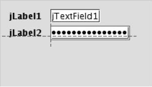
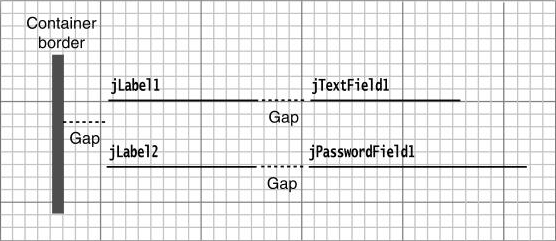
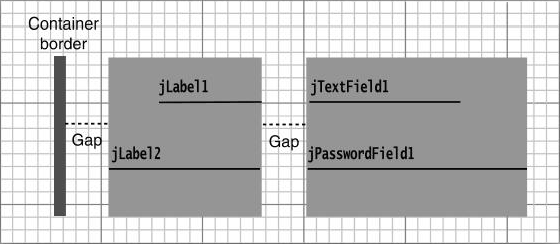
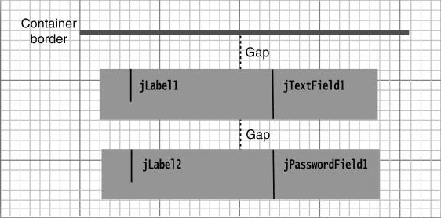

上面的界面转换成组布局代码为：

```java
layout.setHorizontalGroup(
	layout.createParallelGroup(GroupLayout.Alignment.LEADING)
	.addGroup(layout.createSequentialGroup()
             .addContainerGap()
             .addGroup(layout.createParallelGroup(GroupLayout.Alignment.LEADING)
                      .addGroup(layout.createSequentialGroup()
                               .addComponent(jLabel1)
                               .addPreferredGap(LayoutStyle.ComponentPlacement.RELATED)
                               .addComponent(jTextField1))
                      .addGroup(layout.createSequentialGroup()
                               .addCompoent(jLabel2)
                               .addPreferredGap(LayoutStyle.ComponentPlacement.RELATED)
                               .addComponent(jPasswordField1)))
             .addContainerGap(222, Short.MAX_VALUE)));

layout.setVerticalGroup(
	layout.createParallelGroup(GroupLayout.Alignment.LEADING)
	.addGroup(layout.createSequentialGroup()
             .addContainerGap()
             .addGroup(layout.createParallelGroup(GroupLayout.Alignment.BASELINE)
                      .addComponent(jLabel1)
                      .addComponent(jTextField1))
             .addPreferredGap(LayoutStyle.ComponentPlacement.RELATED)
             .addGroup(layout.createParallelGroup(GroupLayout.Alignment.BASELINE)
                      .addComponent(jLabel2)
                      .addComponent(jPasswordField1))
             .addContainerGap(244, Short.MAX_VALUE)));
```

可以通过将组件放入 `GroupLayout.SequentialGroup` 或者 `GroupLayout.ParallelGroup` 对象中将它们组织起来。这些类是 `GroupLayout.Group` 的子类。在组中可以包含组件、间距和内嵌的组。由于组类中的各种 `add` 方法都返回组对象，因此可以像下面这样将方法调用串联在一起：

```java
group.addComponent(...).addPreferredGap(...).addComponent(...);
```

正像上面示例代码中所看到的，组布局分别对水平和垂直布局进行计算。

为了能够看到水平计算的效果，假设组件都被压平了，因此高度为 0，如下所示：



有两个平行的组件序列，对应的代码（略有简化）是：

```java
.addContainerGap()
    .addGroup(layout.createParallelGroup()
             .addGroup(layout.createSequentialGroup()
                      .addComponent(jLabel1)
                      .addPreferredGap(LayoutStyle.ComponentPlacement.RELATED)
                      .addComponent(jTextField1))
             .addGroup(layout.createSequentialGroup()
                      .addComponent(jLabel2)
                      .addPreferredGap(LayoutStyle.ComponentPlacement.RELATED)
                      .addComponent(jPasswordField1)))
```

但是，请稍等，上面这段代码有问题。如果两个标签的长度不一样，那么文本域和密码域就无法对齐。

必须通知布局管理器，这里希望将组件对齐：

```java
.addGroup(layout.createSequentialGroup()
         .addContainerGap()
         .addGroup(layout.createParallelGroup(GroupLayout.Alignment.LEADING)
                  .addComponent(jLabel1, GroupLayout.Alignment.TRAILING)
                  .addComponent(jLabel2, GroupLayout.Alignment.TRAILING))
         .addPreferredGap(LayoutStyle.ComponentPlacement.RELATED)
         .addGroup(layout.createParallelGroup(GroupLayout.Alignment.LEADING)
                  .addComponent(jTextField1)
                  .addComponent(jPasswordField1)))
```

现在，标签和域分别置于两个平行组中。第一组的对齐方式是 `TRAILING`（这意味着当文本方向是自左向右时，应该右对齐）：



鉴于完整性的考虑，下面看一下垂直计算。此时，应该将组件看作没有宽度。这里有一个顺序排列的组，其中包含了两个用间距分隔的平行组：



对应的代码是：

```java
layout.createSequentialGroup()
    .addContainerGap()
    .addGroup(layout.createParallelGroup(GroupLayout.Alignment.BASELINE)
             .addComponent(jLabel1)
             .addComponent(jTextField1))
    .addPreferredGap(LayoutStyle.ComponentPlacement.RELATED)
    .addGroup(layout.createParallelGroup(GroupLayout.Alignment.BASELINE)
             .addComponent(jLabel2)
             .addComponent(jPasswordField2))
```

**示例代码：**

```java
import java.awt.EventQueue;
import java.awt.Font;
import java.awt.event.ActionListener;

import javax.swing.BorderFactory;
import javax.swing.GroupLayout;
import javax.swing.JCheckBox;
import javax.swing.JComboBox;
import javax.swing.JFrame;
import javax.swing.JLabel;
import javax.swing.JScrollPane;
import javax.swing.JTextArea;
import javax.swing.LayoutStyle;
import javax.swing.SwingConstants;

public class GroupLayoutTest {

	public static void main(String[] args) {
		EventQueue.invokeLater(() -> {
			JFrame frame = new FontFrame();
			frame.setTitle("GroupLayout test");
			frame.setDefaultCloseOperation(JFrame.EXIT_ON_CLOSE);
			frame.setVisible(true);
		});
	}
	
}

class FontFrame extends JFrame {
	
	public static final int TEXT_ROWS = 10;
	public static final int TEXT_COLUMNS = 20;
	
	private JComboBox<String> face;
	private JComboBox<Integer> size;
	private JCheckBox bold;
	private JCheckBox italic;
	private JScrollPane pane;
	private JTextArea sample;
	
	public FontFrame() {
		ActionListener listener = event -> updateSample();
		
		// construct components
		
		JLabel faceLabel = new JLabel("Face: ");
		face = new JComboBox<>(new String[] { "Serif", "SansSerif", "Monospaced", "Dialog", "DialogInput" });
		face.addActionListener(listener);
		
		JLabel sizeLabel = new JLabel("Size: ");
		size = new JComboBox<>(new Integer[] { 8, 10, 12, 15, 18, 24, 36, 48});
		size.addActionListener(listener);
		
		bold = new JCheckBox("Bold");
		bold.addActionListener(listener);
		
		italic = new JCheckBox("Italic");
		italic.addActionListener(listener);
		
		sample = new JTextArea(TEXT_ROWS, TEXT_COLUMNS);
		sample.setText("The quick brown fox jumps over the lazy dog");
		sample.setEditable(false);
		sample.setLineWrap(true);
		sample.setBorder(BorderFactory.createEtchedBorder());
		
		pane = new JScrollPane(sample);
		
		GroupLayout layout = new GroupLayout(getContentPane());
		setLayout(layout);
		layout.setHorizontalGroup(layout.createParallelGroup(GroupLayout.Alignment.LEADING)
				.addGroup(
						layout.createSequentialGroup().addContainerGap().addGroup(
								layout.createParallelGroup(GroupLayout.Alignment.LEADING).addGroup(
										GroupLayout.Alignment.TRAILING,
										layout.createSequentialGroup().addGroup(
												layout.createParallelGroup(GroupLayout.Alignment.TRAILING)
													.addComponent(faceLabel).addComponent(sizeLabel))
										.addPreferredGap(LayoutStyle.ComponentPlacement.RELATED)
										.addGroup(
												layout.createParallelGroup(
														GroupLayout.Alignment.LEADING, false)
													.addComponent(size).addComponent(face)))
								.addComponent(italic).addComponent(bold)).addPreferredGap(
										LayoutStyle.ComponentPlacement.RELATED).addComponent(pane)
						.addContainerGap()));
		
		layout.linkSize(SwingConstants.HORIZONTAL, new java.awt.Component[] { face, size });
		
		layout.setVerticalGroup(layout.createParallelGroup(GroupLayout.Alignment.LEADING)
				.addGroup(
						layout.createSequentialGroup().addContainerGap().addGroup(
								layout.createParallelGroup(GroupLayout.Alignment.LEADING).addComponent(
										pane, GroupLayout.Alignment.TRAILING).addGroup(
												layout.createSequentialGroup().addGroup(
														layout.createParallelGroup(GroupLayout.Alignment.BASELINE)
														.addComponent(face).addComponent(faceLabel))
												.addPreferredGap(LayoutStyle.ComponentPlacement.RELATED)
												.addGroup(
														layout.createParallelGroup(
																GroupLayout.Alignment.BASELINE).addComponent(size)
														.addComponent(sizeLabel)).addPreferredGap(
																LayoutStyle.ComponentPlacement.RELATED).addComponent(
																italic, GroupLayout.DEFAULT_SIZE, 
																GroupLayout.DEFAULT_SIZE, Short.MAX_VALUE)
												.addPreferredGap(LayoutStyle.ComponentPlacement.RELATED)
												.addComponent(bold, GroupLayout.DEFAULT_SIZE,
														GroupLayout.DEFAULT_SIZE, Short.MAX_VALUE)))
						.addContainerGap()));
		
		pack();
	}
	
	public void updateSample() {
		String fontFace = (String) face.getSelectedItem();
		int fontStyle = (bold.isSelected() ? Font.BOLD : 0) + (italic.isSelected() ? Font.ITALIC : 0);
		int fontSize = size.getItemAt(size.getSelectedIndex());
		Font font = new Font(fontFace, fontStyle, fontSize);
		sample.setFont(font);
		sample.repaint();
	}
}
```

