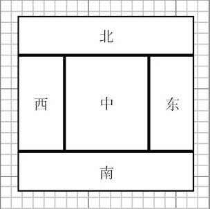

边框布局管理器（border layout manager）是每个 `JFrame` 的内容窗格的默认布局管理器。流布局管理器完全控制每个组件的放置位置，边框布局管理器则不然，它允许为每个组件选择一个放置位置。可以选择把组件放在内容窗格的中部、北部、南部、东部或者西部。



例如：

```java
frame.add(component, BorderLayout.SOUTH);
```

先放置边缘组件，剩余的可用空间由中间组件占据。当容器被缩放时，边缘组件的尺寸不会改变，而中部组件的大小会发生变化。在添加组件时可以指定 `BorderLayout` 类中的 CENTER、NORTH、SOUTH、EAST 和  WEST 常量。并非需要占用所有的位置，如果没有提供任何值，系统默认为 CENTER。

> 提示：`BorderLayout` 常量定义为字符串。例如：`BorderLayout.SOUTH` 定义为字符串 "SOUTH"。很多程序员喜欢直接使用字符串，因为这些字符串比较简短。然而，如果字符串拼写有误，编译器不会捕获错误。

与流布局不同，边框布局会扩展所有组件的尺寸以便填满可用空间（流布局将维持每个组件的最佳尺寸）。当将一个按钮添加到容器中时会出现问题：

```java
frame.add(yellowButton, BorderLayout.SOUTH);	// don't
```

按钮将会扩展至填满框架的整个南部区域。而且，如果再将另外一个按钮添加到南部区域，就会取代第一个按钮。

解决这个问题的常见方法是使用另外一个面板。例如：

```java
JPanel panel = new JPanel();
panel.add(yellowButton);
panel.add(blueButton);
panel.add(redButton);
frame.add(panel, BorderLayout.SOUTH);
```

## java.awt.BorderLayout 1.0

+ `BorderLayout()`

+ `BorderLayout(int hgap, int vgap)`

  构造一个新的 `BorderLayout` 对象。

  参数： hgap	以像素为单位的水平间距（如果为负值，则强行重叠）

  ​			 vgap	以像素为单位的垂直间距（如果为负值，则强行重叠）


