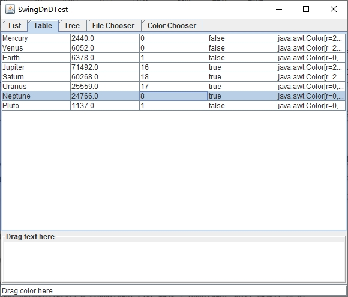
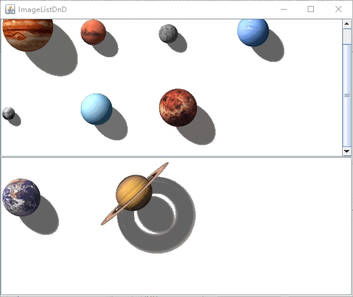

[toc]

可以使用**拖曳源**内部的姿态来初始化一个拖曳操作，通常需要选定一个或者多个元素，然后将选定定目标脱离它的初始位置。当你在接收放置操作放置目标上释放鼠标按键时，放置目标将查询拖曳源，进而了解关于放置元素的信息，并且启动某个恰当的操作。

如果在拖曳的时候按住 <kbd>Ctrl</kbd> 键，那么放置操作的类型将从移动操作变为拷贝操作，该文件的一份拷贝被放入此目录中。如果同时按住了 <kbd>Shift</kbd> 和 <kbd>Ctrl</kbd> 键那么该文件第一个链接将被放入到此目录中。

因此，有三种带有不同姿态的放置操作：

+ 移动
+ 拷贝
+ 链接

### 1. Swing 对数据传递的支持

从 `Java SE 1.4` 开始，多种 `Swing` 构件就已经内置了对数据传递的支持。我们可以从大量的构件中拖曳选中的文本，也可以将文本放置到文本构件中。为了向后兼容性，我们必须使用 `setDragEnbled` 方法来激活拖曳功能，而放置功能总是会得到支持的。

<center>Swing 中支持数据传递的构件</center>

| 构件                                  | 拖曳源                         | 放置目标           |
| ------------------------------------- | ------------------------------ | ------------------ |
| `JFileChooser`                        | 导出文件列表                   | 无                 |
| `JColorChooser`                       | 导出颜色对象                   | 接收颜色对象       |
| `JTextField` `JFormattedTextField`    | 导出选定的文本                 | 接收文本           |
| `JPasswordField`                      | 无（由于安全的原因）           | 接收文本           |
| `JTextArea` `JTextPane` `JEditorPane` | 导出选定的文本                 | 接收文本和文件列表 |
| `JList` `JTable` `JTree`              | 导出所选择的文本描述（只复制） | 无                 |

> 提示：`java.awt.dnd` 包提供了一个底层的拖放 `API`，它形成了 `Swing` 拖放的基础。

`Swing` 包提供了一个潜在的非常有用的机制，可以迅速地将一个构件转换成一个拖曳源和放置目标。我们可以为给定的属性安装一个传递处理器，例如：

```java
textField.setTransferHandler(new TransferHandler("background"));
```

通过把传递处理器安装在文本区域中，就可以禁用标准的传递处理器。你再也不能在此文本域中进行剪切、拷贝、粘贴、拖曳或者放置操作了。

**示例程序：**

**SwingDnDTest.java**

```java
import javax.swing.*;

/**
 * This program demonstrates the basic Swing support for drag and drop.
 */
public class SwingDnDTest {
    public static void main(String[] args) {
        JFrame frame =new SwingDnDFrame();
        frame.setTitle("SwingDnDTest");
        frame.setDefaultCloseOperation(JFrame.EXIT_ON_CLOSE);
        frame.setVisible(true);
    }
}
```

**SwingDnDFrame.java**

```java
import javax.swing.*;
import javax.swing.border.EtchedBorder;
import javax.swing.border.TitledBorder;
import java.awt.*;

public class SwingDnDFrame extends JFrame {

    public SwingDnDFrame() {
        JTabbedPane tabbedPane = new JTabbedPane();

        JList<String> list = SampleComponents.list();
        tabbedPane.addTab("List", list);
        JTable table = SampleComponents.table();
        tabbedPane.addTab("Table", table);
        JTree tree = SampleComponents.tree();
        tabbedPane.addTab("Tree", tree);
        JFileChooser fileChoose = new JFileChooser();
        tabbedPane.addTab("File Chooser", fileChoose);
        JColorChooser colorChooser = new JColorChooser();
        tabbedPane.addTab("Color Chooser", colorChooser);

        final JTextArea textArea = new JTextArea(4, 40);
        JScrollPane scrollPane = new JScrollPane(textArea);
        scrollPane.setBorder(new TitledBorder(new EtchedBorder(), "Drag text here"));

        JTextField textField = new JTextField("Drag color here");
        textField.setTransferHandler(new TransferHandler("background"));

        tabbedPane.addChangeListener(event -> textArea.setText(""));

        tree.setDragEnabled(true);
        table.setDragEnabled(true);
        list.setDragEnabled(true);
        fileChoose.setDragEnabled(true);
        colorChooser.setDragEnabled(true);
        textField.setDragEnabled(true);

        add(tabbedPane, BorderLayout.NORTH);
        add(scrollPane, BorderLayout.CENTER);
        add(textField, BorderLayout.SOUTH);
        pack();
    }
}
```

**SampleComponents.java**

```java
import javax.swing.*;
import javax.swing.tree.DefaultMutableTreeNode;
import java.awt.*;

public class SampleComponents {

    public static JTree tree() {
        DefaultMutableTreeNode root = new DefaultMutableTreeNode("World");
        DefaultMutableTreeNode country = new DefaultMutableTreeNode("USA");
        root.add(country);
        DefaultMutableTreeNode state = new DefaultMutableTreeNode("California");
        country.add(state);
        DefaultMutableTreeNode city = new DefaultMutableTreeNode("San Jose");
        state.add(city);
        city = new DefaultMutableTreeNode("Cupertino");
        state.add(city);
        state = new DefaultMutableTreeNode("Michigan");
        country.add(state);
        city = new DefaultMutableTreeNode("Ann Arbor");
        state.add(city);
        country = new DefaultMutableTreeNode("Germany");
        root.add(country);
        state = new DefaultMutableTreeNode("Schleswing-Holstein");
        country.add(state);
        city = new DefaultMutableTreeNode("Kiel");
        state.add(city);
        return new JTree(root);
    }

    public static JList<String> list() {
        String[] words = { "quick", "brown", "hungry", "wild", "silent", "huge", "private",
                "abstract", "static", "final" };

        DefaultListModel<String> model = new DefaultListModel<>();
        for (String word : words) {
            model.addElement(word);
        }
        return new JList<>(model);
    }

    public static JTable table() {
        Object[][] cells = {{ "Mercury", 2440.0, 0, false, Color.YELLOW },
                { "Venus", 6052.0, 0, false, Color.YELLOW },
                { "Earth", 6378.0, 1, false, Color.BLUE },
                { "Jupiter", 71492.0, 16, true, Color.ORANGE },
                { "Saturn", 60268.0, 18, true, Color.ORANGE },
                { "Uranus", 25559.0, 17, true, Color.BLUE },
                { "Neptune", 24766.0, 8, true, Color.BLUE },
                { "Pluto", 1137.0, 1, false, Color.BLACK }
        };

        String[]columnNames = { "Planet", "Radius", "Moons", "Gaseous", "Color" };
        return new JTable(cells, columnNames);
    }
}
```

运行效果如下：



### 2. 拖曳源

为了定制 `Swing` 构件的拖放行为，必须子类化 `TransferHandler`类。首先，覆写 `getSourceActions` 方法，以表明该构件支持什么样的行为（拷贝、移动、链接）。接下来，覆写 `getTransferable` 方法，以产生 `Transferable` 对象，其过程遵循向剪贴拷贝对象的过程。

如果你希望向不识别拖曳姿态的构件中添加对拖曳操作的支持，则需要由你自己来启动这种传递。例如，下面的代码展示了如何在 `JLabel` 上启动拖曳：

```java
label.addMouseListener(new MouseAdapter() {
    @Override
    public void mousePressed(MouseEvent evt) {
        int mode;
        if ((evt.getModifiers() & (InputEvent.CTRL_MASK | InputEvent.SHIFT_MASK)) != 0) {
            mode = TransferHandler.COPY;
        } else {
            mode = TransferHandler.MOVE;
        }
        JComponent comp = (JComponent) evt.getSource();
        TransferHandler th = comp.getTransferHandler();
        th.exportAsDrag(comp, evt, mode);
    }
});
```

这里，我们只是在用户在标签上点击时启动传递。更复杂的实现还可以观察引起鼠标微量拖曳的鼠标移动。

当用户完成放置行为后，拖曳源传递处理器的 `exportDone` 方法就会被调用，在这个方法中，如果用户执行了移动动作，则应该移除被传递的对象。下面是图像列表的相关实现：

```java
@Override
protected void exportDone(JComponent source, Transferable data, int action) {
    if (action == MOVE) {
        JList list = (JList) source;
        int index = list.getSelectedIndex();
        if (index < 0) return;
        DefaultListModelmodel = (DefaultListModel) list.getModel();
        model.remove(index);
    }
}
```

总结一下，为了使一个构件成为拖曳源，需要添加一个指定了下列内容的传递处理器：

+ 可以支持哪些行为。
+ 可以传输哪些数据。
+ 在执行移动动作之后，如何移除原来的数据。

### 3. 放置目标

要使一个构件成为放置目标，需要设置一个 `TransferHandler`，并实现 `canImport` 和 `importData` 方法。

当用户在放置目标构件上移动鼠标时，`canImport`方法会被连续调用，如果放置是允许的，则返回 `true`。

`canImport` 方法有一个 `TransferHandler.TransferSupport` 类型的参数，通过这个参数，可以获取用户选择的放置动作、放置位置以及要传输的数据。（在 `Java SE6` 之前，调用的是与此不同的一个 `canImport` 方法，它只提供数据风格的列表。）

在 `canImport` 方法中，还可以覆写用户的放置动作。例如，如果用户选择了移动动作，但是移除原有项时不恰当的，那么就可以强制传递处理器使用拷贝动作取而代之。

```java
@Override
public boolean canImport(TransferSupport support) {
    if (support.isDataFlavorSupported(DataFlavor.javaFileListFlavor)) {
        if (support.getUserDropAction() == MOVE) {
            support.setDropAction(COPY);
        }
        return true;
    } else{
        return support.isDataFlavorSupported(DataFlavor.imageFlavor);
    }
}
```

当鼠标在放置目标上移动时，`Swing` 构件 `JList`、`JTable`、`JTree` 和 `JTextComponent` 会给出有关插入位置可视反馈。默认情况下，选中或脱字符被用来表示放置位置。这种方法对用户来说显得很不友好，而且也不灵活，它被设置成默认只是为了向后兼容。应该调用 `setDropMode`方法来选择更恰当的可视反馈。

可以控制被放置的数据是应该覆盖已有项，还是应该插入到已有项的中间。例如：

```java
setDropMode(DropMode.ON_OR_INSERT);
```

<center>放置模式</center>

| 构件             | 支持的放置模式                                               |
| ---------------- | ------------------------------------------------------------ |
| `JList`、`JTree` | `ON`、`INSERT`、`ON_OR_INSERT`、`USE_SELECTION`              |
| `JTable`         | `ON`、`INSERT`、`ON_OR_INSERT`、`INSERT_ROWS`、`INSERT_COLS`、`ON_OR_INSERT_ROWS`、`ON_OR_INSERT_COLS`、`USE_SELECTION` |
| `JTextComponent` | `INSERT`、`USE_SELECTION`（实际上是移动脱字符，而不是选中的字符） |

一旦用户结束了放置姿态，`importData` 方法就会被调用。此时需要从拖曳源获得数据，在 `TransferSupport` 参数上调用 `getTransferable` 方法就可以获得一个对 `Transferable` 对象的引用。

拖放最常用的一种数据类型是 `DataFlavor.javaFileListFlavor`。文件列表描述了要放置到目标上的文件集合，而传递数据就是 `List<File>` 类型的一个对象。下面的代码可以获取这些文件：

```java
DataFlavor[] flavors = transferable.getTransferDataFlavors();
if (Arrays.asList(flavors).contains(DataFlavor.javaFileListFlavor)) {
    List<File> fileList = (List<File>) transferable.getTransferData(DataFlavor.javaFileListFlavor);
    for (File f : fileList) {
        do something with f;
    }
}
```

在 `TransferSupport` 参数上调用 `getDropLocation` 方法可以发现产生放置动作的位置，这个方法将返回一个 `TransferHandler.DropLocation` 的某个子类的对象。`JList`、`JTable` 、`JTree` 和 `JTextComponent` 类都定义了在特定的数据模型中指定位置的子类。例如，在列表中的位置可以是一个整数，但是树中的位置就必须是一个树的路径。下面的代码展示了如何在我们图像列表中获取放置位置：

```java
int index;
if (support.isDrop()) {
    JList.DropLocation location = (JList.DropLocation) support.getDropLocation();
    index = location.getIndex();
} else {
    index = model.size();
}
```

`JList.DropLocation` 子类有一个 `getIndex` 方法，该方法返回放置位置的索引。（`JTree.DropLocation` 子类有一个类似的 `getPath` 方法。）

在数据通过 <kbd>Ctrl</kbd> + <kbd>V</kbd> 组合键粘贴到构件中时，`importData` 方法也会被调用。在这种情况下，`getDropLocation` 方法将抛出 `IllegalStateException`。因此，如果 `isDrop` 方法返回 `false`，我们就只是将粘贴的数据追加到列表的尾部。

在向列表、表格或树中插入时，还需要检查数据是否要插入到项之间，还是应该替换插入位置的项。对于列表，可以调用 `JList.DropLocation` 的 `isInsert` 方法。

总结一下，为了使一个构件成为放置目标，需要添加一个指定了下列内容的传递处理器：

+ 何时可以接受被拖曳的项。
+ 如何导入被放置的数据。

**示例程序：**

**ImageListDnDFrame.java**

```java
import javax.imageio.ImageIO;
import javax.swing.*;
import java.awt.*;
import java.awt.datatransfer.DataFlavor;
import java.awt.datatransfer.Transferable;
import java.awt.datatransfer.UnsupportedFlavorException;
import java.io.File;
import java.io.IOException;
import java.nio.file.DirectoryStream;
import java.nio.file.Files;
import java.nio.file.Path;
import java.nio.file.Paths;
import java.util.ArrayList;
import java.util.Arrays;
import java.util.List;

public class ImageListDnDFrame extends JFrame {

    private static final int DEFAULT_WIDTH = 600;
    private static final int DEFAULT_HEIGHT = 500;

    private ImageList list1;
    private ImageList list2;

    public ImageListDnDFrame() {
        setSize(DEFAULT_WIDTH, DEFAULT_HEIGHT);

        list1 = new ImageList(Paths.get(getClass().getPackage().getName(), "images1"));
        list2 = new ImageList(Paths.get(getClass().getPackage().getName(), "images2"));

        setLayout(new GridLayout(2, 1));
        add(new JScrollPane(list1));
        add(new JScrollPane(list2));
    }
}

class ImageList extends JList<ImageIcon> {

    public ImageList(Path dir) {
        DefaultListModel<ImageIcon> model = new DefaultListModel<>();
        try (DirectoryStream<Path> entries = Files.newDirectoryStream(dir)) {
            for (Path entry : entries) {
                model.addElement(new ImageIcon(entry.toString()));
            }
        } catch (IOException ex) {
            ex.printStackTrace();
        }

        setModel(model);
        setVisibleRowCount(0);
        setLayoutOrientation(JList.HORIZONTAL_WRAP);
        setDragEnabled(true);
        setDropMode(DropMode.ON_OR_INSERT);
        setTransferHandler(new ImageListTransferHandler());
    }
}

class ImageListTransferHandler extends TransferHandler {

    // support for drag
    @Override
    public int getSourceActions(JComponent source) {
        return COPY_OR_MOVE;
    }

    @Override
    protected Transferable createTransferable(JComponent source) {
        ImageList list = (ImageList) source;
        int index = list.getSelectedIndex();
        if (index < 0) return null;
        ImageIcon icon = list.getModel().getElementAt(index);
        return new ImageTransferable(icon.getImage());
    }

    @Override
    protected void exportDone(JComponent source, Transferable data, int action) {
        if (action == MOVE) {
            ImageList list =(ImageList) source;
            int index = list.getSelectedIndex();
            if (index < 0) return;
            DefaultListModel<?> model = (DefaultListModel<?>) list.getModel();
            model.remove(index);
        }
    }

    @Override
    public boolean canImport(TransferSupport support) {
        if (support.isDataFlavorSupported(DataFlavor.javaFileListFlavor)) {
            if (support.getUserDropAction() == MOVE) {
                support.setDropAction(COPY);
            }
            return true;
        } else {
            return support.isDataFlavorSupported(DataFlavor.imageFlavor);
        }
    }

    @Override
    public boolean importData(TransferSupport support) {
        ImageList list = (ImageList) support.getComponent();
        DefaultListModel<ImageIcon> model = (DefaultListModel<ImageIcon>) list.getModel();
        Transferable transferable = support.getTransferable();
        List<DataFlavor> flavors = Arrays.asList(transferable.getTransferDataFlavors());

        List<Image> images = new ArrayList<>();

        try {
            if (flavors.contains(DataFlavor.javaFileListFlavor)) {
                @SuppressWarnings("unchecked") List<File> fileList = (List<File>) transferable.getTransferData(DataFlavor.javaFileListFlavor);
                for (File f : fileList) {
                    try {
                        images.add(ImageIO.read(f));
                    } catch (IOException ex) {
                        ex.printStackTrace();
                    }
                    // couldn't read image  -- skip
                }

            } else if (flavors.contains(DataFlavor.imageFlavor)) {
                images.add((Image) transferable.getTransferData(DataFlavor.imageFlavor));
            }

            int index;
            if (support.isDrop()) {
                JList.DropLocation location = (JList.DropLocation) support.getDropLocation();
                index = location.getIndex();
                if (!location.isInsert()) {
                    model.remove(index);    // replace location
                }
            } else {
                index = model.size();
            }
            for (Image image : images) {
                model.add(index, new ImageIcon(image));
                index++;
            }
            return true;
        } catch (IOException | UnsupportedFlavorException ex) {
            ex.printStackTrace();
            return false;
        }
    }
}
```

**ImageTransferable.java**

```java
import java.awt.*;
import java.awt.datatransfer.DataFlavor;
import java.awt.datatransfer.Transferable;
import java.awt.datatransfer.UnsupportedFlavorException;
import java.io.IOException;

public class ImageTransferable implements Transferable {

    private Image theImage;

    public ImageTransferable(Image image) {
        theImage = image;
    }

    @Override
    public DataFlavor[] getTransferDataFlavors() {
        return new DataFlavor[] { DataFlavor.imageFlavor };
    }

    @Override
    public boolean isDataFlavorSupported(DataFlavor flavor) {
        return flavor.equals(DataFlavor.imageFlavor);
    }

    @Override
    public Object getTransferData(DataFlavor flavor) throws UnsupportedFlavorException, IOException {
        if (flavor.equals(DataFlavor.imageFlavor)) {
            return theImage;
        } else {
            throw new UnsupportedFlavorException(flavor);
        }
    }
}
```

**ImageListDnDTest.java**

```java
import javax.swing.*;
import java.awt.*;

public class ImageListDnDTest {

    public static void main(String[] args) {
        EventQueue.invokeLater(() -> {
            JFrame frame = new ImageListDnDFrame();
            frame.setTitle("ImageListDnD");
            frame.setDefaultCloseOperation(JFrame.EXIT_ON_CLOSE);
            frame.setVisible(true);
        });
    }
}
```

运行效果如下：

