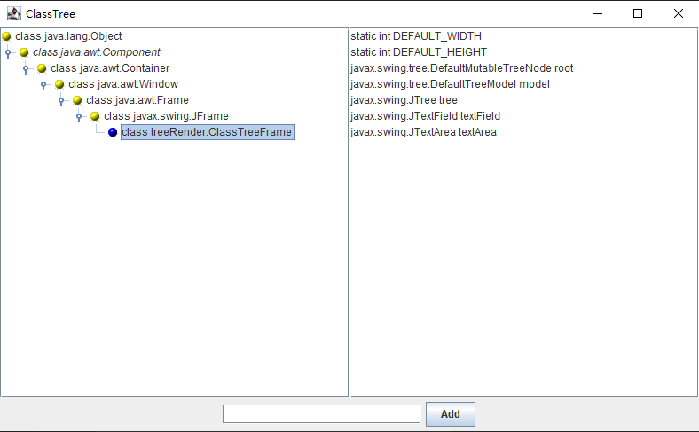

树选择监听器必须实现 `TreeSelectionListener` 接口，这是一个只有下面这个单一方法的接口：

```java
void valueChanged(TreeSelectionEvent event)
```

每当用户选定或者撤销选定树节点的时候，这个方法就会被调用。

可以按照下面这种通常方式向树中添加监听器：

```java
tree.addTreeSelectionListener(listener);
```

可以设定是否用户选定一个单一的节点、连续区间内的节点或者一个任意的、可能不连续的节点集。`JTree` 类使用 `TreeSelectionModel` 来管理节点的选择。必须检索整个模型，以便将选择状态设置为 `SINGLE_TREE_SELECTION`、`CONTIGUOUS_TREE_SELECTION` 或 `DISCONTIGUOUS_TREE_SELECTION` 三种状态之一。（在默认情况下是非连续的选择模式）

```java
int mode = TreeSelectionModel.SINGLE_TREE_SELECTION;
tree.getSelectionModel().setSelectionMode(mode);
```

要找出当前的选项集，可以用 `getSelectionPaths` 方法来查询树：

```java
TreePath[] selectedPaths = tree.getSelectionPaths();
```

如果想限制用户只能做单项选择，那么可以使用便捷的 `getSelectionPath` 方法，它将返回第一个被选择的路径，或者是 `null`（如果没有任何路径被选）。

> 警告：`TreeSelectionEvent` 类具有一个 `getPaths` 方法，它将返回一个 `TreePath` 对象数组，但是该数组描述的是选项集的变化，而不是当前的选项集。

**示例代码：**

1. treeRender/ClassTreeFrame.java

   ```java
   package treeRender;
   
   import java.awt.*;
   import java.awt.event.*;
   import java.lang.reflect.*;
   import java.util.*;
   
   import javax.swing.*;
   import javax.swing.tree.*;
   
   /**
    * This frame displays the class tree, a text field, and an "Add" button to add
    * more classes into the tree.
    */
   public class ClassTreeFrame extends JFrame {
   	private static final int DEFAULT_WIDTH = 400;
   	private static final int DEFAULT_HEIGHT = 300;
   
   	private DefaultMutableTreeNode root;
   	private DefaultTreeModel model;
   	private JTree tree;
   	private JTextField textField;
   	private JTextArea textArea;
   
   	public ClassTreeFrame() {
   		setSize(DEFAULT_WIDTH, DEFAULT_HEIGHT);
   
   		// the root of the class tree is Object
   		root = new DefaultMutableTreeNode(java.lang.Object.class);
   		model = new DefaultTreeModel(root);
   		tree = new JTree(model);
   
   		// add this class to populate the tree with some data
   		addClass(getClass());
   
   		// set up node icons
   		ClassNameTreeCellRenderer renderer = new ClassNameTreeCellRenderer();
   		renderer.setClosedIcon(new ImageIcon(getClass().getResource("red-ball.gif")));
   		renderer.setOpenIcon(new ImageIcon(getClass().getResource("yellow-ball.gif")));
   		renderer.setLeafIcon(new ImageIcon(getClass().getResource("blue-ball.gif")));
   		tree.setCellRenderer(renderer);
   
   		// set up selection mode
   		tree.addTreeSelectionListener(event -> {
   			// the user selected a different node--update description
   			TreePath path = tree.getSelectionPath();
   			if (path == null)
   				return;
   			DefaultMutableTreeNode selectedNode = (DefaultMutableTreeNode) path.getLastPathComponent();
   			Class<?> c = (Class<?>) selectedNode.getUserObject();
   			String description = getFieldDescription(c);
   			textArea.setText(description);
   		});
   		int mode = TreeSelectionModel.SINGLE_TREE_SELECTION;
   		tree.getSelectionModel().setSelectionMode(mode);
   
   		// this text area holds the class description
   		textArea = new JTextArea();
   
   		// add tree and text area
   		JPanel panel = new JPanel();
   		panel.setLayout(new GridLayout(1, 2));
   		panel.add(new JScrollPane(tree));
   		panel.add(new JScrollPane(textArea));
   
   		add(panel, BorderLayout.CENTER);
   
   		addTextField();
   	}
   
   	/**
   	 * Add the text field and "Add" button to add a new class.
   	 */
   	public void addTextField() {
   		JPanel panel = new JPanel();
   
   		ActionListener addListener = event -> {
   			// add the class whose name is in the text field
   			try {
   				String text = textField.getText();
   				addClass(Class.forName(text)); // clear text field to indicate success
   				textField.setText("");
   			} catch (ClassNotFoundException e) {
   				JOptionPane.showMessageDialog(null, "Class not found");
   			}
   		};
   
   		// new class names are typed into this text field
   		textField = new JTextField(20);
   		textField.addActionListener(addListener);
   		panel.add(textField);
   
   		JButton addButton = new JButton("Add");
   		addButton.addActionListener(addListener);
   		panel.add(addButton);
   
   		add(panel, BorderLayout.SOUTH);
   	}
   
   	/**
   	 * Finds an object in the tree.
   	 * 
   	 * @param obj the object to find
   	 * @return the node containing the object or null if the object is not present
   	 *         in the tree
   	 */
   	@SuppressWarnings("unchecked")
   	public DefaultMutableTreeNode findUserObject(Object obj) {
   		// find the node containing a user object
   		Enumeration<TreeNode> e = (Enumeration<TreeNode>) root.breadthFirstEnumeration();
   		while (e.hasMoreElements()) {
   			DefaultMutableTreeNode node = (DefaultMutableTreeNode) e.nextElement();
   			if (node.getUserObject().equals(obj))
   				return node;
   		}
   		return null;
   	}
   
   	/**
   	 * Adds a new class and any parent classes that aren't yet part of the tree
   	 * 
   	 * @param c the class to add
   	 * @return the newly added node.
   	 */
   	public DefaultMutableTreeNode addClass(Class<?> c) {
   		// add a new class to the tree
   
   		// skip non-class types
   		if (c.isInterface() || c.isPrimitive())
   			return null;
   
   		// if the class is already in the tree, return its node
   		DefaultMutableTreeNode node = findUserObject(c);
   		if (node != null)
   			return node;
   
   		// class isn't present--first add class parent recursively
   
   		Class<?> s = c.getSuperclass();
   
   		DefaultMutableTreeNode parent;
   		if (s == null)
   			parent = root;
   		else
   			parent = addClass(s);
   
   		// add the class as a child to the parent
   		DefaultMutableTreeNode newNode = new DefaultMutableTreeNode(c);
   		model.insertNodeInto(newNode, parent, parent.getChildCount());
   
   		// make node visible
   		TreePath path = new TreePath(model.getPathToRoot(newNode));
   		tree.makeVisible(path);
   
   		return newNode;
   	}
   
   	/**
   	 * Returns a description of the fields of a class.
   	 * 
   	 * @param the class to be described
   	 * @return a string containing all field types and names
   	 */
   	public static String getFieldDescription(Class<?> c) {
   		// use reflection to find types and names of fields
   		StringBuilder r = new StringBuilder();
   		Field[] fields = c.getDeclaredFields();
   		for (int i = 0; i < fields.length; i++) {
   			Field f = fields[i];
   			if ((f.getModifiers() & Modifier.STATIC) != 0)
   				r.append("static ");
   			r.append(f.getType().getName());
   			r.append(" ");
   			r.append(f.getName());
   			r.append("\n");
   		}
   		return r.toString();
   	}
   }
   ```

2. treeRender/ClassNameTreeCellRenderer.java

   ```java
   package treeRender;
   
   import java.awt.*;
   import java.lang.reflect.*;
   import javax.swing.*;
   import javax.swing.tree.*;
   
   /**
    * This class renders a class name either in plain or italic. Abstract classes
    * are italic.
    */
   public class ClassNameTreeCellRenderer extends DefaultTreeCellRenderer {
   	private Font plainFont = null;
   	private Font italicFont = null;
   
   	public Component getTreeCellRendererComponent(JTree tree, Object value, boolean selected, boolean expanded,
   			boolean leaf, int row, boolean hasFocus) {
   		super.getTreeCellRendererComponent(tree, value, selected, expanded, leaf, row, hasFocus);
   		// get the user object
   		DefaultMutableTreeNode node = (DefaultMutableTreeNode) value;
   		Class<?> c = (Class<?>) node.getUserObject();
   
   		// the first time, derive italic font from plain font
   		if (plainFont == null) {
   			plainFont = getFont();
   			// the tree cell renderer is sometimes called with a label that has a null font
   			if (plainFont != null)
   				italicFont = plainFont.deriveFont(Font.ITALIC);
   		}
   
   		// set font to italic if the class is abstract, plain otherwise
   		if ((c.getModifiers() & Modifier.ABSTRACT) == 0)
   			setFont(plainFont);
   		else
   			setFont(italicFont);
   		return this;
   	}
   }
   ```

3. treeRender/ClassTree.java

   ```java
   package treeRender;
   
   import java.awt.*;
   import javax.swing.*;
   
   /**
    * This program demonstrates cell rendering and listening to tree selection
    * events.
    * 
    * @version 1.04 2016-05-10
    * @author Cay Horstmann
    */
   public class ClassTree {
   	public static void main(String[] args) {
   		EventQueue.invokeLater(() -> {
   			JFrame frame = new ClassTreeFrame();
   			frame.setTitle("ClassTree");
   			frame.setDefaultCloseOperation(JFrame.EXIT_ON_CLOSE);
   			frame.setVisible(true);
   		});
   	}
   }
   ```

运行效果如下：

