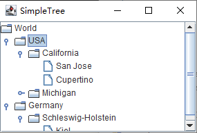

为了构建 `JTree`，需要在构造器中提供这样一个树模型：

```java
TreeModel model = ...;
JTree tree = new JTree(model);
```

> 注意：还有一些构造器可以用一些元素的集合来构建树：
>
> ```
> JTree(Object[] nodes)
> JTree(Vector<?> nodes)
> JTree(Hashtable<?, ?> nodes)	// the values become the nodes
> ```

可以通过创建一个实现了 `TreeModel` 接口的类来构建自己的树模型。现在，我们仍坚持使用 `Swing` 类库提供的 `DefaultTreeModel` 模型。

为了构建一个默认的树模型，必须提供一个根节点。

```java
TreeNode root = ...;
DefaultTreeModel model = new DefaultTreeModel(root);
```

`TreeNode` 是另外一个接口。可以将任何实现了这个接口的类的对象组装到默认的树模型中。这里，我们使用的是 `Swing` 提供的具体节点类，叫做 `DefaultMutableTreeNode`。这个类实现了 `MutableTreeNode` 接口，该接口是 `TreeNode` 的一个子接口。

任何一个默认的可变树节点都存放着一个对象，即用户对象。树会为所有的节点绘制这些用户对象。除非指定一个绘制器，否则树将直接显示执行完 `toString` 方法之后的结果字符串。

可以在构造器中设定用户对象，也可以稍后在 `setUserObject` 方法中设定用户对象：

```java
DefaultMutableTreeNode node = new DefaultMutableTreeNode("Texas");
...
node.setUserObject("California");
```

接下来，可以建立节点之间的父/子关系。从根节点开始，使用 `add` 方法来添加子节点：

```java
DefaultMutableTreeNode root = new DefaultMutableTreeNode("World");
DefaultMutableTreeNode country = new DefaultMutableTreeNode("USA");
root.add(country);
DefaultMutableTreeNode state = new DefaultMutableTreeNode("California");
country.add(state);
```

然后用根节点构建一个 `DefaultTreeModel`。最后，用这个树模型构建一个 `JTree`。

```java
DefaultTreeModel treeModel = new DefaultTreeModel(root);
JTree tree = new JTree(treeModel);
```

或者，使用快捷方式，直接将根节点传递给 `JTree` 构造器。那么这个棵树就会自动构建一个默认的树模型：

```java
JTree tree = new JTree(root);
```

**示例代码：**

1. tree/SimpleTreeFrame.java

   ```java
   package tree;
   
   import javax.swing.*;
   import javax.swing.tree.*;
   
   /**
    * This frame contains a simple tree that displays a manually constructed tree
    * model.
    */
   public class SimpleTreeFrame extends JFrame {
   	private static final int DEFAULT_WIDTH = 300;
   	private static final int DEFAULT_HEIGHT = 200;
   
   	public SimpleTreeFrame() {
   		setSize(DEFAULT_WIDTH, DEFAULT_HEIGHT);
   
   		// set up tree model data
   
   		DefaultMutableTreeNode root = new DefaultMutableTreeNode("World");
   		DefaultMutableTreeNode country = new DefaultMutableTreeNode("USA");
   		root.add(country);
   		DefaultMutableTreeNode state = new DefaultMutableTreeNode("California");
   		country.add(state);
   		DefaultMutableTreeNode city = new DefaultMutableTreeNode("San Jose");
   		state.add(city);
   		city = new DefaultMutableTreeNode("Cupertino");
   		state.add(city);
   		state = new DefaultMutableTreeNode("Michigan");
   		country.add(state);
   		city = new DefaultMutableTreeNode("Ann Arbor");
   		state.add(city);
   		country = new DefaultMutableTreeNode("Germany");
   		root.add(country);
   		state = new DefaultMutableTreeNode("Schleswig-Holstein");
   		country.add(state);
   		city = new DefaultMutableTreeNode("Kiel");
   		state.add(city);
   
   		// construct tree and put it in a scroll pane
   
   		JTree tree = new JTree(root);
   		add(new JScrollPane(tree));
   	}
   }
   ```

2. tree/SimpleTree.java

   ```java
   package tree;
   
   import java.awt.*;
   import javax.swing.*;
   
   /**
    * This program shows a simple tree.
    * 
    * @version 1.03 2016-05-10
    * @author Cay Horstmann
    */
   public class SimpleTree {
   	public static void main(String[] args) {
   		EventQueue.invokeLater(() -> {
   			JFrame frame = new SimpleTreeFrame();
   			frame.setTitle("SimpleTree");
   			frame.setDefaultCloseOperation(JFrame.EXIT_ON_CLOSE);
   			frame.setVisible(true);
   		});
   	}
   }
   ```


可以使用下面代码取消父子节点之间的连线：

```java
tree.putClientProperty("JTree.lineStyle", "None");
```

效果如下：



相反地，如果要确保显示这些线条，则可以使用：

```java
tree.putClientProperty("JTree.lineStyle", "Angled");
```

> 提示：另一种线条样式：水平线。

默认情况下，这种树中的根节点没有用于折叠的把手。如果需要的话，可以通过下面的调用来添加一个把手：

```java
tree.setShowsRootHandles(true);
```

可以使用下面这条指令将根节点隐藏起来：

```java
tree.setRootVisible(false);
```

节点绘制器必须知道每个节点要使用什么样的图标。默认情况下，这个决策过程是这样的：如果某个节点的 `isLeaf` 方法返回的是 `true`，那么就使用叶节点图标，否则，使用文件夹图标。

`JTree` 类无法知道哪些节点是叶节点，它要询问树模型。如果一个没有任何子节点的节点不应该自动地被设置为概念上的叶节点，那么可以让树模型对这些叶节点使用一个不同的标准，即可以查询其 "允许有子节点" 的节点属性。

对于那些不应该有子节点的节点，调用：

```java
node.setAllowsChildren(false);
```

然后，告诉树模型去查询 "允许有子节点" 的属性值以确定一个节点是否应该显示成叶子图标。你可以使用 `DefaultTreeModel` 类中的方法 `setAsksAllowsChildren` 设定此动作：

```java
model.setAsksAllowsChildren(true);
```

另外，如果你是通过提供根节点来构建一颗树的，那么请在构造器中直接提供 "询问允许有子节点" 属性值的设置。

```java
JTree tree = new JTree(root, true);	// nodes that don't allow children get leaf icons
```


