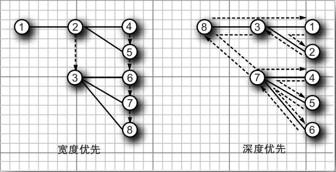

`breadthFirstEnumeration` 方法和 `depthFirstEnumeration` 方法分别使用广度优先或深度优先的遍历方式，返回枚举对象，它们的 `nextElement` 方法能够访问当前节点的所有子节点。



<center><b>树的遍历顺序</b></center>

`postOrderTraversal` 方法在搜索过程中先访问到子节点，然后才访问到父节点。`preOrderTraversal` 方法是一种深度优先搜索方法，但是它首先枚举父节点，然后是子节点。

下面是一种典型的使用模式：

```java
Enumeration breadthFirst = node.breadthFirstEnumeration();
while (breadthFirst.hasMoreElements()) {
    do something with breadthFirst.nextElement();
}
```

`pathFromAncestorEnumeration` 方法用于查找一条从祖先节点到给定节点之间的路径，然后枚举出该路径中的所有节点。整个过程并不需要大量的处理操作，只需要不断调用 `getParent` 直到发现祖先节点，然后将该路径倒置过来存放即可。

如果在树中存在给定用户对象的节点，下面这个方法就可以用来查找该节点：

```java
public DefaultMutableTreeNode findUserObject(Object obj) {
    Enumeration e = root.breadthFirstEnumeration();
    while (e.hasMoreElements()) {
        DefaultMutableTreeNode node = (DefaultMutableTreeNode) e.nextElement();
        if (node.getUserObject().equals(obj)) {
            return node;
        }
    }
    return null;
}
```

