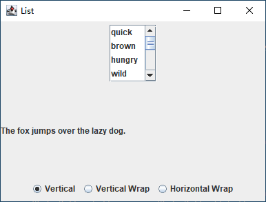

[toc]

### 1. JList 控件

从 `Java SE 7` 开始，`JList` 是一个泛型，其 `type` 参数是用户可选的值的类型。

为了构建列表框，首先需要创建一个字符串数组，然后将这个数组传递给 `JList` 构造器：

```java 
String[] words = { "quick", "brown", "hungry", "wild", ...};
JList<String> wordList = new JList<>(words);
```

列表框不能自动滚动，要想为列表框加上滚动条，必须将它插入到滚动面板中：

```java
JScrollPane scrollPane = new JScrollPane(wordList);
```

然后应该把滚动面板而不是列表框，插入到外围面板上。

默认情况下，列表框控件可以显示 8 个选项；可以使用 `setVisibleRowCount` 方法改变这个值：

```java
wordList.setVisibleRowCount(4);	// display 4 items
```

还可以使用以下三个值中的任意一个来设置列表框摆放的方向：

+ `JList.VERTICAL`（默认值）：垂直摆放所有选项。
+ `JList.VERTICAL_WRAP`：如果选项数超过了可视行数，就开始新的一行。
+ `JList.HORIZONTAL_WRAP`：如果选项数超过了可视行数，就开始新的一行，并且按照水平方向进行填充。

在默认情况下，用户可以选择多个选项。为了选择多个选项，只需按住 <kbd>CTRL</kbd> 键，然后在要选择的选项上单击。要选择处于连续范围内的选项，首先选择第一个选项，然后按住 <kbd>SHIFT</kbd>，并在最后一个选项上单击即可。

使用 `setSelectionMode` 方法，还可以对用户的选择模式加以限制：

```java
wordList.setSelectionMode(ListSelectionModel.SINGLE_SELECTION);	// select one item at a time
wordList.setSelectionMode(ListSelectionModel.SINGLE_INTERVAL_SELECTION);	// select one item or one range of items
```

可以向列表构件添加一个列表选择监听器，然后在监听器中实现下面这个方法：

```java
public void valueChanged(ListSelectionEvent evt)
```

在用户选择了若干选项的同时，将产生一系列列表选择事件。假如用户在一个新选项上单击，当鼠标按下的时候，就会有一个事件来报告选项的改变。这是一种过渡型事件，在调用：

```java
event.getValueIsAdjusting();
```

时，如果该选择仍未最终结束则返回 `true`。然后，当松开鼠标时，就产生另一事件，此时 `getValueIsAdjusting()` 返回 `false`。

如果是单选模式，调用 `getSelectedValue` 可以获取所选中列表元素的值；否则调用 `getSelectedValuesList` 返回一个包含所有选中选项的对象数组。之后，可以以常规方式处理它：

```java
for (String value : wordList.getSelectedValuesList()) {
    // do something with value
}
```

> 注意：列表构件不响应鼠标的双击事件。但是，某些用户界面允许用户在一个列表选项上双击鼠标，作为选择一个选项并调用一个默认动作的快捷方式。如果想实现这种行为，那么必须对这个列表框添加一个鼠标监听器，然后按照下面这样捕获鼠标事件：
>
> ```java
> public void mouseClicked(MouseEvent evt) {
>     if (evt.getClickCount() == 2) {
>         JList source = (JList) evt.getSource();
>         Object[] selection = source.getSelectedValuesList();
>         doAction(selection);
>     }
> }
> ```

**示例代码：ListFrame.java**

```java

import java.awt.*;

import javax.swing.*;

/**
 * This frame contains a word list and a label that shows a sentence made up
 * from the chosen words. Note that you can select multiple words with
 * Ctrl+click and Shift+click.
 */
class ListFrame extends JFrame {
	private static final int DEFAULT_WIDTH = 400;
	private static final int DEFAULT_HEIGHT = 300;

	private JPanel listPanel;
	private JList<String> wordList;
	private JLabel label;
	private JPanel buttonPanel;
	private ButtonGroup group;
	private String prefix = "The ";
	private String suffix = "fox jumps over the lazy dog.";

	public ListFrame() {
		setSize(DEFAULT_WIDTH, DEFAULT_HEIGHT);

		String[] words = { "quick", "brown", "hungry", "wild", "silent", "huge", "private", "abstract", "static",
				"final" };

		wordList = new JList<>(words);
		wordList.setVisibleRowCount(4);
		JScrollPane scrollPane = new JScrollPane(wordList);

		listPanel = new JPanel();
		listPanel.add(scrollPane);
		wordList.addListSelectionListener(event -> {
			StringBuilder text = new StringBuilder(prefix);
			for (String value : wordList.getSelectedValuesList()) {
				text.append(value);
				text.append(" ");
			}
			text.append(suffix);

			label.setText(text.toString());
		});

		buttonPanel = new JPanel();
		group = new ButtonGroup();
		makeButton("Vertical", JList.VERTICAL);
		makeButton("Vertical Wrap", JList.VERTICAL_WRAP);
		makeButton("Horizontal Wrap", JList.HORIZONTAL_WRAP);

		add(listPanel, BorderLayout.NORTH);
		label = new JLabel(prefix + suffix);
		add(label, BorderLayout.CENTER);
		add(buttonPanel, BorderLayout.SOUTH);
	}

	/**
	 * Makes a radio button to set the layout orientation.
	 * 
	 * @param label       the button label
	 * @param orientation the orientation for the list
	 */
	private void makeButton(String label, final int orientation) {
		JRadioButton button = new JRadioButton(label);
		buttonPanel.add(button);
		if (group.getButtonCount() == 0)
			button.setSelected(true);
		group.add(button);
		button.addActionListener(event -> {
			wordList.setLayoutOrientation(orientation);
			listPanel.revalidate();
		});
	}

	public static void main(String[] args) {
		EventQueue.invokeLater(() -> {
			JFrame frame = new ListFrame();
			frame.setTitle("List");
			frame.setDefaultCloseOperation(JFrame.EXIT_ON_CLOSE);
			frame.setVisible(true);
		});
	}
}
```

运行效果如下：



### 2. 列表模式

列表构件使用了模型-视图-控制器这种设计模式，将可视化外观和底层数据进行了分离。

`JList` 类负责数据的可视化外观，它只知道可以通过某个实现了 `ListModel` 接口的对象来获取这些数据：

```java
public interface ListModel<E> {
    int getSize();
    E getElementAt(int i);
    void addListDataListener(ListDataListener l);
    void removeListDataListener(ListDataListener l);
}
```

通过这个接口，`JList` 就可以获得元素的个数，并且能够获取每一个元素。另外，`JList` 对象可以将其自身添加为一个 `ListDataListener`。在这种方式下，一旦元素集合发生了变化，就会通知 `JList`，从而使它能够重新绘制列表。

> 注意：这个接口并未指定这些对象是怎么存储的。尤其是，它根本就没有强制要求这些对象一定要被存储！无论何时调用 `getElementAt` 方法，它都会对每个值进行重新计算。如果想显示一个极大的集合，而且又不想存储这些值那么这个方法可能会有帮助。

可以通过继承 `AbstractListModel` 类来创建 `ListModel` 接口，该类已经实现了添加和删除监听器，我们只需要提供 `getSize` 和 `getElementAt` 方法即可：

```java
class WordListModel extends AbstractListModel<String> {
    
    public WordListModel(int n) {
        length = n;
    }
    
    public int getSize() {
        return (int) Math.pow(26, length);
    }
    
    public String getElementAt(int n) {
        // compute nth string
        ...
    }
    
    ...
}
```

接下来我们就可以构件一个列表：

```java
JList<String> wordList = new JList<>(new WordListMode(3));
wordList.setSelectionMode(ListSelectionModel.SINGLE_SELECTION);
JScrollPane scrollPane = new JScrollPane(wordList);
```

我们还必须告诉列表构件，所有的选项都有一个固定的宽度和高度。最简单的方法就是通过设置单元格的尺寸大小来设定原型单元格的值：

```java
wordList.setPrototypeCellValue("www");
```

另外，可以像下面这样这样设置一个固定不变的单元格尺寸：

```java
wordList.setFixedCellWidth(50);
wordList.setFixedCellHeight(15);
```

如果你既没有设置原型值也没有设置固定的单元格尺寸，那么列表构件就必须计算每个选项的宽度和高度。这可能需要花费更长时间。

**示例代码：LongListFrame.java**

```java
import java.awt.BorderLayout;
import java.awt.Container;
import java.awt.EventQueue;

import javax.swing.AbstractListModel;
import javax.swing.JFrame;
import javax.swing.JLabel;
import javax.swing.JList;
import javax.swing.JPanel;
import javax.swing.JScrollPane;
import javax.swing.ListSelectionModel;

/**
 * This frame contains a long word list and a label that shows a sentence made up from the chosen
 * word.
 */
public class LongListFrame extends JFrame {

	private JList<String> wordList;
	private JLabel label;
	private String prefix = "The quick brown ";
	private String suffix = " jumps over the lazy dog.";
	
	public LongListFrame() {
		wordList = new JList<String>(new WordListModel(3));
		wordList.setSelectionMode(ListSelectionModel.SINGLE_SELECTION);
		wordList.setPrototypeCellValue("www");
		JScrollPane scrollPane = new JScrollPane(wordList);
		
		JPanel p = new JPanel();
		p.add(scrollPane);
		wordList.addListSelectionListener(event -> setSubject(wordList.getSelectedValue()));
		
		Container contentPage = getContentPane();
		contentPage.add(p, BorderLayout.NORTH);
		label = new JLabel(prefix + suffix);
		contentPage.add(label, BorderLayout.CENTER);
		setSubject("fox");
		pack();
	}
	
	/**
	 * Sets the subject in the label.
	 * @param word the new subject that jumps over the lazy dog
	 */
	public void setSubject(String word) {
		StringBuilder text = new StringBuilder(prefix);
		text.append(word);
		text.append(suffix);
		label.setText(text.toString());
	}
	
	public static void main(String[] args) {
		EventQueue.invokeLater(() -> {
			JFrame frame = new LongListFrame();
			frame.setTitle("Long List");
			frame.setDefaultCloseOperation(JFrame.EXIT_ON_CLOSE);
			frame.setVisible(true);
		});
	}
	
}

class WordListModel extends AbstractListModel<String> {
	
	private int length;
	public static final char FIRST = 'a';
	public static final char LAST = 'z';
	
	/**
	 * Constructs the model.
	 * @param n the word length
	 */
	public WordListModel(int n) {
		length = n;
	}
	
	public int getSize() {
		return (int) Math.pow(LAST - FIRST + 1, length);
	}
	
	public String getElementAt(int n) {
		StringBuilder r = new StringBuilder();
		
		for (int i = 0; i < length; i++) {
			char c = (char) (FIRST + n % (LAST - FIRST + 1));
			r.insert(0,  c);
			n = n / (LAST - FIRST + 1);
		}
		return r.toString();
	}
}
```

### 3. 插入和移除值

不能直接编辑列表值的集合。相反地，必须先访问模型，然后再添加或移除元素。假设想要向列表中添加更多的选项值，那么首先需要通过下面的语句获得对该模型的一个引用：

```java
ListModel<String> model = list.getModel();
```

但 `ListModel` 接口并未提供任何插入或移除元素的方法。`JList` 有一个构造器可以接受一个对象向量作为参数：

```java
Vector<String> values = new Vector<String>();
values.addElement("quick");
values.addElement("brown");
...
JList<String> list = new JList<>(values);
```

现在，就可以通过编辑这个向量来添加或移除元素了，不过列表并不知道正在放生的事情，因此也就无法对这种变化做出响应。

取而代之的是，应该构建一个 `DefaultListModel` 对象，填入初始值，然后将它与一个列表关联起来。`DefaultListModel` 类实现了 `ListModel` 接口，并管理着一个对象集合。

```java
DefaultListModel<String> model = new DefaultListModel<>();
model.addElement("quick");
model.addElement("brown");
...
JList<String> list = new JList<>(model);
```

现在，就可以从 `model` 对象中添加或移除元素值了：

```java
model.removeElement("quick");
model.addElement("slow");
```

### 4. 值的绘制

实际上只需要传递一个用 `Icon` 对象填充的数组或向量，便可以很容易地显示一个图标列表。

尽管 `JList` 类可以自动地显示字符串和图标，但是仍然需要在 `JList` 对象中安装一个用于所有自定义图形的列表单元格绘制器。列表单元格绘制器可以是任何一个实现了下面接口的类：

```java
interface ListCellRenderer<E> {
    Component getListCellRendererComponent(JList<? extends E> list, E value, int index, boolean isSelected, boolean cellHasFocus);
}
```

实现单元格绘制器的一种方法是创建一个扩展了 `JComponent` 的类，如下所示：

```java
class MyCellRenderer extends JComponent implements ListCellRenderer<Type> {
    
    public Component getListCellRendererComponent(JList<? extends Type> list, Type value, int index, boolean isSelected, boolean cellHasFocus) {
        // stash away information needed for painting and size measurement
        return this;
    }
    
    public void paintComponent(Graphics g) {
        // paint code
    }
    
    public Dimension getPreferredSize() {
        // size measurement code
    }
    
    // instance fields
}
```

通过调用 `JList` 类中的 `getForeground/getBackground` 和 `getSelectionForeground/getSelectionBackground` 方法可以获取这些状态下 `JList` 类的外观常用颜色。

如果要安装单元格绘制器，只需调用 `setCellRenderer` 方法即可：

```java
fontList.setCellRenderer(new FontCellRenderer());
```

如果绘制的图像仅仅包含文本、图标或者变化颜色，那么通过配置一个 `JLabel` 就可以得到这样的一个绘制器。

```java
class FontCellRenderer extends JLabel implements ListCellRenderer<Font> {
    
    public Component getListCellRendererComponent(JList<? extends Font> list, Font value, int index, boolean isSelected, boolean cellHasFocus) {
        Font font = (Font) value;
        setText(font.getFamily());
        setFont(font);
        setOpaque(true);
        setBackground(isSelected ? list.getSelectionBackground() : list.getBackground());
        setForeground(isSelected ? list.getSelectionForeground() : list.getForeground());
        return this;
    }
}
```

> 注意：在每一个 `getListCellRendererComponent` 调用中都构建一个新的构件并不是一个好主意。因为如果用户滚动了许多个列表项，那么每一次都需要构建一个新构件。而对已有构件进行重配置则显得更安全更高效。

**示例代码：FontCellRenderer.java**

```java
import java.awt.*;
import javax.swing.*;

/**
 * A cell renderer for Font objects that renders the font name in its own font.
 */
public class FontCellRenderer extends JComponent implements ListCellRenderer<Font> {
    private Font font;
    private Color background;
    private Color foreground;
    
    public Component getListCellRendererComponent(JList<? extends Font> list, Font value, int index, boolean isSelected, boolean cellHasFocus) {
        font = value;
        background = isSelected ? list.getSelectionBackground() : list.getBackground();
        foreground = isSelected ? list.getSelectionForeground() : list.getForeground();
        return this;
    }
    
    public void paintComponent(Graphics g) {
        String text = font.getFamily();
        FontMetrics fm = g.getFontMetrics(font);
        g.setColor(background);
        g.fillRect(0, 0, getWidth(), getHeight());
        g.setColor(foreground);
        g.setFont(font);
        g.drawString(text, 0, fm.getAscent());
    }
    
    public Dimension getPreferredSize() {
        String text = font.getFamily();
        Graphics g = getGraphics();
        FontMetrics fm = g.getFontMetrics(font);
        return new Dimension(fm.stringWidth(text), fm.getHeight());
    }
}
```

