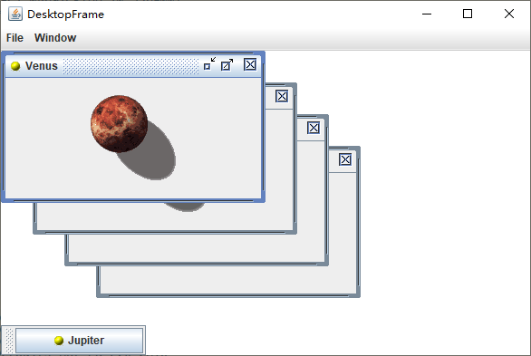

[toc]

### 1. 显示内部框体

在 `Metal` 外观模式中，内部框体具有独一无二的 `grabber` 区域，可以让你随意移动这些框体，并可以通过拖动用来调整大小的角来更改窗口的大小。

为了实现这项功能，请遵循下面几步：

1）在该应用中使用常规的 `JFrame`。

2） 向该 `JFrame` 添加 `JDesktopPane`。

```java
JDesktopPane desktop = new JDesktopPane();
add(desktop, BorderLayout.CENTER);
```

3）构建 `JInternalFrame` 窗口，可以设定是否需要更改框体大小和关闭框体的图标。通常情况下，需要添加所有的图标。

```java
JInternalFrame iframe = new JInternalFrame(title,
                                          true,	// resizable
                                          true, // closable
                                          true, // maximizable
                                          true);// iconifiable
```

4）向该内部框体中添加构件。

```java
iframe.add(c, BorderLayout.CENTER);
```

5）设置该内部框体的图标。该图标会显示在框体左上角。

```java
iframe.setFrameIcon(icon);
```


<center><b>具有三个内部框体的 Java 应用程序</b></center>

> 注意：在 `Metal` 外观模式的当前版本中，框体图标并不在图标化的框体中显示出来。

6）设置内部框体的大小。和常规框体一样，内部框体初始大小为 0 x 0 个像素。因为你并不希望内部框体在另一个框体上面重叠地显示出来，因此，应该为下一个框体使用一个变量位置。使用 `reshape` 方法对框体的位置和大小进行设置：

```java
iframe.reshape(nextFrameX, nextFrameY, width, height);
```

7）和 `JFrame` 一样，需要将该框体设为可见的。

```java
iframe.setVisible(true);
```

> 注意：在 `Swing` 的早期版本，内部框体自动是可见的，因为就不需要调用这个方法。

8）将该框体添加到 `JDesktopPane` 中：

```java
desktop.add(iframe);
```

9）你可能想使新的框体成为选定框体。对于桌面上的内部框体，只有选定的框体才能接收键盘焦点。在 `Metal` 外观模式中，选定框体具有蓝色标题栏，相反地，其他框体是灰色标题栏。可以使用 `setSelected` 方法选定一个框体。不过，这种 "选定" 属性可能会被否决掉，当前选定的框体可以拒绝放弃焦点。在这种情况下，`setSelected` 方法会抛出一个 `PropertyVetoException` 异常让你处理。

```java
try {
    iframe.setSelected(true);
} catch (PropertyVetoException ex) {
    // attempt was vetoed
}
```

10）你可能希望下一个内部框体的位置能够向下移动，使得不至于覆盖已经存在的框体。框体之间的合适距离是标题栏的高度，可以通过下面的方式活动：

```java
int frameDistance = iframe.getHeight - iframe.getContentPane().getHeight();
```

11）使用该距离确定下一个内部框体的位置。

```java
nextFrameX += frameDistance;
nextFrameY += frameDistance;
if (nextFrameX + width > desktop.getWidth()) {
    nextFrameX = 0;
}
if (nextFrameY + height > desktop.getHeight()) {
    nextFrameY = 0;
}
```

### 2. 级联与平铺

在 `Windows` 环境中，有一些用于级联及平铺窗口的标准命令。`Java` 语言的 `JDesktopPane` 类和 `JInternalFrame` 类对这些操作未提供任何内置支持。


<center><b>级联的内部框体</b></center>


<center><b>平铺的内部框体</b></center>

为了级联所有的窗口，可以将这些窗口重新绘制成同样的大小，并交错排列它们的位置。`JDesktopPane` 类的 `getAllFrames` 方法可以返回一个所有内部框体的数组。不过需要注意一下框体的状态。

可以使用 `isIcon` 方法确定哪些内部框体当前是处于图标状态，因而应该跳过。但是，如果一个框体处于最大状态，那么首先要通过调用 `setMaximum(false)` 方法将它设置为可放缩状态。这是另外一个可能被否决掉的属性，因此你必须捕获 `PropertyVetoException` 异常。

下面这个循环用于级联一个桌面上的所有内部框体：

```java
for (JInternalFrame frame : desktop.getAllFrames()) {
    if (!frame.isIcon()) {
        try {
            // try to make maximized frames resizable; this might be vetoed
            frame.setMaximum(false);
            frame.reshape(x, y, width, height);
            x += frameDistance;
            y += frameDistance;
            // wrap around at the desktop edge
            
            if (x + width > desktop.getWidth()) x = 0;
            if (y + height > desktop.getHeight()) y = 0;
        } catch (PropertyVetoException ex) {
            
        }
    }
}
```

平铺框体更具有技巧性，尤其是当框体数不是一个完全平方数时。首先，计算出不是图标的框体数。然后，按照下面的方法计算行数：

```java
int rows = (int) Math.sqrt(frameCount);
```

然后是计算列数：

```java
int cols = frameCount / rows;
```

除了最后一列是：

```java
int extra = frameCount % rows;
```

下面这个循环用于平铺桌面上的所有内部框体：

```java
int width = desktop.getWidth() / cols;
int height = desktop.getHeight() / rows;
int r = 0; 
int c = 0;
for (JInternalFrame frame : desktop.getAllFrames()) {
    if (!frame.isIcon()) {
        try {
            frame.setMaximum(false);
            frame.reshape(c * width, r * height, width, height);
            r++;
            if (r == rows) {
                r = 0;
                c++;
                if (c == cols - extra) {
                    // start adding an extra row
                    height = desktop.getHeight() / rows;
                }
            }
        } catch (PropertyVetoException ex) {
            
        }
    }
}
```

另一个常用的框体操作：将所选择的框体从当前框体转换为下一个非图标框体。此时，首先遍历所有的框体并调用 `isSelected` 方法，直到发现当前选定的框体为止。然后，查找框体序列中下一个非图标框体，进而通过如下调用选中它：

```java
frames[next].setSelected(true);
```

该方法会抛出一个 `PropertyVetoException` 异常，在这种情况下，需要一直进行监视。如果返回到原先那个框体，那么其他任何框体都无法选定，因此只有放弃。下面是完整的循环代码：

```java
JInternalFrame[] frames = desktop.getAllFrames();
for (int i = 0; i < frames.length; i++) {
    if (frames[i].isSelected()) {
        // find next frame that isn't an icon and can be selected
        int next = (i + 1) % frames.length;
        
        while (next != i) {
            if (!frames[next].isIcon()) {
                try {
                    // all other frames are icons or veto selection
                    frames[next].setSelected(true);
                    frames[next].toFront();
                    frames[i].toBack();
                    return;
                } catch (PropertyVetoException ex) {
                    
                }
            }
            next = (next + 1) % frames.length;
        }
    }
}
```

### 3. 否决属性设置

框体通常并不想使用否决机制以抗议将窗口图标化或失去焦点，但是对于框体来说，检查它们是不是可以关闭则是很常见的。可以使用 `JInternalFrame` 类的 `setClosed` 方法关闭一个窗口。因为该方法是可否决的，因此在进行更改之前，它会调用所有已注册的可否决的更改监听器。这样就赋予每个监听器抛出有一个 `PropertyVetoException` 异常的机会，并且在它更改任何设置之前，终止对 `setClosed` 的调用。

下面就说说要怎样才能实现这样一个通知机制。

1）为每个框体添加一个监听器对象。该监听器对象必须属于实现了 `VetoableChangeListener` 接口的某个类。最好是在刚构建完这个框体时就添加就监听器。

```java
iframe.addVetoableChangeListener(listener);
```

2）实现 `vetoableChange` 方法，该方法接收一个 `PropertyChangeEvent` 对象，使用`getName` 方法查找将要更改的属性的名称（例如，如果该方法调用要否决的方法是 `setClosed(true)`，那么属性名就是 `closed`）。通过移除方法名的 `set` 前缀，并且将后面的字母变为小写，便可获得属性名。

3）使用 `getNewValue` 方法获取建议使用的新值。

```java
String name = event.getPropertyName();
Object value = event.getNewValue();
if (name.equals("closed") && value.equals(true)) {
    ask user for confirmation
}
```

4）直接通过抛出一个 `PropertyVetoException` 异常来阻止属性修改。如果不想否决更改，则正常返回：

```java
class DesktopFrame extends JFrame implements VetoableChangeListener {
    ....
    public void vetoableChange(PropertyChangeEvent event) throws PropertyVetoException {
        ....
        if (not ok) {
            throw new PropertyVetoException(reason, event);
        }
        // return normally if ok
    }
}
```

### 4. 内部框体中的对话框

如果使用内部框体，那么不应该将 `JDialog` 类用作对话框。因为，这些对话框有两个缺点：

+ 它们是重量级的，因为它们是在窗口系统中创建了一个新的框体。
+ 窗口系统并不知道应该如何确定这些对话框与派生出它们的内部框体之间的相对位置。

相反地，对于简单的对话框，请使用 `JOptionPane` 类的 `showInternalXXXDialog` 方法。除了它们是在内部框体上放置一个轻量级窗口外，它们的运行特性与 `showXxxDialog` 方法纪委相似。

对于更复杂的对话框，请使用一个 `JInternalFrame` 来构建。遗憾的是，这样你就无法使用任何对模式对话框的内置支持了。

```java
int result = JOptionPane.showInternalConfirmDialog(iframe, "OK to close?", "Select an Option", JOptionPane.YES_NO_OPTION);
```

> 注意：如果只是想在关闭一个框体时能够得到通知，那么就应该不使用否决机制。相反地，应该安装一个 `InternalFrameListener` 监听器。内部框体监听器和 `WindowListener` 监听器运行特性极为相似。当关闭一个内部框体时，调用的是 `internalFrameListenerClose` 方法，而不是大家所熟悉的 `WindowClosing` 方法。

### 5. 边框拖曳

为了启动边框拖动，请调用：

```java
desktop.setDragMode(JDesktopPane.OUTLINE_DRAG_MODE);
```

> 注意：在 `Swing` 的早期版本中，必须使用下面代码开启边框拖曳：
>
> ```java
> desktop.putClientProperty("JDesktopPane.dragMode", "outline");
> ```

### 6. 示例代码: internalFrame/DesktopFrame.java

```java
package internalFrame;

import java.awt.BorderLayout;
import java.awt.Component;
import java.beans.PropertyVetoException;

import javax.swing.ImageIcon;
import javax.swing.JCheckBoxMenuItem;
import javax.swing.JDesktopPane;
import javax.swing.JFrame;
import javax.swing.JInternalFrame;
import javax.swing.JLabel;
import javax.swing.JMenu;
import javax.swing.JMenuBar;
import javax.swing.JMenuItem;
import javax.swing.JOptionPane;

public class DesktopFrame extends JFrame {
	
	private static final int DEFAULT_WIDTH = 600;
	private static final int DEFAULT_HEIGHT = 400;
	private static final String[] planets = {
			"Mercury", "Venus", "Earth", "Mars", "Jupiter",
			"Saturn", "Uranus", "Neptune", "Pluto"
	};
	
	private JDesktopPane desktop;
	private int nextFrameX;
	private int nextFrameY;
	private int frameDistance;
	private int counter;
	
	public DesktopFrame() {
		setSize(DEFAULT_WIDTH, DEFAULT_HEIGHT);
		
		desktop = new JDesktopPane();
		add(desktop, BorderLayout.CENTER);
		
		// set up menus
		
		JMenuBar menuBar = new JMenuBar();
		setJMenuBar(menuBar);
		JMenu fileMenu = new JMenu("File");
		menuBar.add(fileMenu);
		JMenuItem openItem = new JMenuItem("New");
		openItem.addActionListener(event -> {
			createInternalFrame(new JLabel(new ImageIcon(getClass().getResource(planets[counter]
					+ ".gif"))), planets[counter]);
			counter = (counter + 1) % planets.length;
		});
		fileMenu.add(openItem);
		JMenuItem exitItem = new JMenuItem("Exit");
		exitItem.addActionListener(event -> System.exit(0));
		fileMenu.add(exitItem);
		JMenu windowMenu = new JMenu("Window");
		menuBar.add(windowMenu);
		JMenuItem nextItem = new JMenuItem("Next");
		nextItem.addActionListener(event -> selectNextWindow());
		windowMenu.add(nextItem);
		JMenuItem cascadeItem = new JMenuItem("Cascade");
		cascadeItem.addActionListener(event -> cascadeWindows());
		windowMenu.add(cascadeItem);
		JMenuItem tileItem = new JMenuItem("Tile");
		tileItem.addActionListener(event -> tileWindows());
		windowMenu.add(tileItem);
		final JCheckBoxMenuItem dragOutlineItem = new JCheckBoxMenuItem("Drag Outline");
		dragOutlineItem.addActionListener(event -> {
			desktop.setDragMode(dragOutlineItem.isSelected() ? JDesktopPane.OUTLINE_DRAG_MODE : JDesktopPane.LIVE_DRAG_MODE);
		});
		windowMenu.add(dragOutlineItem);
	}
	
	public void createInternalFrame(Component c, String t) {
		final JInternalFrame iframe = new JInternalFrame(t,
				true, // resizable
				true, // closable
				true, // maximizable
				true);// iconifiable
		iframe.add(c, BorderLayout.CENTER);
		desktop.add(iframe);
		
		iframe.setFrameIcon(new ImageIcon(getClass().getResource("document.gif")));
		
		// add listener to confirm frame closing
		iframe.addVetoableChangeListener(event -> {
			String name = event.getPropertyName();
			Object value = event.getNewValue();
			
			// we only want to check attempts to close a frame
			if (name.equals("closed") && value.equals(true)) {
				// ask user if it is ok to close
				int result = JOptionPane.showInternalConfirmDialog(iframe, "OK to close?",
						"Select an Option", JOptionPane.YES_NO_OPTION);
				
				// if the user doesn't agree, veto the close
				if (result != JOptionPane.YES_OPTION) {
					throw new PropertyVetoException("User canceled close", event);
				}
			}
		});
		
		// position frame
		int width = desktop.getWidth() / 2;
		int height = desktop.getHeight() / 2;
		iframe.reshape(nextFrameX, nextFrameY, width, height);
		
		iframe.show();
		
		// select the frame--might be vetoed
		try {
			iframe.setSelected(true);
		} catch (PropertyVetoException e) {
			
		}
		
		frameDistance = iframe.getHeight() - iframe.getContentPane().getHeight();
		
		// compute placement for next frame
		
		nextFrameX += frameDistance;
		nextFrameY += frameDistance;
		if (nextFrameX + width > desktop.getWidth()) {
			nextFrameX = 0;
		}
		if (nextFrameY + height > desktop.getHeight()) {
			nextFrameY = 0;
		}
	}
	
	public void cascadeWindows() {
		int x = 0;
		int y = 0;
		int width = desktop.getWidth() / 2;
		int height = desktop.getHeight() / 2;
		
		for (JInternalFrame frame : desktop.getAllFrames()) {
			if (!frame.isIcon()) {
				try {
					// try to make maximized frames resizable; this might be veoted
					frame.setMaximum(false);
					frame.reshape(x, y, width, height);
					
					x += frameDistance;
					y += frameDistance;
					// wrap around at the desktop edge
					if (x + width > desktop.getWidth()) {
						x = 0;
					}
					if (y + height > desktop.getHeight()) {
						y = 0;
					}
				} catch (PropertyVetoException e) {
					
				}
			}
		}
	}
	
	public void tileWindows() {
		// count frames that aren't iconized
		int frameCount = 0;
		for (JInternalFrame frame : desktop.getAllFrames()) {
			if (!frame.isIcon()) {
				frameCount++;
			}
		}
		if (frameCount == 0) {
			return;
		}
		
		int rows = (int) Math.sqrt(frameCount);
		int cols = frameCount / rows;
		int extra = frameCount % rows;
		// number of columns with an extra row
		
		int width = desktop.getWidth() / cols;
		int height = desktop.getHeight() / rows;
		int r = 0;
		int c = 0;
		for (JInternalFrame frame : desktop.getAllFrames()) {
			if (!frame.isIcon()) {
				try {
					frame.setMaximum(false);
					frame.reshape(c * width, r * height, width, height);
					r++;
					if (r == rows) {
						r = 0;
						c++;
						if (c == cols -extra) {
							// start adding an extra row
							rows++;
							height = desktop.getHeight() / rows;
						}
					}
				} catch (PropertyVetoException e) {
					
				}
			}
		}
	}
	
	public void selectNextWindow() {
		JInternalFrame[] frames = desktop.getAllFrames();
		for (int i = 0; i < frames.length; i++) {
			if (frames[i].isSelected()) {
				// find next frame that isn't an icon and can be selected
				int next = (i + 1) % frames.length;
				while (next != i) {
					if (!frames[next].isIcon()) {
						try {
							// all other frames are icons or veto selection
							frames[next].setSelected(true);
							frames[next].toFront();
							frames[i].toBack();
							return;
						} catch (PropertyVetoException e) {
							
						}
					}
					next = (next + 1) % frames.length;
				}
			}
		}
	}
}
```

运行效果如下：

