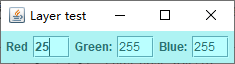

`JLayer` 类将一个构件与某个 `LayerUI` 对象关联在一起，而后者将负责绘制和事件处理。`LayerUI` 类应该有一个必须与所关联的构件相匹配的类型参数。例如，下面的代码在一个 `JPanel` 中添加了一个层：

```java
Jpanel panel = new JPanel();
LayerUI<JPanel> layerUI = new PanelLayer();
JLayer layer = new JLayer(panel, layerUI);
frame.add(layer);
```

> 注意：这段代码向父面板添加的是层而不是面板，其中， `PanelLayer` 是一个子类：
>
> ```java
> class PanelLayer extends LayerUI<Panel> {
>     public void paint(Graphics g, JComponent c) {
>         ...
>     }
>     ...
> }
> ```

在 `LayerUI` 的 `paint` 方法中，可以绘制任意想要绘制的东西，但是要记住需要调用 `super.paint` 以确保构件被正确绘制。这里，我们在整个构件上绘制了透明的颜色：

```java
public void paint(Graphics g, JComponent c) {
    super.paint(g, c);
    
    Graphics2D g2 = (Graphics2D) g.create();
    g2.setComposite(AlphaComposite.getInstance(AlphaComposite.SRC_OVER, .3f));
    g2.setPaint(color);
    g2.fillRect(0, 0, c.getWidth(), c.getHeight());
    g2.dispose();
}
```

为了监听来自所关联构件或任意子构件的事件，`LayerUI` 类必须设置层事件掩码，这应该在 `installUI` 方法中完成，就像下面这样：

```java
class PanelLayer extends LayerUI<JPanel> {
    
    public void installUI(JComponent c) {
        super.installUI(c);
        ((JLayer<?>) c).setLayerEventMask(AWTEvent.KEY_EVENT_MASK | AWTEvent.FOCUS_EVENT_MASK);
    }
    
    public void uninstallUI(JComponent c) {
        ((JLayer<?>) c).setLayerEventMask(0);
        super.uninstallUI(c);
    }
    ...
}
```

**示例程序：layer/ColorFrame.java**

```java
package layer;

import java.awt.AWTEvent;
import java.awt.AlphaComposite;
import java.awt.Color;
import java.awt.Component;
import java.awt.Font;
import java.awt.Graphics;
import java.awt.Graphics2D;
import java.awt.event.FocusEvent;
import java.awt.event.KeyEvent;

import javax.swing.JComponent;
import javax.swing.JFrame;
import javax.swing.JLabel;
import javax.swing.JLayer;
import javax.swing.JPanel;
import javax.swing.JTextField;
import javax.swing.plaf.LayerUI;

public class ColorFrame extends JFrame {

	private JPanel panel;
	private JTextField redField;
	private JTextField greenField;
	private JTextField blueField;
	
	public ColorFrame() {
		panel = new JPanel();
		
		panel.add(new JLabel("Red"));
		redField = new JTextField("255", 3);
		panel.add(redField);
		
		panel.add(new JLabel("Green:"));
		greenField = new JTextField("255", 3);
		panel.add(greenField);
		
		panel.add(new JLabel("Blue:"));
		blueField = new JTextField("255", 3);
		panel.add(blueField);
		
		LayerUI<JPanel> layerUI = new PanelLayer();
		JLayer<JPanel> layer = new JLayer<JPanel>(panel, layerUI);
		
		add(layer);
		pack();
	}
	
	class PanelLayer extends LayerUI<JPanel> {
		
		@Override
		public void installUI(JComponent c) {
			super.installUI(c);
			System.out.println("installUI");
			((JLayer<?>) c).setLayerEventMask(AWTEvent.KEY_EVENT_MASK | AWTEvent.FOCUS_EVENT_MASK);
		}
		
		@Override
		public void uninstallUI(JComponent c) {
			System.out.println("uninstallUI");
			((JLayer<?>) c).setLayerEventMask(0);
			super.uninstallUI(c);
		}
		
		@Override
		protected void processFocusEvent(FocusEvent e, JLayer<? extends JPanel> l) {
			if (e.getID() == FocusEvent.FOCUS_GAINED) {
				Component c = e.getComponent();
				c.setFont(getFont().deriveFont(Font.BOLD));
			}
			if (e.getID() == FocusEvent.FOCUS_LOST) {
				Component c = e.getComponent();
				c.setFont(getFont().deriveFont(Font.PLAIN));
			}
		}
		
		@Override
		protected void processKeyEvent(KeyEvent e, JLayer<? extends JPanel> l) {
			l.repaint();
		}
		
		@Override
		public void paint(Graphics g, JComponent c) {
			super.paint(g, c);
			
			Graphics2D g2 = (Graphics2D) g.create();
		    g2.setComposite(AlphaComposite.getInstance(AlphaComposite.SRC_OVER, .3f));
		    int red = Integer.parseInt(redField.getText().trim());
		    int green = Integer.parseInt(greenField.getText().trim());
		    int blue = Integer.parseInt(blueField.getText().trim());
		    g2.setPaint(new Color(red, green, blue));
		    g2.fillRect(0, 0, c.getWidth(), c.getHeight());
		    g2.dispose();
		}
	}
}
```

运行效果如下：

