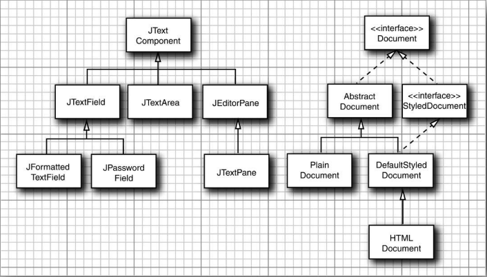

<b>文本构件和文档的层次结构</b>

`JEditorPane` 可以展示和编辑各种格式的样式文本（包括字体、颜色等），特别是 `HTML`，`StyledDocument` 接口描述了对样式、字体和颜色的额外需求，而 `HTMLDocument` 类实现了这个接口。

`JEditorPane` 的子类 `JTextPane` 可以持有样式化的文本和嵌入的 `Swing` 构件，但是推荐参考 `Kim Toley` 所著的 《Core Swing》 一书以了解其中关于此构件十分详细的描述。对于 `JTextPane` 类的典型用法，可以查看 `JDK` 中的 `StylePad` 颜色程序。

