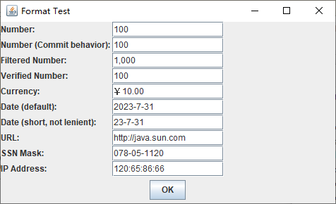

[toc]

`JFormattedTextField` 类不仅可以用于数字型的输入，而且可以用于日期型输入以及更加专用的格式化输入值，例如 `IP` 地址：

### 1. 整数输入

创建用于整数格式化输入的文本框代码如下所示：

```java
JFormattedTextField intField = new JFormattedTextField(NumberFormat.getIntegerInstance());
```

对于任何文本框，都可以设置整数的位数：

```java
intField.setColumns(6);
```

还可以用 `setValue` 方法设置其默认值，该方法接受一个 `Object` 类型的参数：

```java
intField.setValue(new Integer(100));
```

可以用 `getValue` 方法来获取用户提供的值，这个方法返回的是一个 `Object` 类型的结果，必须将它转型为恰当的类型。

```java
Number value = (Number) intField.getValue();
int v = value.intValue();
```

### 2. 失去焦点时的行为

当格式化文本框失去焦点时，格式器会查看用户输入的文本字符串。如果格式器知道如何将这个文本字符串转换为对象，那么这个文本就是有效的，否则就是无效的。可以使用 `isEditValid` 方法来检查文本框的当前内容是否有效。

如果文本字符串有效，则它被提交，之后格式器将其转换为对象，而该对象将成为文本框的当前值。

反之，如果文本字符串无效，则当前值不发生变化，而文本框将恢复到表示原有值的字符串。

> 注意：整数格式器将以整数开头的文本字符串当作是有效的。例如，1729x 是有效的字符串，它将被转换为数字 1729，这个数字之后会被格式化为字符串 1,729.

可以用 `setFocusLostBehavior` 方法来设置其他的行为。"提交" 行为与默认行为有些细微的差异，如果文本字符串无效，那么文本字符串和文本框的值都将保持不变，现在它们是不同步的。"持久化" 行为更加保守，即使文本字符串是有效的，文本框和当前值也都不发生变化，这时需要调用 `commitEdit`、`setValue` 和 `setText` 来使它们同步。

### 3. 过滤器

我们可以用文档过滤器来防止用户键入非法字符。要过滤非法字符，需要覆写 `PlainDocument` 类的 `insertString` 方法：

```java
public void insertString(FilterBypass fb, int offset, String string, AttributeSet attr) throws BadLocationException {
    StringBuilder builder = new StringBuilder(string);
    for (int i = builder.length() - 1; i >= 0; i--) {
        int cp = builder.codePointAt(i);
        if (!Character.isDigit(cp) && cp != '-') {
            builder.deleteCharAt(i);
            if (Character.isSupplementaryCodePoint(cp)) {
                i--;
                builder.deleteCharAt(i);
            }
        }
    }
    super.insertString(fb, offset, builder.toString(), attr);
}
```

还应该覆盖 `DocumentFilter` 类的 `replace` 方法，该方法在文本被选中并被替换时调用。

现在需要安装文档过滤器。但是，没有很直观的方法可以实现这个任务，必须覆盖某个格式器类的 `getDocumentFilter` 方法，然后将这个格式化器的一个对象传递给 `JFormattedTextField` ：

```java
JFormattedTextField intField = new JFormattedTextField(new InternationalFormatter(NumberFormat.getIntegerInstance()) {
    private DocumentFilter filter = new IntFilter();
    protected DocumentFilter getDocumentFilter() {
        return filter;;
    }
})
```

> 注意：`Java SE` 文档声明 `DocumentFilter` 类被设计为禁止子类化。直到 `Java SE 1.3`，文本框中的过滤机制才通过扩展 `PlainDocument` 类和覆盖 `insertString` 与 `replace` 方法得到了实现。

### 4. 校验器

可以在任意的 `JComponent` 上附着一个校验器。如果该构件失去了焦点，那么校验器就会被查询。如果校验器报告该构件的内容无效，那么该构件就会立即重新获得焦点。

校验器必须扩展 `InputVerifier` 类并定义 `verify` 方法，而定义检查格式化文本框的校验器非常容易。`JFormattedTextField` 类的 `isEditValid` 方法将调用格式器，并且在格式器可以将文本字符串转换为对象时返回 `true`。

```java
intField.setInputVerifier(new InputVerifier() {
    public boolean verify(JComponent component) {
        JFormattedTextField field = (JFormattedTextField) component;
        return field.isEditValid();
    }
})
```

但是，校验器并非总是很安全。如果点击了某个按钮，而这个按钮在无效构件再次获得焦点之前通知了它的动作监听器就会从未通过校验的构件中得到一个无效的结果。这种行为的原因在于：用户可能希望点击 `Cancel` 按钮，而无需订正无效输入。

### 5. 其他的标准格式器

`NumberFormat` 类有以下静态方法：

```
getNumberInstance
getCurrencyInstance
getPercentInstance
```

它们将分别产生用于浮点数字、货币值和百分比的格式器。

```java
JFormattedTextField currencyField = new JFormattedTextField(NumberFormat.getCurrencyInstance());
```

要编辑日期和时间，可以调用 `DateFormat` 类的下列静态方法之一：

```
getDateInstance
getTimeInstance
getDateTimeInstance
```

例如：

```java
JFormattedTextField dateField = new JFormattedTextField(DateFormat.getDateInstance());
```

所产生的文本框将用默认格式或下面的 "中等长度" 格式来编辑日期：

```
Aug 5, 2007
```

也可以选择使用 "短" 格式：

```
8/5/07
```

方法是调用下面的语句：

```java
DateFormat.getDateInstance(DateFormat.SHORT);
```

> 注意：默认情况下，日期格式器是很 "宽容" 的，也就是说，像 2002 年 2 月 31 日这样的无效日期将会滚动到下一个有效日期 2002 年 3 月 3 日。可以在 `DateFormat` 对象上调用 `setLenient(false)` 方法关闭该功能。

对于任何类，只要它有一个接受字符串参数的构造器，以及相匹配的 `toString` 方法，那么 `DefaultFormatter` 就可以格式化它的对象。

> 注意：默认情况下，`DefaultFormatter` 是覆写模式，这与其他格式器很不相同，并且不是非常有用。调用 `setOverwriteMode(false)` 可以关闭覆写模式。

最后，`MaskFormatter` 对于包含部分常量和部分变量字符的固定尺寸的模式是非常有用的。例如：

```java
new MaskFormatter("###-##-####");
```

其中 `#` 符号表示单个数字。

<center><b>MaskFormatter 符号</b></center>

| 符号 | 解释                 | 符号 | 解释                           |
| ---- | -------------------- | ---- | ------------------------------ |
| `#`  | 一个数字             | `A`  | 一个字母或数字                 |
| `?`  | 一个字母             | `H`  | 一个十六进制数字 `[0-9A-Fa-f]` |
| `U`  | 一个字母，转换为大写 | `*`  | 任何字符                       |
| `L`  | 一个字母，转换为小写 | `'`  | 在模式中包含的转义字符         |

我们可以通过调用 `MaskFormatter` 类的下列方法之一来限制可以键入到文本框中的字符：

```
setValidCharacters
setInvalidCharacters
```

例如，要读入用字母表示的成绩（例如 A+ 或 F），可以执行下面的语句：

```java
MaskFormatter formatter = new MaskFormatter("U*");
formatter.setValidCharacters("ABCDF+-");
```

> 注意：由掩码格式器格式化的字符串与掩码有严格相同的长度。如果用户在编辑时删除了某些字符，那么它们就会被占位符所替换。默认的占位符是空格，但是可以用 `setPlaceholderCharacter` 方法来改变它，例如：
>
> ```java
> formatter.setPlaceholderCharacter('0');
> ```

### 6. 定制格式化器

要定义自己的格式器，需要扩展 `DefaultFormatter` 类，并覆盖下面的方法：

```java
String valueToString(Object value);
Object stringToValue(String text);
```

第一个方法将文本框的值转换为显示在其中的字符串；第二个方法解析用户键入的文本，并将其转换回对象。这两个方法只要发现了错误，就应该抛出 `ParseException`。

> 提示：`Swing Connection` 在线通讯有一篇短文描述了一个可以与任何正则表达式匹配的格式器。参见 <http://www.oracle.com/technetwork/java/reftf-138955.html>。

**示例代码：**

运行效果如下：



1. textFormat/FormatTest.java

   ```java
   package textFormat;
   
   import java.awt.EventQueue;
   
   import javax.swing.JFrame;
   
   public class FormatTest {
   
   	public static void main(String[] args) {
   		EventQueue.invokeLater(() -> {
   			JFrame frame = new FormatTestFrame();
   			frame.setTitle("Format Test");
   			frame.setDefaultCloseOperation(JFrame.EXIT_ON_CLOSE);
   			frame.setVisible(true);
   		});
   	}
   }
   ```

2. textFormat/FormatTestFrame.java

   ```java
   package textFormat;
   
   import java.awt.BorderLayout;
   import java.awt.GridLayout;
   import java.net.MalformedURLException;
   import java.net.URL;
   import java.text.DateFormat;
   import java.text.NumberFormat;
   import java.text.ParseException;
   import java.util.Arrays;
   import java.util.Date;
   
   import javax.management.ReflectionException;
   import javax.swing.InputVerifier;
   import javax.swing.JButton;
   import javax.swing.JComponent;
   import javax.swing.JFormattedTextField;
   import javax.swing.JFrame;
   import javax.swing.JLabel;
   import javax.swing.JPanel;
   import javax.swing.text.DefaultFormatter;
   import javax.swing.text.DocumentFilter;
   import javax.swing.text.InternationalFormatter;
   import javax.swing.text.MaskFormatter;
   
   public class FormatTestFrame extends JFrame {
   	
   	private DocumentFilter filter = new IntFilter();
   	private JButton okButton;
   	private JPanel mainPanel;
   	
   	public FormatTestFrame() {
   		JPanel buttonPanel = new JPanel();
   		okButton = new JButton("OK");
   		buttonPanel.add(okButton);
   		add(buttonPanel, BorderLayout.SOUTH);
   		
   		mainPanel = new JPanel();
   		mainPanel.setLayout(new GridLayout(0, 3));
   		add(mainPanel, BorderLayout.CENTER);
   		
   		JFormattedTextField intField = new JFormattedTextField(NumberFormat.getIntegerInstance());
   		intField.setValue(new Integer(100));
   		addRow("Number: ", intField);
   		
   		JFormattedTextField intField2 = new JFormattedTextField(NumberFormat.getIntegerInstance());
   		intField2.setValue(new Integer(100));
   		intField2.setFocusLostBehavior(JFormattedTextField.COMMIT);
   		addRow("Number (Commit behavior): ", intField2);
   		
   		JFormattedTextField intField3 = new JFormattedTextField(new InternationalFormatter(NumberFormat.getInstance()) {
   			@Override
   			protected DocumentFilter getDocumentFilter() {
   				return filter;
   			}
   		});
   		intField3.setValue(new Integer(1000));
   		addRow("Filtered Number:", intField3);
   		
   		JFormattedTextField intField4 = new JFormattedTextField(NumberFormat.getIntegerInstance());
   		intField4.setValue(100);
   		intField4.setInputVerifier(new InputVerifier() {
   			
   			@Override
   			public boolean verify(JComponent input) {
   				JFormattedTextField field = (JFormattedTextField) input;
   				return field.isEditValid();
   			}
   		});
   		addRow("Verified Number:", intField4);
   		
   		JFormattedTextField currencyField = new JFormattedTextField(NumberFormat.getCurrencyInstance());
   		currencyField.setValue(new Double(10));
   		addRow("Currency:", currencyField);
   		
   		JFormattedTextField dateField = new JFormattedTextField(DateFormat.getDateInstance());
   		dateField.setValue(new Date());
   		addRow("Date (default):", dateField);
   		
   		DateFormat format = DateFormat.getDateInstance(DateFormat.SHORT);
   		format.setLenient(false);
   		JFormattedTextField dateField2 = new JFormattedTextField(format);
   		dateField2.setValue(new Date());
   		addRow("Date (short, not lenient):", dateField2);
   		
   		try {
   			DefaultFormatter formatter = new DefaultFormatter();
   			formatter.setOverwriteMode(false);
   			JFormattedTextField urlField = new JFormattedTextField(formatter);
   			urlField.setValue(new URL("http://java.sun.com"));
   			addRow("URL:", urlField);
   		} catch (MalformedURLException ex) {
   			ex.printStackTrace();
   		}
   		
   		try {
   			MaskFormatter formatter = new MaskFormatter("###-##-####");
   			formatter.setPlaceholderCharacter('0');
   			JFormattedTextField ssnField = new JFormattedTextField(formatter);
   			ssnField.setValue("078-05-1120");
   			addRow("SSN Mask:", ssnField);
   		} catch (ParseException ex) {
   			ex.printStackTrace();
   		}
   		
   		JFormattedTextField ipField = new JFormattedTextField(new IPAddressFormatter());
   		ipField.setValue(new byte[] { (byte) 120, 65, 86, 66});
   		addRow("IP Address:", ipField);
   		pack();
   	}
   	
   	public void addRow(String labelText, final JFormattedTextField field) {
   		mainPanel.add(new JLabel(labelText));
   		mainPanel.add(field);
   		final JLabel valueLabel = new JLabel();
   		mainPanel.add(valueLabel);
   		okButton.addActionListener(event -> {
   			Object value = field.getValue();
   			Class<?> cl = value.getClass();
   			String text = null;
   			if (cl.isArray()) {
   				if (cl.getComponentType().isPrimitive()) {
   					try {
   						text = Arrays.class.getMethod("toString",  cl).invoke(null, value).toString();
   					} catch (ReflectiveOperationException ex) {
   						// ignore reflection exception
   						ex.printStackTrace();
   					}
   				} else {
   					text = Arrays.toString((Object[]) value);
   				}
   			} else {
   				text = value.toString();
   			}
   			valueLabel.setText(text);
   		});
   	}
   }
   ```

3. textFormat/IntFilter.java

   ```java
   package textFormat;
   
   import javax.swing.text.AttributeSet;
   import javax.swing.text.BadLocationException;
   import javax.swing.text.DocumentFilter;
   
   public class IntFilter extends DocumentFilter {
   	
   	@Override
   	public void insertString(FilterBypass fb, int offset, String string, AttributeSet attr)
   			throws BadLocationException {
   		StringBuilder builder = new StringBuilder(string);
   		for (int i = builder.length() - 1; i >= 0; i--) {
   			int cp = builder.codePointAt(i);
   			if (!Character.isDigit(cp) && cp != '-') {
   				i--;
   				builder.deleteCharAt(i);
   			}
   		}
   		super.insertString(fb, offset, string, attr);
   	}
   	
   	@Override
   	public void replace(FilterBypass fb, int offset, int length, String text, AttributeSet attrs)
   			throws BadLocationException {
   		if (text != null) {
   			StringBuilder builder = new StringBuilder(text);
   			for (int i = builder.length() - 1; i >= 0; i--) {
   				int cp = builder.codePointAt(i);
   				if (!Character.isDigit(cp) && cp != '-') {
   					builder.deleteCharAt(i);
   					if (Character.isSupplementaryCodePoint(cp)) {
   						i--;
   						builder.deleteCharAt(i);
   					}
   				}
   			}
   			text = builder.toString();
   		}
   		super.replace(fb, offset, length, text, attrs);
   	}
   
   }
   ```

4. textFormat/IPAddressFormatter.java

   ```java
   package textFormat;
   
   import java.text.ParseException;
   import java.util.StringTokenizer;
   
   import javax.swing.text.DefaultFormatter;
   
   public class IPAddressFormatter extends DefaultFormatter {
   
   	@Override
   	public String valueToString(Object value) throws ParseException {
   		if (!(value instanceof byte[])) throw new ParseException("Not a byte[]", 0);
   		byte[] a = (byte[]) value;
   		if (a.length != 4) throw new ParseException("length != 4", 0);
   		StringBuilder builder = new StringBuilder();
   		for (int i = 0; i < 4; i++) {
   			int b = a[i];
   			if (b < 0) b += 256;
   			builder.append(String.valueOf(b));
   			if (i < 3) builder.append(':');
   		}
   		return builder.toString();
   	}
   	
   	@Override
   	public Object stringToValue(String string) throws ParseException {
   		StringTokenizer tokenizer = new StringTokenizer(string, ".");
   		byte[] a = new byte[4];
   		for (int i = 0; i < 4; i++) {
   			int b = 0;
   			if (!tokenizer.hasMoreElements()) throw new ParseException("Too few bytes", 0);
   			try {
   				b = Integer.parseInt(tokenizer.nextToken());
   			} catch (NumberFormatException ex) {
   				throw new ParseException("Not an integer", 0);
   			}
   			if (b < 0 || b >= 256) throw new ParseException("Byte out of range", 0);
   			a[i] = (byte) b;
   		}
   		if (tokenizer.hasMoreElements()) throw new ParseException("Too many bytes", 0);
   		return a;
   	}
   	
   }
   ```
