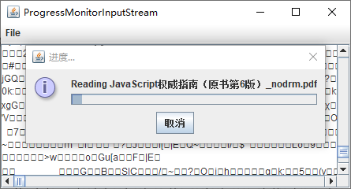

`ProgressMonitorInputStream` 可以自动弹出一个对话框，监视已经从流中读取了多少。

例如，假定你现在要从一个文件中读取文本。首先要使用一个 `FileInputStream`：

```java
FileInputStream in = new FileInputStream(f);
```

通常情况下，要将 `in` 转换成一个 `InputStreamReader`：

```java
InputStreamReader reader = new InputStreamReader(in);
```

为了监视这个流，首先要将这个文件输入流转换成一个具有进度监视器的数据流：

```java
ProgressMonitorInputStream progressIn = new ProgressMonitorInputStream(parent, caption, in);
```

你要提供一个父构件、一个标题，当然还有要监视的流。进度监视器流的 `read` 方法只能传输字节和更新进度对话框。

现在可以开始着手构建你的过滤器序列：

```java
InputStreamReader reader = new InputStreamReader(progressIn);
```

> 警告：进度监视器流使用 `InputStream` 类的 `available` 方法来确定流中的总字节数。但是，`available` 方法只报告流中不阻塞即可访问到的字节数。进度监视器适用于文件以及 `HTTP URL`，因为它们的长度都是事先可以知道的，但它并不适用于所有的流。

**示例程序：progressMonitorInputStream/TextFrame.java**

```java
package progressMonitorInputStream;

import java.io.File;
import java.io.IOException;
import java.io.InputStream;
import java.nio.file.Files;
import java.util.Scanner;

import javax.swing.JFileChooser;
import javax.swing.JFrame;
import javax.swing.JMenu;
import javax.swing.JMenuBar;
import javax.swing.JMenuItem;
import javax.swing.JScrollPane;
import javax.swing.JTextArea;
import javax.swing.ProgressMonitorInputStream;
import javax.swing.SwingWorker;

public class TextFrame extends JFrame {

	public static final int TEXT_ROWS = 10;
	public static final int TEXT_COLUMNS = 40;
	
	private JMenuItem openItem;
	private JMenuItem exitItem;
	private JTextArea textArea;
	private JFileChooser chooser;
	
	public TextFrame() {
		textArea = new JTextArea(TEXT_ROWS, TEXT_COLUMNS);
		add(new JScrollPane(textArea));
		
		chooser = new JFileChooser();
		chooser.setCurrentDirectory(new File("."));
		
		JMenuBar menuBar = new JMenuBar();
		setJMenuBar(menuBar);
		JMenu fileMenu = new JMenu("File");
		menuBar.add(fileMenu);
		openItem = new JMenuItem("Open");
		openItem.addActionListener(event -> {
			try {
				openFile();
			} catch (IOException e) {
				e.printStackTrace();
			}
		});
		
		fileMenu.add(openItem);
		exitItem = new JMenuItem("Exit");
		exitItem.addActionListener(event -> System.exit(0));
		fileMenu.add(exitItem);
		pack();
	}
	
	public void openFile() throws IOException {
		int r = chooser.showOpenDialog(this);
		if (r != JFileChooser.APPROVE_OPTION) return;
		final File f = chooser.getSelectedFile();
		
		// set up stream and reader filter sequence
		
		InputStream fileIn = Files.newInputStream(f.toPath());
		final ProgressMonitorInputStream progressIn = new ProgressMonitorInputStream(this, "Reading " + f.getName(), fileIn);
		
		textArea.setText("");
		
		SwingWorker<Void, Void> worker = new SwingWorker<Void, Void>() {
			@Override
			protected Void doInBackground() throws Exception {
				try (Scanner in = new Scanner(progressIn, "UTF-8")) {
					while (in.hasNextLine()) {
						String line = in.nextLine();
						textArea.append(line);
						textArea.append("\n");
					}
				}
				return null;
			}
		};
		worker.execute();
	}
}
```

运行效果如下：

