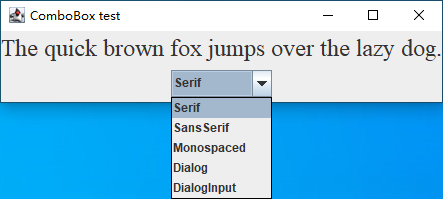

当用户点击组合框组件时，选择列表就会下拉出来，用户可以从中选择一项。



调用 `setEditable` 方法可以让组合框可编辑。注意，编辑只会影响当前项，而不会改变列表内容。

可以调用 `getSelectedItem` 方法获取当前的选项。

可以调用 `addItem` 方法增加选项。

可以利用 `insertItemAt` 方法在列表的任何位置插入一个新选项：

```java
faceCombo.insertItemAt("Monospaced", 0);	// add at the beginning
```

如果需要在运行时删除某些选项，可以使用 `removeItem` 或者 `removeItemAt` 方法，使用哪个方法将取决于参数提供的是想要删除的选项内容，还是选项位置。

```java
faceCombo.removeItem("Monospaced");
faceCombo.removeItemAt(0);	// remove first item
```

调用 `removeAllItems` 方法将立即移除所有的选项。

> 提示：如果需要往组合框中添加大量的选项，`addItem` 方法的性能就显得很差了。取而代之的是构造一个 `DefaultComboBoxModel`，并调用 `addElement` 方法进行加载，然后再调用 `JComboBox` 中的 `setModel` 方法。

当用户从组合框中选择一个选项时，组合框就将产生一个动作事件。为了判断哪个选项被选择，可以通过事件参数调用 `getSource` 方法来得到发送事件的组合框引用，接着调用 `getSelectedItem` 方法获取当前选择的选项。需要把这个方法的返回值转化为相应的类型，通常是 `String` 型。

```java
ActionListener listener = event -> {
    label.setFont(new Font(faceCombo.getItemAt(faceCombo.getSelectedIndex()), Font.PLAIN, DEFAULT_SIZE));
};
```

**示例代码：**

```java
import java.awt.BorderLayout;
import java.awt.EventQueue;
import java.awt.Font;

import javax.swing.JComboBox;
import javax.swing.JFrame;
import javax.swing.JLabel;
import javax.swing.JPanel;

public class ComboBoxTest {

	public static void main(String[] args) {
		EventQueue.invokeLater(() -> {
			JFrame frame = new ComboBoxFrame();
			frame.setTitle("ComboBox test");
			frame.setDefaultCloseOperation(JFrame.EXIT_ON_CLOSE);
			frame.setVisible(true);
		});
	}
	
}

class ComboBoxFrame extends JFrame {
	
	private static final int DEFAULT_SIZE = 24;
	
	private JComboBox<String> faceCombo;
	private JLabel label;
	
	public ComboBoxFrame() {
		// add the sample text label
		label = new JLabel("The quick brown fox jumps over the lazy dog.");
		label.setFont(new Font("Serif", Font.PLAIN, DEFAULT_SIZE));
		add(label, BorderLayout.CENTER);
		
		// make a combo box and add face names
		faceCombo = new JComboBox<>();
		faceCombo.addItem("Serif");
		faceCombo.addItem("SansSerif");
		faceCombo.addItem("Monospaced");
		faceCombo.addItem("Dialog");
		faceCombo.addItem("DialogInput");
		
		// the combo box listener changes the label font to the selected face name
		faceCombo.addActionListener(event -> {
			label.setFont(new Font(faceCombo.getItemAt(faceCombo.getSelectedIndex()), Font.PLAIN, DEFAULT_SIZE));
		});
		
		// add combo box to a panel at the frame's southern border
		JPanel comboPanel = new JPanel();
		comboPanel.add(faceCombo);
		add(comboPanel, BorderLayout.SOUTH);
		pack();
	}
}
```

