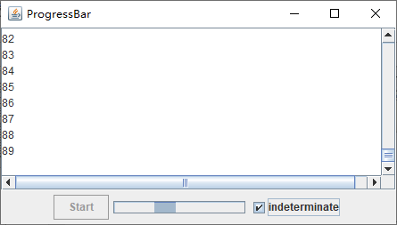

通过提供最大值和最小值以及一个可供选择的定位方向，就可以像构建一个滑动条那样构建一个进度条：

```java
JProgressBar progressBar = new JProgressBar(0, 1000);
JProgressBar progressBar = new JProgressBar(SwingConstants.VERTICAL, 0, 1000);
```

也可以使用 `setMinimum` 和 `setMaximum` 方法来设置最大值和最小值。

和滑动条不同的是，进度条不能让用户自行调节。你的程序必须调用 `setValue` 才能对它进行更新。

如果调用：

```java
progressBar.setStringPainted(true);
```

那么进度条会计算出某项操作完成的百分比，然后以一个 `n%` 形式的字符串将它显示出来。如果你想以不同形式的字符串将它显示出来，可以用 `setString` 方法提供该字符串：

```java
if (progressBar.getValue() > 900) {
    progressBar.setString("Almost Done");
}
```

`Java SE 1.4` 增加了对不确定进度条的支持，这种进度条能够以动画显示某种类型的进度，而不具体显示完成情况的百分比。如果要以动画显示 "不确定等待"，请调用 `setIndeterminate` 方法。

**示例程序：progressBar/ProgressBarFrame.java**

```java
package progressBar;

import java.awt.BorderLayout;
import java.util.List;

import javax.swing.JButton;
import javax.swing.JCheckBox;
import javax.swing.JFrame;
import javax.swing.JPanel;
import javax.swing.JProgressBar;
import javax.swing.JScrollPane;
import javax.swing.JTextArea;
import javax.swing.SwingWorker;

public class ProgressBarFrame extends JFrame {

	public static final int TEXT_ROWS = 10;
	public static final int TEXT_COLUMNS = 40;
	
	private JButton startButton;
	private JProgressBar progressBar;
	private JCheckBox checkBox;
	private JTextArea textArea;
	private SimulatedActivity activity;
	
	public ProgressBarFrame() {
		// this text area holds the activity output
		textArea = new JTextArea(TEXT_ROWS, TEXT_COLUMNS);
		
		// set up panel with button and progress bar
		
		final int MAX = 1000;
		JPanel panel = new JPanel();
		startButton = new JButton("Start");
		progressBar = new JProgressBar(0, MAX);
		progressBar.setStringPainted(true);
		panel.add(startButton);
		panel.add(progressBar);
		
		checkBox = new JCheckBox("indeterminate");
		checkBox.addActionListener(event -> {
			progressBar.setIndeterminate(checkBox.isSelected());
			progressBar.setStringPainted(!progressBar.isIndeterminate());
		});
		panel.add(checkBox);
		add(new JScrollPane(textArea), BorderLayout.CENTER);
		add(panel, BorderLayout.SOUTH);
		
		// set up the button action
		
		startButton.addActionListener(event -> {
			startButton.setEnabled(false);
			activity = new SimulatedActivity(MAX);
			activity.execute();
		});
		pack();
	}
	
	class SimulatedActivity extends SwingWorker<Void, Integer> {
		
		private int current;
		private int target;
		
		public SimulatedActivity(int t) {
			current = 0;
			target = t;
		}
		
		protected Void doInBackground() throws Exception {
			try {
				while (current < target) {
					Thread.sleep(100);
					current++;
					publish(current);
				}
			} catch (InterruptedException e) {
				e.printStackTrace();
			}
			return null;
		}
		
		@Override
		protected void process(List<Integer> chunks) {
			for (Integer chunk : chunks) {
				textArea.append(chunk + "\n");
				progressBar.setValue(chunk);
			}
		}
		
		@Override
		protected void done() {
			startButton.setEnabled(true);
		}
	}
}
```

运行效果如下：

