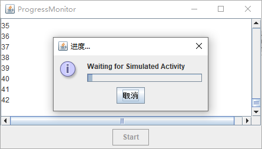

`ProgressMonitor` 是一个完整的包含进度条的对话框。这个对话框还包含一个 `Cancel` 按钮，如果点击该按钮，那么将会关闭监视器对话框。另外，程序还可以查询用户是否已经取消对话框并终止了监视活动。

通过提供下面这些信息，就可以构建一个进度监视器：

+ 在其上弹出对话框的父构件。

+ 在对话框上显示一个对象（可能是一个字符串、图标或者是一个构件）。

+ 在对象下面显示一个可选注释。

+ 最大值以及最小值。

不过，进度监视器无法自己测量进度或者取消活动。因此，仍需定时调用 `setProgress` 方法设置进度值。在取消监视器活动的时候，请调用 `close` 方法来撤销对话框。还可以再次调用 `start` 重新使用该对话框。

使用 `setMillisToDecideToPopup` 方法可以设置在构建对话框对象和确定是否显示弹出对话框之间需要等待的毫秒数，默认值是 500 毫秒。

`setMillisToPopup` 是你估计对话框弹出所需的时间，`Swing` 设计者将这个值默认设置为 2 秒。

**示例程序：progressMonitor/ProgressMonitorFrame.java**

```java
package progressMonitor;

import java.awt.BorderLayout;
import java.util.List;

import javax.swing.JButton;
import javax.swing.JFrame;
import javax.swing.JPanel;
import javax.swing.JScrollPane;
import javax.swing.JTextArea;
import javax.swing.ProgressMonitor;
import javax.swing.SwingWorker;
import javax.swing.Timer;

public class ProgressMonitorFrame extends JFrame {

	public static final int TEXT_ROWS = 10;
	public static final int TEXT_COLUMNS = 40;
	
	private Timer cancelMonitor;
	private JButton startButton;
	private ProgressMonitor progressDialog;
	private JTextArea textArea;
	private SimulatedActivity activity;
	
	public ProgressMonitorFrame() {
		// this text area holds the activity output
		textArea = new JTextArea(TEXT_ROWS, TEXT_COLUMNS);
		
		// set up a button panel
		JPanel panel = new JPanel();
		startButton = new JButton("Start");
		panel.add(startButton);
		
		add(new JScrollPane(textArea), BorderLayout.CENTER);
		add(panel, BorderLayout.SOUTH);
		
		// set up the button action
		
		startButton.addActionListener(event -> {
			startButton.setEnabled(false);
			final int MAX = 1000;
			
			// start activity
			activity = new SimulatedActivity(MAX);
			activity.execute();
			
			// launch progress dialog
			progressDialog = new ProgressMonitor(ProgressMonitorFrame.this, "Waiting for Simulated Activity", null, 0, MAX);
			cancelMonitor.start();
		});
		
		// set up the timer action
		
		cancelMonitor = new Timer(500, event -> {
			if (progressDialog.isCanceled()) {
				activity.cancel(true);
				startButton.setEnabled(true);
			} else if (activity.isDone()) {
				progressDialog.close();
				startButton.setEnabled(true);
			} else {
				progressDialog.setProgress(activity.getProgress());
			}
		});
		pack();
	}
	
	class SimulatedActivity extends SwingWorker<Void, Integer> {
		
		private int current;
		private int target;
		
		public SimulatedActivity(int t) {
			current = 0;
			target = t;
		}
		
		protected Void doInBackground() throws Exception {
			try {
				while (current < target) {
					Thread.sleep(100);
					current++;
					publish(current);
				}
			} catch (InterruptedException e) {
				e.printStackTrace();
			}
			return null;
		}
		
		@Override
		protected void process(List<Integer> chunks) {
			for (Integer chunk : chunks) {
				textArea.append(chunk + "\n");
				progressDialog.setProgress(chunk);
			}
		}
		
		@Override
		protected void done() {
			startButton.setEnabled(true);
		}
	}
}
```

运行效果如下：


