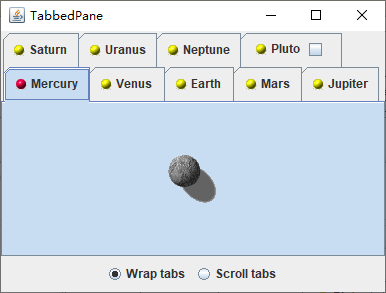

为了创建一个选项卡面板，首先要构建一个 `JTabbedPane` 对象，然后向其中添加选项卡：

```java
JTabbedPane tabbedPane = new JTabbedPane();
tabbedPane.addTab(title, icon, component);
```

`addTab` 方法最后一个参数的类型为 `Component`。为了向同一个选项卡中添加多个构件，首先要将这些构件包装到一个容器中，例如一个 `JPanel`。

该方法中的图标参数是一个可选项。`addTab` 方法并非一定要有一个图标参数，例如：

```java
tabbedPane.addTab(title, component);
```

也可以使用 `insertTab` 方法，将一个选项卡添加到选项卡集中：

```java
tabbedPane.insertTab(title, icon, component, tooltip, index);
```

如果要从选项卡集中删掉一个选项卡，请使用：

```java
tabPane.removeTabAt(index);
```

向选项集中添加一个新的选项卡时，并不能自动将其显示出来，必须使用 `setSelectedIndex` 方法选定它。

```java
tabbedPane.setSelectedIndex(tabbedPane.getTabCount() - 1);
```

调用下面这个方法，就可以将选项卡布局设置为隐藏格式或者滚动模式：

```java
tabbedPane.setTabLayoutPolicy(JTabbedPane.WRAP_TAB_LAYOUT);
```

或者

```java
tabbedPane.setTabLayoutPolicy(JTabbedPane.SCROLL_TAB_LAYOUT);
```

选项卡标签可以有快捷键，就像菜单项一样。例如：

```java
int marsIndex = tabbedPane.indexOfTab("Mars");
tabbedPane.setMnemonicAt(marsIndex, KeyEvent.VK_M);
```

之后 `M` 就会有下划线，而程序用户可以通过键入 <kbd>ALT</kbd> + <kbd>M</kbd> 来选择选项卡。

可以在选项卡标题栏中添加任何构件，此时，首先需要添加选项卡，然后调用：

```java
tabbedPane.setTabComponentAt(index, component);
```

为了在用户任何时候点击一个新选项卡时都能获得通知，需要为选项卡面板安装一个 `ChangeListener`。注意，必须为选项卡面板本身添加监听器，而不是它所包含的任何一个选项卡构件。

```java
tabbedPane.addChangeListener(listener);
```

当用户选定一个选项卡时，就会调用修改监听器的 `stateChanged` 方法。可以将选项卡面板作为事件源来读取，并调用 `getSelectedIndex` 方法就可以查明将要显示哪个面板。

```java
public void stateChanged(ChangeEvent event) {
    int n = tabbedPane.getSelectedIndex();
    loadTab(n);
}
```

**示例程序：tabbedPane/TabbedPaneFrame.java**

```java
package tabbedPane;

import java.awt.BorderLayout;

import javax.swing.ButtonGroup;
import javax.swing.ImageIcon;
import javax.swing.JCheckBox;
import javax.swing.JFrame;
import javax.swing.JLabel;
import javax.swing.JPanel;
import javax.swing.JRadioButton;
import javax.swing.JTabbedPane;
import javax.swing.JToggleButton;
import javax.swing.SwingConstants;

public class TabbedPaneFrame extends JFrame {
	
	private static final int DEFAULT_WIDTH = 400;
	private static final int DEFAULT_HEIGHT = 300;
	
	private JTabbedPane tabbedPane;
	
	public TabbedPaneFrame() {
		setSize(DEFAULT_WIDTH, DEFAULT_HEIGHT);
		
		tabbedPane = new JTabbedPane();
		// we set the components to null and delay their loading until the tab is shown
		
		ImageIcon icon = new ImageIcon(getClass().getResource("yellow-ball.gif"));
		
		tabbedPane.addTab("Mercury", icon, null);
		tabbedPane.addTab("Venus", icon, null);
		tabbedPane.addTab("Earth", icon, null);
		tabbedPane.addTab("Mars", icon, null);
		tabbedPane.addTab("Jupiter", icon, null);
		tabbedPane.addTab("Saturn", icon, null);
		tabbedPane.addTab("Uranus", icon, null);
		tabbedPane.addTab("Neptune", icon, null);
		tabbedPane.addTab("Pluto", null, null);
		
		final int plutoIndex = tabbedPane.indexOfTab("Pluto");
		JPanel plutoPanel = new JPanel();
		plutoPanel.add(new JLabel("Pluto", icon, SwingConstants.LEADING));
		JToggleButton plutoCheckBox = new JCheckBox();
		plutoCheckBox.addActionListener(event -> tabbedPane.remove(plutoIndex));
		plutoPanel.add(plutoCheckBox);
		tabbedPane.setTabComponentAt(plutoIndex, plutoPanel);
		
		add(tabbedPane, "Center");
		
		tabbedPane.addChangeListener(event -> {
			// check if this tab still has a null component
			if (tabbedPane.getSelectedComponent() == null) {
				// set the component to the image icon
				int n = tabbedPane.getSelectedIndex();
				loadTab(n);
			}
		});
		
		loadTab(0);
		
		JPanel buttonPanel = new JPanel();
		ButtonGroup buttonGroup = new ButtonGroup();
		JRadioButton wrapButton = new JRadioButton("Wrap tabs");
		wrapButton.addActionListener(event -> tabbedPane.setTabLayoutPolicy(JTabbedPane.WRAP_TAB_LAYOUT));
		buttonPanel.add(wrapButton);
		buttonGroup.add(wrapButton);
		wrapButton.setSelected(true);
		JRadioButton scrollButton = new JRadioButton("Scroll tabs");
		scrollButton.addActionListener(event -> tabbedPane.setTabLayoutPolicy(JTabbedPane.SCROLL_TAB_LAYOUT));
		buttonPanel.add(scrollButton);
		buttonGroup.add(scrollButton);
		add(buttonPanel, BorderLayout.SOUTH);
	}
	
	private void loadTab(int n) {
		String title = tabbedPane.getTitleAt(n);
		ImageIcon planetIcon = new ImageIcon(getClass().getResource(title + ".gif"));
		tabbedPane.setComponentAt(n, new JLabel(planetIcon));
		
		// indicate that this tab has been visited--just for run
		
		tabbedPane.setIconAt(n, new ImageIcon(getClass().getResource("red-ball.gif")));
	}

}
```

运行效果如下：

