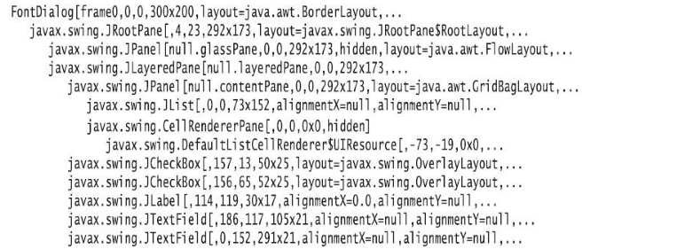

如果你看过 Swing 窗口，肯定想知道它的设计者如何把组件摆放得如此恰到好处，可以查看它内容。按下 <kbd>Ctrl</kbd> + <kbd>Shift</kbd> + <kbd>F1</kbd> 得到所有组件的层次结构输出：



可以使用 `JComponent` 类的 `setDebugGraphicsOptions` 方法打开对一个 Swing 组件的调试。有以下几个选项：

| DebugGraphics.FLASH_OPTION    | 绘制前用红色闪烁地显示各条线、矩形和文本 |
| ----------------------------- | ---------------------------------------- |
| DebugGraphics.LOG_OPTION      | 为每个绘制操作打印一个消息               |
| DebugGraphics.BUFFERED_OPTION | 显示在离屏缓冲区完成的操作               |
| DebugGraphics.NONE_OPTION     | 关闭图形调试                             |

我们发现，要让闪烁选项起作用，必须禁用 “双缓冲” —— 这是 Swing 更新窗口时为减少闪烁所用的策略。打开闪烁选项的魔咒是：

```java
RepaintManager.currentManager(getRootPane()).setDoubleBufferingEnabled(false);
((JComponent) getContentPane()).setDebugGraphicsOptions(DebugGraphics.FLASH_OPTION);
```

如果希望得到 GUI 应用中生成的每一个 AWT 事件的记录，可以在发出事件的每一个组件安装一个监听器。利用反射，可以很容易地自动完成这个工作。

**示例代码：**

```java
import java.awt.BorderLayout;
import java.awt.Component;
import java.awt.Container;
import java.awt.EventQueue;
import java.beans.BeanInfo;
import java.beans.EventSetDescriptor;
import java.beans.IntrospectionException;
import java.beans.Introspector;
import java.lang.reflect.InvocationHandler;
import java.lang.reflect.Method;
import java.lang.reflect.Proxy;

import javax.swing.JButton;
import javax.swing.JFrame;
import javax.swing.JSlider;

public class EventTracerTest {
	
	public static void main(String[] args) {
		EventQueue.invokeLater(() -> {
			JFrame frame = new EventTracerFrame();
			frame.setTitle("EventTracer");
			frame.setDefaultCloseOperation(JFrame.EXIT_ON_CLOSE);
			EventTracer tracer = new EventTracer();
			tracer.add(frame);
			frame.setVisible(true);
		});
	}
	
}

class EventTracerFrame extends JFrame {
	
	private static final int DEFAULT_WIDTH = 300;
	private static final int DEFAULT_HEIGHT = 200;
	
	private JSlider slider;
	private JButton button;
	
	public EventTracerFrame() {
		setSize(DEFAULT_WIDTH, DEFAULT_HEIGHT);
		
		slider = new JSlider();
		button = new JButton("Test");
		
		add(slider, BorderLayout.CENTER);
		add(button, BorderLayout.SOUTH);
	}
	
}


class EventTracer {
	
	private InvocationHandler handler;
	
	public EventTracer() {
		// the handler for all event proxies
		handler = new InvocationHandler() {
			@Override
			public Object invoke(Object proxy, Method method, Object[] args) throws Throwable {
				System.out.println(method + ":" + args[0]);
				return null;
			}
		};
	}
	
	public void add(Component c) {
		try {
			// get all events to which this component can listen
			BeanInfo info = Introspector.getBeanInfo(c.getClass());
			
			EventSetDescriptor[] eventSets = info.getEventSetDescriptors();
			for (EventSetDescriptor eventSet : eventSets) {
				addListener(c, eventSet);
			}
		} catch (IntrospectionException e) {
			e.printStackTrace();
		}
		
		// ok not to add listeners if exception is thrown
		if (c instanceof Container) {
			// get all children and call add recursively
			for (Component comp : ((Container) c).getComponents()) {
				add(comp);
			}
		}
	}
	
	public void addListener(Component c, EventSetDescriptor eventSet) {
		// make proxy object for this listener type and route all calls to the handler
		Object proxy = Proxy.newProxyInstance(null, new Class[] { eventSet.getListenerType() }, handler);
		
		// add the proxy as a listener to the component
		Method addListenerMethod = eventSet.getAddListenerMethod();
		try {
			addListenerMethod.invoke(c, proxy);
		} catch (ReflectiveOperationException e) {
			e.printStackTrace();
		}
		// ok not to add listener if excetion is thrown
	}

}
```

