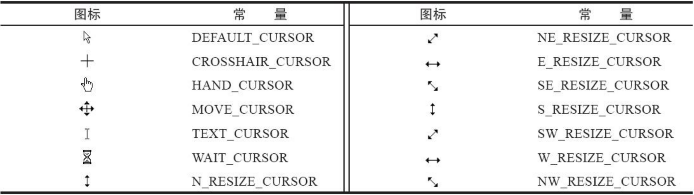

可以在 `JFrame`  或 `JComponent` 类中调用 `setCursor` 方法设置鼠标形状：

```java
setCursor(Cursor.getDefaultCursor());
```

可以通过 `Cursor` 类的 `getPredefinedCursor` 静态方法获取系统定义好的鼠标形状：

```java
setCursor(Cursor.getPredefinedCursor(Cursor.CROSSHAIR_CURSOR));
```

<center><b>光标形状样例</b></center>



> 提示：还可以利用 `ToolKit` 类中的 `createCustomCursor` 方法自定义光标类型：
>
> ```java
> Toolkit tk = Toolkit.getDefaultToolkit();
> Image img = tk.getImage("dynamite.gif");
> Cursor dynamiteCursor = tk.createCustomCursor(img, new Point(10, 10), "dynamite stick");
> ```
>
> `createCustomCursor` 的第一个参数指向光标图像。第二个参数给出了光标的 "热点" 偏移。第三个参数是一个描述光标的字符串。这个字符串可以用于访问性支持，例如，可以将光标形式读给视力受损或没有在屏幕前面的人。

**示例代码：**

```java
import java.awt.Cursor;
import java.awt.Dimension;
import java.awt.EventQueue;
import java.awt.Graphics;
import java.awt.Graphics2D;
import java.awt.event.MouseAdapter;
import java.awt.event.MouseEvent;
import java.awt.event.MouseMotionListener;
import java.awt.geom.Point2D;
import java.awt.geom.Rectangle2D;
import java.util.ArrayList;

import javax.swing.JComponent;
import javax.swing.JFrame;

public class MouseTest {

	public static void main(String[] args) {
		EventQueue.invokeLater(() -> {
			JFrame frame = new MouseFrame();
			frame.setTitle("MouseTest");
			frame.setDefaultCloseOperation(JFrame.EXIT_ON_CLOSE);
			frame.setVisible(true);
		});
	}
	
}

class MouseFrame extends JFrame {
	
	public MouseFrame() {
		add(new MouseComponent());
		pack();
	}
	
}

class MouseComponent extends JComponent {
	
	private static final int DEFAULT_WIDTH = 300;
	private static final int DEFAULT_HEIGHT = 200;
	
	private static final int SIDELENGTH = 10;
	private ArrayList<Rectangle2D> squares;
	private Rectangle2D current;	// the square containing the mouse cursor
	
	public MouseComponent() {
		squares = new ArrayList<>();
		current = null;
		
		addMouseListener(new MouseHandler());
		addMouseMotionListener(new MouseMotionHandler());
	}
	
	@Override
	public Dimension getPreferredSize() {
		return new Dimension(DEFAULT_WIDTH, DEFAULT_HEIGHT);
	}
	
	@Override
	protected void paintComponent(Graphics g) {
		Graphics2D g2 = (Graphics2D) g;
		
		// draw all squares
		for (Rectangle2D r : squares) {
			g2.draw(r);
		}
	}
	
	public Rectangle2D find(Point2D p) {
		for (Rectangle2D r : squares) {
			if (r.contains(p)) return r;
		}
		return null;
	}
	
	public void add(Point2D p) {
		double x = p.getX();
		double y = p.getY();
		
		current = new Rectangle2D.Double(x - SIDELENGTH / 2, y - SIDELENGTH / 2, SIDELENGTH, SIDELENGTH);
		squares.add(current);
		repaint();
	}
	
	public void remove(Rectangle2D s) {
		if (s == null) return;
		if (s == current) current = null;
		squares.remove(s);
		repaint();
	}
	
	private class MouseHandler extends MouseAdapter {
		
		@Override
		public void mousePressed(MouseEvent e) {
			// add a new square if the cursor isn't inside a square
			current = find(e.getPoint());
			if (current == null) add(e.getPoint());
		}
		
		@Override
		public void mouseClicked(MouseEvent e) {
			// remove the current squared if double clicked
			current = find(e.getPoint());
			if (current != null && e.getClickCount() >= 2) remove(current);
		}
		
	}
	
	private class MouseMotionHandler implements MouseMotionListener {
		
		@Override
		public void mouseMoved(MouseEvent e) {
			// set the mouse cursor to cross hairs if it is inside
			// a rectangle
			
			if (find(e.getPoint()) == null) setCursor(Cursor.getDefaultCursor());
			else setCursor(Cursor.getPredefinedCursor(Cursor.CROSSHAIR_CURSOR));
		}
		
		@Override
		public void mouseDragged(MouseEvent e) {
			if (current != null) {
				int x = e.getX();
				int y = e.getY();
				
				// drag the current rectangle to center it at (x, y)
				current.setFrame(x - SIDELENGTH / 2, y - SIDELENGTH / 2, SIDELENGTH, SIDELENGTH);
				repaint();
			}
			
		}
	}
}
```

