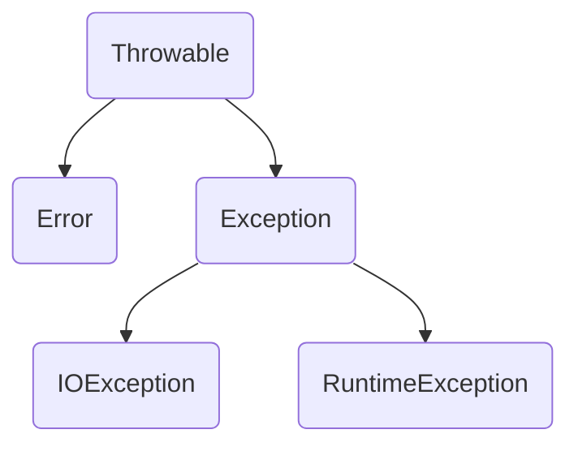

<b>Java 中的异常层次结构</b>

`Error` 类层次结构描述了 Java 运行时系统的内部错误和资源耗尽错误。应用程序不应该抛出这种类型的对象。

在设计 Java 程序时，需要关注 `Exception` 层次结构。这个层次结构又分解为两个分支：一个分支派生于 `RuntimeException`；另一个分支包含其他异常。划分两个分支的规则是：由程序错误导致的异常属于 `RuntimeException`；而程序本身没有问题，但由于像 I/O 错误这类问题导致的异常属于其他异常。

派生于 `RuntimeException` 的异常包含下面几种情况：

+ 错误的类型转换。
+ 数组访问越界。
+ 访问 null 指针。

不是派生于 `RuntimeException` 的异常包括：

+ 试图在文件尾部后面读取数据。
+ 试图打开一个不存在的文件。
+ 试图根据给定的字符串查找 `Class` 对象，而这个字符串表示类并不存在。

Java 语言规范将派生于 `Error` 类或 `RuntimeException` 类的所有异常称为非受查（unchecked）异常，所有其他的异常称为受查（checked）异常。
