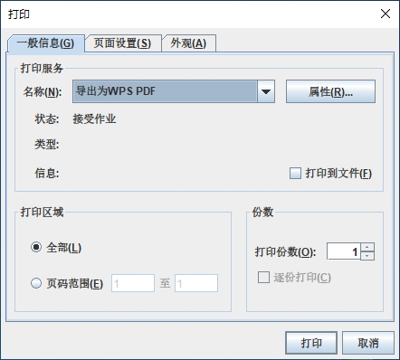
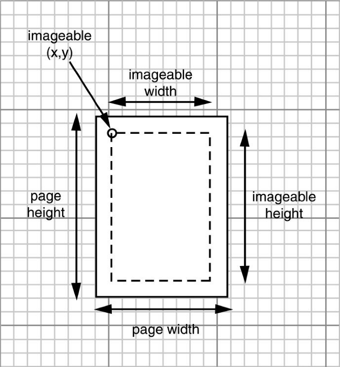
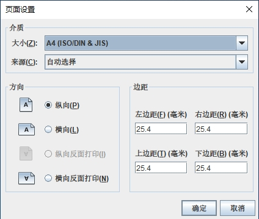

如果要生成打印输出，必须完成下面这两个任务：

+ 提供一个实现了 `Printable` 接口的对象。
+ 启动一个打印作业。

`Printable` 接口只有下面一个方法：

```java
int print(Graphics g, PageFormat format, int page);
```

每当打印引擎需要对某一页面进行排版以便打印时，都要调用这个方法。你的代码绘制了准备在图形上下文上打印的文本和图像，页面排版显示了纸张的大小和页边距，页好现实了将要打印的页。

如果要启动一个打印作业，需要使用 `PrinterJob` 类。首先，应该调用静态方法 `getPrinterJob` 来获取一个打印作业对象。然后，设置要打印的 `Printable` 对象：

```java
Printable canvas = ...;
PrinterJob job = PrinterJob.getPrinterJob();
job.setPrintable(canvas);
```

> 警告：`PrintJob` 这个类处理的是 `JDK 1.1` 风格的打印操作，这个类已经被弃用了。

在开始打印作业之前，应该调用 `printDialog` 方法来显示一个打印对话框。这个对话框为用户提供了机会去选择要使用的打印机（在有多个打印机可用的情况下），选择将要打印的页的范围，以及选择打印机的各种设置。



可以在一个实现了 `PrintRequestAttributeSet` 接口的类的对象中收集到各种打印机的设置，例如 `HashPrintRequestAttributeSet` 类：

```java
HashPrintRequestAttributeSet attributes = new HashPrintRequestAttributeSet();
```

你可以添加属性设置，并且把 `attributes` 对象传递给 `printDialog` 方法。

如果用户点击 `OK` ，那么 `printDialog` 方法将返回 `true`；如果用户关掉对话框，那么该方法将返回 `false`。如果用户接受了设置，那么就可以调用 `PrinterJob` 类的 `print` 方法来启动打印进程。`print` 方法可能会抛出一个 `PrinterException` 异常。下面是打印代码的基本框架：

```java
if (job.printDialog(attributes)) {
    try {
        job.print(attributes);
    } catch (PrinterException exception) {
        ......
    }
}
```

> 注意：在 `JDK 1.4` 之前，打印系统使用的都是宿主平台本地的打印和页面设置对话框。要展示本地打印对话框，可以调用没有任何参数的 `printDialog` 方法。

在执行打印操作时，`PrinterJob` 类的 `print` 方法不断地调用和此项作业相关的 `Printable` 对象的 `print` 方法。

由于打印作业不知道用户想要打印的页数，所以它只是不断地调用 `print` 方法。只要该 `print` 方法的返回值是 `Printable.PAGE_EXISTS`，打印作业就不断地产生输出页。当 `print` 方法返回 `Printable.NO_SUCH_PAGE` 时，打印作业就停止。

> 警告：打印作业传递到 `print` 方法的打印页号是从 0 开始的。

在打印的过程中，打印作业反复地调用 `Printable` 对象的 `print` 方法。打印作业可以对同一页面多次调用 `print` 方法，因此不应该在 `print` 方法内对页进行计数，而是应始终依赖于页码参数来进行计数操作。打印作业之所以能够对某一页反复地调用 `print` 方法是有一定道理的：一些打印机，尤其是点阵式打印机和喷墨式打印机，都使用条带打印技术，它们在打印纸上一条接着一条地打印。

> 警告：你的 `print` 方法获得的 `Graphics` 对象也是按照页边距进行剪切的。如果替换了剪切区域，那么就可以在外边距外面进行绘图操作。尤其是在打印机的绘图上下文中，剪切区域是被严格遵守的。如果想进一步地限制剪切区域，可以调用 `clip` 方法，而不是 `setClip` 方法。如果必须要移除一个剪切区域，那么请务必在你的 `print` 方法开始处调用 `getClip` 方法，并还原该剪切区域。

`print` 方法的 `PageFormat` 参数包含有关被打印页的信息。`getWidth` 方法和 `getHeight` 方法返回该纸张的大小，它以磅为计量单位。

`getImageableWidth` 和 `getImageableHeight` 方法可以告诉你能够真正用来打印的区域的大小。然而，页边距没有必要时对称的，所以还必须知道可打印区域的左上角，他们可以通过调用 `getImageableX` 和 `getImageableY` 方法来获得。



<center>页面格式计量</center>

> 提示：在 `print` 方法中接收到的图形上下文是经过剪切后的图形上下文，它不包括页边距。但是，坐标系统的原点仍然是纸张的左上角。应该将该坐标系统转换成可打印区域的左上角，并以其为起点。这只需让 `print` 方法以下面的代码开始即可：
>
> ```java
> g.translate(pageFormat.getImageableX(), pageFormat.getImageableY());
> ```

如果想让用户来设定页边距，或者让用户在纵向和横向打印方式之间切换，同时并不涉及设置其他打印属性，那么就应该调用 `PrinterJob` 类的 `pageDialog` 方法：

```java
PageFormat format = job.pageDialog(attributes);
```



<center>一个跨平台的页面设置对话框</center>

**程序清单 PrintComponent.java**

```java
package com.qty;

import javax.swing.*;
import java.awt.*;
import java.awt.font.FontRenderContext;
import java.awt.font.TextLayout;
import java.awt.geom.*;
import java.awt.print.PageFormat;
import java.awt.print.Printable;
import java.awt.print.PrinterException;

/**
 * This component generates a 2D graphics image for screen display and printing.
 */
public class PrintComponent extends JComponent implements Printable {

    private static final Dimension PREFERRED_SIZE = new Dimension(300, 300);

    @Override
    public void paintComponent(Graphics g) {
        Graphics2D g2 = (Graphics2D) g;
        drawPage(g2);
    }

    public int print(Graphics g, PageFormat pf, int page) throws PrinterException {
        if (page >= 1) {
            return Printable.NO_SUCH_PAGE;
        }
        Graphics2D g2 = (Graphics2D) g;
        g2.translate(pf.getImageableX(), pf.getImageableY());
        g2.draw(new Rectangle2D.Double(0, 0, pf.getImageableWidth(), pf.getImageableHeight()));

        drawPage(g2);
        return Printable.PAGE_EXISTS;
    }

    /**
     * This method draws the page both on the screen and the printer graphics context.
     * @param g2 the graphics context
     */
    public void drawPage(Graphics2D g2) {
        FontRenderContext context = g2.getFontRenderContext();
        Font f = new Font("Serif", Font.PLAIN, 72);
        GeneralPath clipShape = new GeneralPath();

        TextLayout layout = new TextLayout("Hello", f, context);
        AffineTransform transform = AffineTransform.getTranslateInstance(0, 72);
        Shape outline = layout.getOutline(transform);
        clipShape.append(outline, false);

        layout = new TextLayout("World", f, context);
        transform = AffineTransform.getTranslateInstance(0, 144);
        outline = layout.getOutline(transform);
        clipShape.append(outline, false);

        g2.draw(clipShape);
        g2.clip(clipShape);

        final int NLINES = 50;
        Point2D p = new Point2D.Double(0, 0);
        for (int i = 0; i < NLINES; i++) {
            double x = (2.0 * getWidth() * i) / NLINES;
            double y = (2.0 * getHeight() * (NLINES - 1 - i)) / NLINES;
            Point2D q = new Point2D.Double(x, y);
            g2.draw(new Line2D.Double(p, q));
        }
    }

    @Override
    public Dimension getPreferredSize() {
        return PREFERRED_SIZE;
    }
}
```

**程序清单 PrintTestFrame.java**

```java
package com.qty;

import javax.print.attribute.HashPrintRequestAttributeSet;
import javax.print.attribute.PrintRequestAttributeSet;
import javax.swing.*;
import java.awt.*;
import java.awt.print.PrinterException;
import java.awt.print.PrinterJob;

/**
 * This frame shows a panel with 2D graphics and buttons to print the graphics and to set up the
 * page format.
 */
public class PrintTestFrame extends JFrame {

    private PrintComponent canvas;
    private PrintRequestAttributeSet attributes;

    public PrintTestFrame() {
        canvas = new PrintComponent();
        add(canvas, BorderLayout.CENTER);

        attributes = new HashPrintRequestAttributeSet();

        JPanel buttonPanel = new JPanel();
        JButton printButton = new JButton("Print");
        buttonPanel.add(printButton);
        printButton.addActionListener(event -> {
            try {
                PrinterJob job = PrinterJob.getPrinterJob();
                job.setPrintable(canvas);
                if (job.printDialog(attributes)) {
                    job.print(attributes);
                }
            } catch (PrinterException ex) {
                JOptionPane.showMessageDialog(PrintTestFrame.this, ex);
            }
        });

        JButton pageSetupButton = new JButton("Page setup");
        buttonPanel.add(pageSetupButton);
        pageSetupButton.addActionListener(event -> {
            PrinterJob job = PrinterJob.getPrinterJob();
            job.pageDialog(attributes);
        });

        add(buttonPanel, BorderLayout.NORTH);
        pack();
    }
}
```

**程序清单 PrintTest.java**

```java
package com.qty;

import javax.swing.*;
import java.awt.*;

public class PrintTest {

    public static void main(String[] args) {
        EventQueue.invokeLater(() -> {
            PrintTestFrame frame = new PrintTestFrame();
            frame.setTitle("打印页面");
            frame.setDefaultCloseOperation(JFrame.EXIT_ON_CLOSE);
            frame.setVisible(true);
        });
    }
}
```

运行效果如下：

