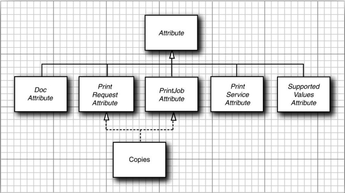
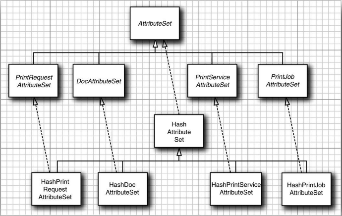

打印服务程序 `API` 包含了一组复杂的接口和类，用以设定不同种类的属性。重要的属性共有四组，前两组属性用于设定对打印机的访问请求。

+ 打印请求属性为第一个打印作业中的所有 `doc` 对象请求特定的打印属性，例如，双面打印或者纸张的大小。
+ `Doc` 属性（Doc attribute）是仅作用在单个 `doc` 对象上的请求属性。

另外两组属性包含关于打印机和作业状态的信息。

+ 打印服务属性提供了关于打印服务程序的信息，比如打印机的种类和型号，或者打印机当前是否接受打印作业。
+ 打印作业属性提供了关于某个特定打印作业状态的信息，比如该打印作业是否已经完成。

如果要描述各种不同的打印属性，可以使用带有如下子接口的 `Attribute` 接口：

```java
PrintRequestAttribute
DocAttribute
PrintServiceAttribute
PrintJobAttribute
SupportedValuesAttribute
```

各个属性类都实现了上面的一个或几个接口。例如，`Copies` 类的对象描述了一个打印输出的拷贝数量，该类就实现了 `PrintRequestAttribute` 和 `PrintJobAttribute` 两个接口。

`SupportedValuesAttribute` 接口表示某个属性值反映的不是实际的打印请求或状态数据，而是某个服务程序的能力。



<center>属性分层结构的类图</center>

除了为各个属性定义的接口和类以外，打印服务程序 `API` 还为属性集定义了接口和类。父接口 `AttributeSet` 有四个子接口：

```
PrintRequestAttributeSet
DocAttributeSet
PrintServiceAttributeSet
PrintJobAttributeSet
```

对于每个这样的接口，都有一个实现类，因此会产生下面 5 个类：

```
HashAttributeSet
HashPrintRequestAttributeSet
HashDocAttributeSet
HashPrintServiceAttributeSet
HashPrintJobAttributeSet
```



<center>属性集的分层结构</center>

例如，可以用如下的方式构建一个打印请求属性集：

```java
PrintRequestAttributeSet attributes = new HashPrintRequestAttributeSet();
```

属性集是一个特殊的映射表，其键是 `Class` 类型的，而值是一个实现了 `Attribute` 接口的类。例如，如果要插入一个对象：

```java
new Copies(10)
```

到属性集中，那么它的键就是 `Class` 对象 `Copies.class`。该键被称为属性的类别。`Attribute` 接口声明了下面这样一个方法：

```java
Class getCategory()
```

当将一个属性添加到属性集中时，属性的类别就会被自动地获取。你只需添加该属性的值：

```java
attributes.add(new Copies(10));
```

如果后来添加了一个具有相同类别的另一个属性，那么新属性就会覆盖第一个属性。如果要检索一个属性，需要使用它的类别作为键，例如：

```java
AttributeSet attributes = job.getAttributes();
Copies copies = (Copies) attribute.get(Copies.class);
```

最后，属性是按照它们拥有的值来进行组织的。`Copies` 属性能够拥有任何整数值。`Copies` 类继承了 `IntegerSyntax` 类，该类负责处理所有带有整数值的属性。`getValue` 方法将返回属性的整数值，例如：

```java
int n = copies.getValue();
```

下面这些类：

```
TextSyntax
DateTimeSyntax
URISyntax
```

用于封装一个字符串、日期与时间，或者 `URI` 。

最后要说明的是，许多属性都能够接受数量有限的值。例如，`PrintQuality` 属性有三个设置值：`draft`（草稿质量），`normal`（正常质量）和 `hight` （高质量），它们用三个常量来表示：

```
PrintQuality.DRAFT
PrintQuality.NORMAL
PrintQuality.HIGH
```

下面的代码说明了如何来检查一个属性的值：

```java
if (attributes.get(PrintQuality.class) == PrintQuality.HIGHT) {
    ......
}
```

<center>打印属性一览表</center>

| 属性                         | 超类或枚举常量                                               | DA   | PJA  | PRA  | PSA  |
| ---------------------------- | ------------------------------------------------------------ | ---- | ---- | ---- | ---- |
| Chromaticity                 | MONOCHROME, COLOR                                            | √    | √    | √    |      |
| ColorSupported               | SUPPORTED, NOT_SUPPORTED                                     |      |      |      | √    |
| Compression                  | COMPRESS, DEFLATE, GZIP, NONE                                | √    |      |      |      |
| Copies                       | IntegerSyntax                                                |      | √    | √    |      |
| DateTimeAtCompleted          | DateTimeSyntax                                               |      | √    |      |      |
| DateTimeAtCreation           | DateTimeSyntax                                               |      | √    |      |      |
| DateTimeAtProcessing         | DateTimeSyntax                                               |      | √    | √    |      |
| Destination                  | URISyntax                                                    | √    |      |      |      |
| DocumentName                 | TextSyntax                                                   |      | √    | √    |      |
| Fidelity                     | FIDELITY_TRUE, FIDELITY_FALSE                                | √    | √    | √    |      |
| Finishings                   | NONE, STAPLE, EDGE_STITCH, BIND, SADDLE_STITCH, COVER, ...... |      | √    | √    |      |
| JobHoldUntil                 | DateTimeSyntax                                               |      | √    | √    |      |
| JobImpressions               | IntegerSyntax                                                |      | √    | √    |      |
| JobImpressionsCompleted      | IntegerSyntax                                                |      | √    |      |      |
| JobKOctets                   | IntegerSyntax                                                |      | √    | √    |      |
| JobKOctetsProcessed          | IntegerSyntax                                                |      | √    |      |      |
| JobMediaSheets               | IntegerSyntax                                                |      | √    | √    |      |
| JobMediaSheetsCompleted      | IntegerSyntax                                                |      | √    |      |      |
| JobMessageFromOperator       | TextSyntax                                                   |      | √    |      |      |
| JobName                      | TextSyntax                                                   |      | √    | √    |      |
| JobOriginatingUserName       | TextSyntax                                                   |      | √    |      |      |
| JobPriority                  | IntegerSyntax                                                |      | √    | √    |      |
| JobSheets                    | STANDARD, NONE                                               |      | √    | √    |      |
| JobState                     | ABORTED, CANCELED,COMPLETED, PENDING, PENDING_HELD, PROCESSING, PROCESSING_STOPPED |      | √    |      |      |
| JobStateReason               | ABORTED_BY_SYSTEM, DOCUMENT_FORMAT_ERROR, 其他               |      |      |      |      |
| JobStateReasons              | HashSet                                                      |      | √    |      |      |
| MediaName                    | ISO_A4_WHITE, ISO_A4_TRANSPARENT, NA_LETTER_WHITE, NA_LETTER_TRANSPARENT | √    | √    | √    |      |
| MediaSize                    | ISO.A0-ISON.A10, ISO.B0-ISO.B10, ISO.C0-ISO.C10, NA.LETTER, NA.LEGAL, 各种其他纸张和信封尺寸 |      |      |      |      |
| MediaSizeName                | ISO_A0-ISO_A10, ISO_B0-ISO_B10, ISON_C0-ISON_C10, NA_LETTER, NA_LEGAL, 各种其他纸张和信封尺寸名称 | √    | √    | √    |      |
| MediaTray                    | TOP, MIDDLE, BOTTOM, SIDE, ENVELOPE, LARGECAPACITY, MAIN, MANUAL | √    | √    | √    |      |
| MultipleDocumentHandling     | SINGLE_DOCUMENT, SINGLE_DOCUMENT_NEW_SHEET, SEPARATE_DOCUMENTS_COLLATED_COPIES, SEPARATE_DOCUMENTS_UNCOLLATED_COPIES |      | √    | √    |      |
| NumberOfDocuments            | IntegerSyntax                                                |      | √    |      |      |
| NumberOfInterveningJobs      | IntegerSyntax                                                |      | √    |      |      |
| NumberUp                     | IntegerSyntax                                                | √    | √    | √    |      |
| OrientationRequested         | PORTRAIT, LANDSCAPE, REVERSE_PORTRAIT, REVERSE_LANDSCAPE     | √    | √    | √    |      |
| OutputDeviceAssigned         | TextSyntax                                                   |      | √    |      |      |
| PageRanges                   | SetOfInteger                                                 | √    | √    | √    |      |
| PagePerMinute                | IntegerSyntax                                                |      |      |      | √    |
| PagesPerMinuteColor          | IntegerSyntax                                                |      |      |      | √    |
| PDLOverrieSupported          | ATTEMPTED, NOT_ATTEMPTED                                     |      |      |      | √    |
| PresentationDirection        | TORIGHT_TOBOTTOM, TORIGHT_TOTOP, TOBOTTOM_TORIGHT, TOBOTTOM_TOLEFT, TOLEFT_TOBOTTOM, TOLEFT_TOTOP, TOTOP_TORIGHT, TOTOP_TOLEFT |      | √    | √    |      |
| PrinterInfo                  | TextSyntax                                                   |      |      |      | √    |
| PrinterIsAceptingJobs        | ACCEPTING_JOBS, NOT_ACCEPTING_JOBS                           |      |      |      | √    |
| PrinterLocation              | TextSyntax                                                   |      |      |      | √    |
| PrinterMakeAndModel          | TextSyntax                                                   |      |      |      | √    |
| PrinterMessageFromOperator   | TextSyntax                                                   |      |      |      | √    |
| PrinterMoreInfo              | URISyntax                                                    |      |      |      | √    |
| PrinterMoreInfoManufacturer  | URISyntax                                                    |      |      |      | √    |
| PrinterName                  | TextSyntax                                                   |      |      |      | √    |
| PrinterResolution            | ResolutionSyntax                                             | √    | √    | √    |      |
| PrinterState                 | PROCESSING, IDLE, STOPPED, UNKNOWN                           |      |      |      | √    |
| PrinterStateReason           | COVER_OPEN, PUSER_OVER_TEMP, MEDIA_JAM, 其他                 |      |      |      |      |
| PrinterStateReasons          | HashMap                                                      |      |      |      |      |
| PrinterURI                   | URISyntax                                                    |      |      |      | √    |
| PrintQuality                 | DRAFT, NORMAL, HIGH                                          | √    | √    | √    |      |
| QueuedJobCount               | IntegerSyntax                                                |      |      |      | √    |
| ReferenceUriSchemesSupported | FILE, FTP, GOPHER, HTTP, HTTPS, NEWS, NNTP, WAIS             |      |      |      |      |
| RequestingUserName           | TextSyntax                                                   |      |      |      |      |
| Severity                     | ERROR, REPORT, WARNING                                       |      |      |      | √    |
| SheetCollate                 | COLLATED, UNCOLLATED                                         | √    | √    | √    |      |
| Sides                        | ONE_SIDED, DUPLEX (= TWO_SIDED_LONG_EDGE), TUMBLE (= TWO_SIDED_SHORT_EDGE) | √    | √    | √    |      |

