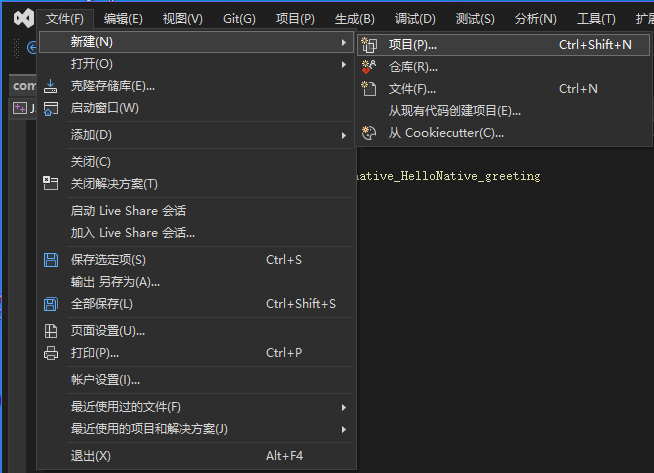
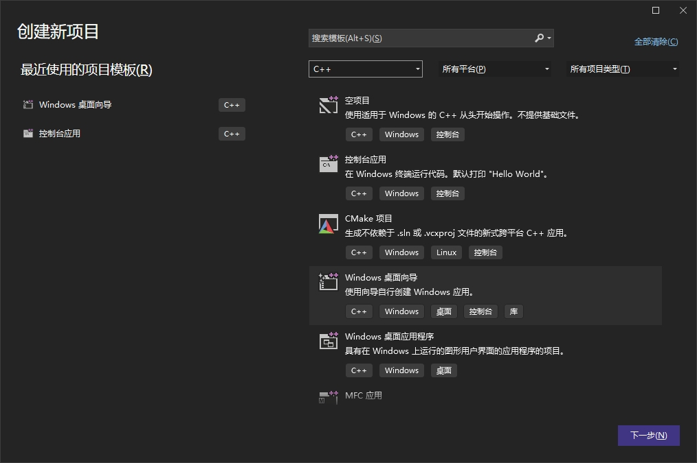
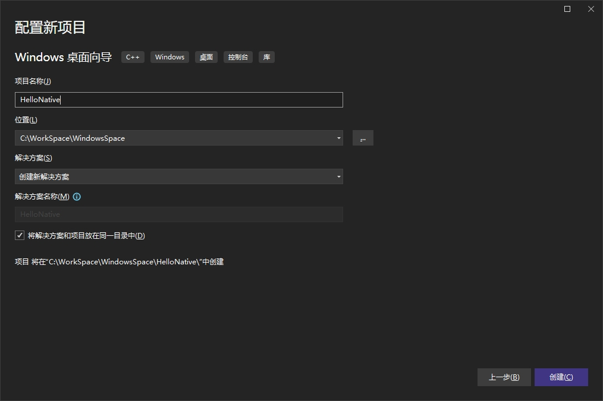
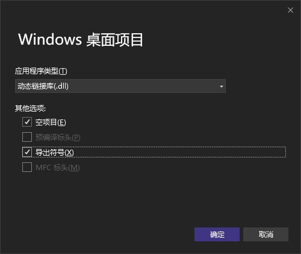
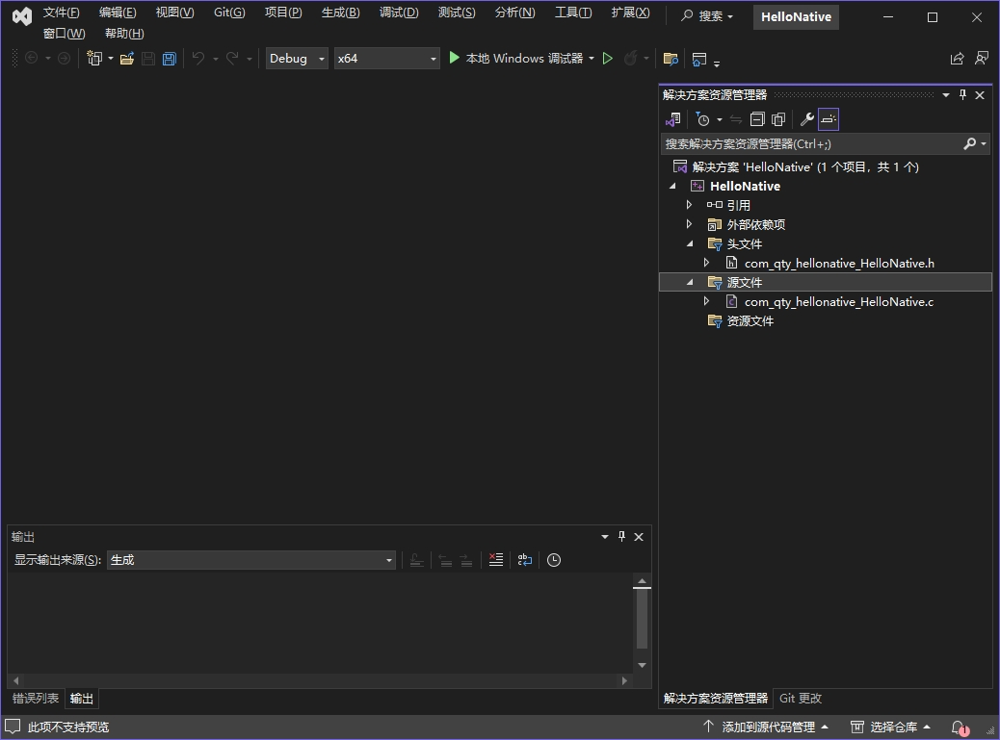
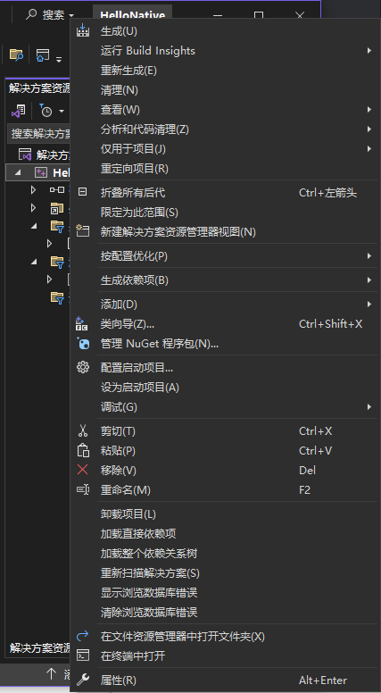
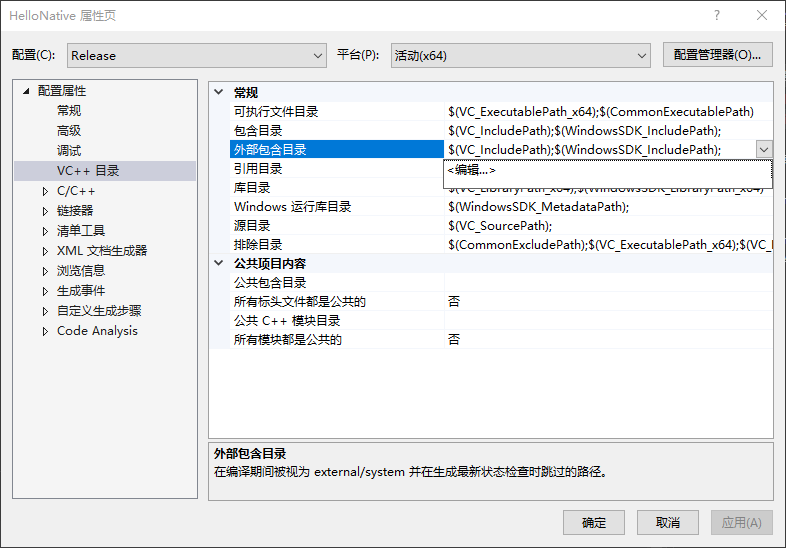
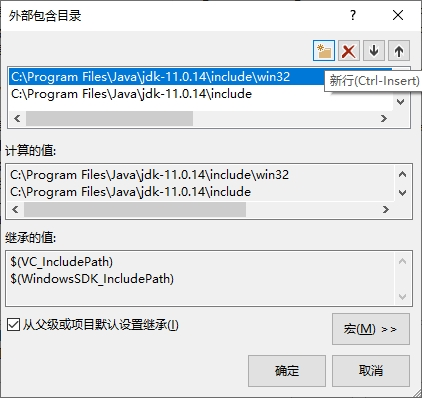
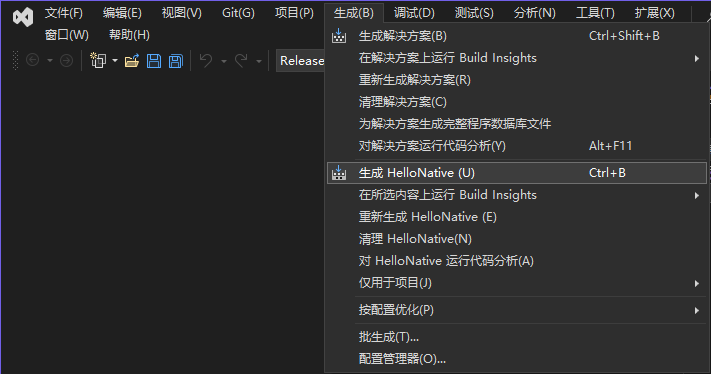
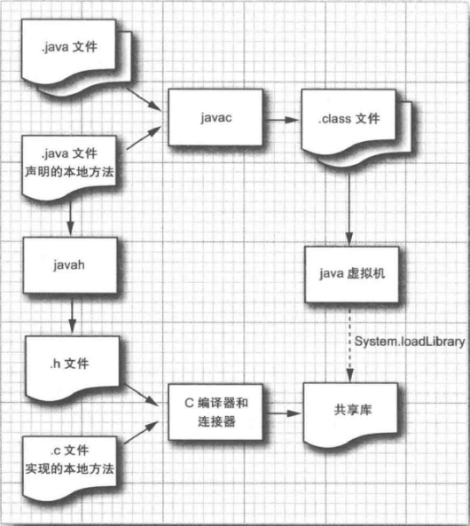

`Java` 编程语言使用关键字 `native` 表示本地方法，而且很显然，你还需要在类中放置一个方法。

关键字 `native` 提醒编译器该方法将在外部定义。当然，本地方法不包含任何 `Java` 编程语言编写的代码，而且方法头后面直接跟着一个表示终结的分号。

**示例程序：HelloNative.java**

```java 
class HelloNative {
    public static native void greeting();
}
```

本地方法既可以是静态的也可以是非静态的，使用静态方法是因为我们此刻还不想处理参数传递。

为了实现本地代码，需要编写一个相应的 `C` 函数，你必须完全按照 `Java` 虚拟机预期的那样来命名这个函数。其规则是：

1）使用完整的 `Java` 方法名，比如：`HelloNative.greeting`。如果该类属于某个包，那么在前面添加包名，比如：`com.horstmann.HelloNative.greeting`。

2）用下划线替换掉所有的句号，并加上 `Java_` 前缀，例如，`Java_HelloNative_greeting` 或 `Java_com_horstmann_HelloNative_greeting`。

3）如果类名含有非 `ASCII` 字母或数字，如：`_`，`$` 或是大于 `\u007F` 的 `Unicode` 字符，用 `_0xxxx` 来替代它们，`xxxx` 是该字符的 `Unicode` 值的 4 个十六进制数序列。

> 注意：如果你重载了本地方法，也就是说，你用相同的名字提供了多个本地方法，那么你必须在名称后面附加两个下划线，后面再加上已编码的参数类型。例如，如果你有一个本地方法 `greeting` 和另一个本地方法 `greeting(int repeat)`，那么，第一个称为 `Java_HelloNative_greeting__`，第二个称为 `Java_HelloNative_greeting__I`。

实际上，没人会手工完成这些操作。相反，你应该运行 `javah` 实用程序，它能够自动生成函数名。要使用 `javah`，首先要变异程序的源代码：

```shell
javac HelloNative.java
```

接着，调用 `javah` 实用程序，从该类文件中产生一个 `C` 的头文件。`javah` 可执行文件可以在 `jdk/bin` 目录下找到。可用用类的名字来调用它：

```shell
javah HelloNative
```

这条命令会产生一个头文件 `HelloNative.h` ：

```c
/* DO NOT EDIT THIS FILE - it is machine generated */
#include <jni.h>
/* Header for class com_qty_hellonative_HelloNative */

#ifndef _Included_com_qty_hellonative_HelloNative
#define _Included_com_qty_hellonative_HelloNative
#ifdef __cplusplus
extern "C" {
#endif
/*
 * Class:     com_qty_hellonative_HelloNative
 * Method:    greeting
 * Signature: ()V
 */
JNIEXPORT void JNICALL Java_com_qty_hellonative_HelloNative_greeting
  (JNIEnv *, jclass);

#ifdef __cplusplus
}
#endif
#endif
```

> 提示：在 `Java 11` 后，`Orcale` 已经移除了 `javah` 命令，使用下面命令来生成头文件：
>
> ```shell
> javac -h 头文件存放的路径 类路径
> ```
>
> 例如：
>
> ```shell
> $ javac -h . src/com/qty/hellonative/HelloNative.java
> ```

现在，需要将函数原型从头文件中复制到源文件中，并且给出函数的实现代码：

```c
#include "com_qty_hellonative_HelloNative.h"
#include <stdio.h>

JNIEXPORT void JNICALL Java_com_qty_hellonative_HelloNative_greeting
  (JNIEnv *env, jclass cl) {
    printf("Hello Native World!\n");
}
```

> 注意：你可以使用 `C++` 实现本地方法。然而，那样你必须将实现本地方法声明为 `extern "C"`（这可以阻止 `C++` 编译器混编方法名）。例如：
>
> ```cpp
> #include <iostream>
> #include "com_qty_hellonative_HelloNative.h"
> 
> using namespace std;
> 
> extern "C" {
> JNIEXPORT void JNICALL Java_com_qty_hellonative_HelloNative_greeting
>   (JNIEnv *env, jclass cl) {
>     cout << "Hello Native World!" << endl;
> }
> }
> ```

将本地 `C` 代码编译到一个动态装载库中，具体方法依赖于编译器。

例如，`Linux`下的 `GNU C` 编译器，使用如下命令：

```shell
gcc-fPIC -I jdk/include -I jdk/include/linux -shared -o libHelloNative.so com_qty_hellonative_HelloNative.c
```

如果是 `Solaris` 操作系统的 `Sun` 编译器，命令是：

```shell
cc -G -I jdk/include -I jdk/include/solaris -o libHelloNative.so com_qty_hellonative_HelloNative.c
```

用 `Windows` 下的微软编译器，命令是：

```shell
cl -I jdk\include -I jdk\include\win32 -LD com_qty_hellonative_HelloNative.c -FeHelloNative.dll
```

这里 `jdk` 是含有 `JDK` 的目录。

> 提示：如果你要从命令 `shell` 中使用微软的编译器，首先要运行批处理文件 `vcvars32.bat` 或 `vcvarsall.bat`。这个批处理文件设置了编译器需要的路径和环境变量。

也可以使用可从 <http://www.cygwin.com> 处免费获取的 `Cygwin` 编译环境。它包含了 `GNU C` 编译器和 `Windows` 下的 `UNIX` 风格编程的库。使用 `Cygwin` 时，用以下命令：

```shell
gcc -mno-cygwin -D __int64="long long" -I jdk/include/ -I jdk/include/win32 -shared -Wl,--add-stdcall-alias -o HelloNative.dll com_qty_hellonative_HelloNative.c
```

整个命令应该键入在同一行中。

> 注意：`Windows` 版本的头文件 `jni_md.h` 含有如下类型声明：
>
> ```c
> typedef __int64 jlong;
> ```
>
> 它是专门用于微软编译器的。如果你使用的是 `GNU` 编译器，那么你就需要修改这个文件，例如：
>
> ```c
> #ifdef __GNUC__
> 	typedef long long jlong;
> #else
> 	typedef __int64 jlong;
> #endif
> ```
>
> 或者，如编译器调用的示例那样，使用 `-D __int64="long long"` 进行编译。

上面的 `Windows` `cl` 编译器编译代码方法会报错，可以使用 `Visual Studio` 软件代替命令行进行编译，具体操作如下：

1）在 `Visual Studio` 软件中执行 `文件(F)` -> `新建(N)` -> `项目(p)...` 菜单。



2）在创建新项目对话框中，选择 `C++` 语言，然后在下面选择 `Windows 桌面向导` 项，然后点击 `下一步` 按钮。



3）在配置新项目对话框中，输入项目名称，然后点击 `创建` 按钮。



4）在 Windows 桌面项目对话框中，在应用程序类型下选择 `动态链接库(.dll)`，在其他选项中勾选 `空项目(E)` 和 `导出符号(X)` 选项，然后点击 `确定` 按钮。



5）将上面生成的头文件（`com_qty_hellonative_HelloNative.h`）拷贝到 `Visual Studio` 项目中的头文件文件夹中，将源代码文件（`com_qty_hellonative_HelloNative.c`）拷贝到 `Visual Studio` 项目中的源文件文件夹中。



6）右击 `Visual Studio` 项目名，在弹出的菜单中点击 `属性` 菜单。



7）在 HelloNative 属性页对话框中，选中 `配置属性` -> `VC++ 目录` ，然后在右边的 `常规` 项下的 `外部包含目录` 右侧的编辑框中单击，在显示的下拉按钮处单击，然后单击弹出框中的编辑项。



8）在外部包含目录对话框中，点击 `新行` 图标按钮，然后点击新行右边的 `...` 按钮，选择 `jdk/include` 目录，同样操作将 `jdk/include/win32` 目录添加进去，最后点击 `确定` 按钮。



9）重复操作第 7 步骤和第 8 步骤将 `Release` 配置和 `Debug` 配置都设置上。

10）最后点击菜单 `生成(B)` -> `生成 HelloNative (U)` 菜单生成 `HelloNative.dll` 文件。



最后，我们要在程序中添加一个对 `System.loadLibrary` 方法的调用。为了确保虚拟机在第一次使用该类之前就会转载这个库，需要使用静态初始化代码。下图给出了对本地代码处理的总结：



**示例程序：HelloNativeTest.java**

```java
package com.qty.hellonative;

public class HelloNativeTest {

    public static void main(String[] args) {
        HelloNative.greeting();
    }

    static {
        System.loadLibrary("libs/HelloNative");
    }
}
```

> 提示：将 `HelloNative.dll` 共享库文件放置在项目根目录下的 `libs` 目录中。

运行结果如下：

```shell
"C:\Program Files\Java\jdk-11.0.14\bin\java.exe" "-javaagent:C:\Program Files\JetBrains\IntelliJ IDEA Community Edition 2023.3.3\lib\idea_rt.jar=63482:C:\Program Files\JetBrains\IntelliJ IDEA Community Edition 2023.3.3\bin" -Dfile.encoding=UTF-8 -classpath C:\WorkSpace\JavaSpace\HelloNative\out\production\HelloNative com.qty.hellonative.HelloNativeTest
Hello Native World!

Process finished with exit code 0
```

> 注意：如果运行在 `Linux` 下，必须把当前目录添加到库路径中。实现方式可以是通过设置 `LD_LIBRARY_PATH` 环境变量：
>
> ```shell
> export LD_LIBRARY_PATH=.:$LD_LIBRARY_PATH
> ```
>
> 或者是设置 `java.library.path` 系统属性：
>
> ```shell
> java -Djava.library.path=. HelloNativeTest
> ```

总之，遵循下面的步骤就可以将一个本地方法链接到 `Java` 程序中：

1）在 `Java` 类中声明一个本地方法。

2）运行 `javah` 以获得包含该方法的 `C` 声明的头文件。

3）用 `C` 实现该本地方法。

4）将代码置于共享类库中。

5）在 `Java` 程序中加载该类库。

> 注意：一些本地代码的共享库必须先运行初始化代码。你可以把初始化代码放到 `JNI_OnLoad` 方法中。类似地，如果你提供该方法，当虚拟机关闭时，将会调用 `JNI_OnUnload` 方法。它们的原型是：
>
> ```c
> jint JNI_OnLoad(JavaVM *vm, void *reserved);
> void JNI_OnUnload(JavaVM *vm, void *reserved);
> ```
>
> `JNI_OnLoad` 方法要返回它所需的虚拟机的最低版本，例如：`JNI_VERSION_1_2`。
