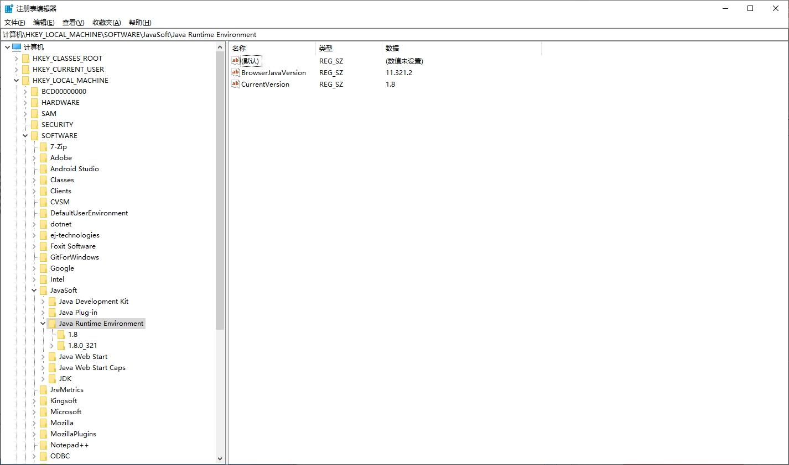
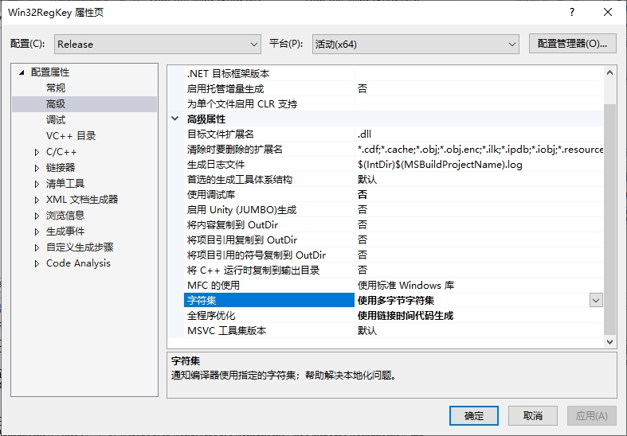

[toc]

### 1. Windows 注册表概述

`Windows` 注册表是一个存放 `Windows` 操作系统和应用程序的配置信息和数据仓库。它提供了对系统和应用程序参数的单点管理和备份。其不足的方面是，注册表的错误也是单点的。

我们不建议你使用注册表来存储 `Java` 程序的配置参数。`Java` 配置 `API` 是一个更好的解决方案。

`Windows` 没有配备任何图标来启动注册表编辑器，你必须启动 `DOS shell` （或打开 “开始” -> “运行” 对话框）然后键入 `regedit`。下图给出了一个运行中的注册表编辑器：



左边是树形结构排列的注册表键。请注意，每个键都以 `HKEY` 节点开始，如：

```
HKEY_CLASSES_ROT
HKEY_CURRENT_USER
HKEY_LOCAL_MACHINE
...
```

右边是与特定键关联的名/值对。例如，如果你安装了 Java SE 8，那么键：

```
HKEY_LOCAL_MACHINE\Software\JavaSoft\Java Runtime Environment
```

就包含下面这样的名值对：

```
CurrentVersion="1.8"
```

在本例中，值是字符串。值也可以是整数或字节数组。

### 2. 访问注册表的 Java 平台接口

下面是封装注册表键的 `Java` 类：

**Win32RegKey.java**

```java
package com.qty;

import java.util.Enumeration;

public class Win32RegKey {
    public static final int HKEY_CLASSES_ROOT = 0x80000000;
    public static final int HKEY_CURRENT_USER = 0x80000001;
    public static final int HKEY_LOCAL_MACHINE = 0x80000002;
    public static final int HKEY_USERS = 0x80000003;
    public static final int HKEY_CURRENT_CONFIG = 0x80000005;
    public static final int HKEY_DYN_DATA = 0x80000006;

    private int root;
    private String path;

    /**
     * Gets the value of a registry entry.
     *
     * @param name the entry name
     * @return the associated value
     */
    public native Object getValue(String name);

    /**
     * Sets the value of a registry entry.
     *
     * @param name  the entry name
     * @param value the new value
     */
    public native void setValue(String name, Object value);

    /**
     * Construct a registry key object.
     *
     * @param theRoot one of HKEY_CLASSES_ROOT, HKEY_CURRENT_USER, HKEY_LOCAL_MACHINE, HKEY_USERS,
     *                HKEY_CURRENT_CONFIG, HKEY_DYN_DATA
     * @param thePath the registry key path
     */
    public Win32RegKey(int theRoot, String thePath) {
        root = theRoot;
        path = thePath;
    }

    /**
     * Enumerates all names of registry entries under the path that this object describes.
     *
     * @return an enumeration listing all entry names
     */
    public Enumeration<String> names() {
        return new Win32RegKeyNameEnumeration(root, path);
    }

    static {
        System.loadLibrary("libs/Win32RegKey");
    }
}

class Win32RegKeyNameEnumeration implements Enumeration<String> {
    public native String nextElement();

    public native boolean hasMoreElements();

    private int root;
    private String path;
    private int index = -1;
    private int hkey = 0;
    private int maxsize;
    private int count;

    Win32RegKeyNameEnumeration(int theRoot, String thePath) {
        root = theRoot;
        path = thePath;
    }
}

class Win32RegKeyException extends RuntimeException {
    public Win32RegKeyException() {
    }

    public Win32RegKeyException(String why) {
        super(why);
    }
}
```

### 3. 以本地方法实现注册表访问函数

我们需要实现三个操作：

+ 获取某个键的值。
+ 设置某个键的值。
+ 迭代键的名字。

`getValue` 和 `setValue` 方法处理的是 `Object` 类型，它可以是 `String`、`Integer` 或 `byte[]` 之一。枚举对象需要用来存放连续的对 `hasMoreElements` 和 `nextElement` 的调用之间的状态。

让我们先看一下 `getValue` 方法，该方法经历了以下几个步骤：

1）打开注册表。为了读取它们的值，注册表 `API` 要求这些键是开放的。

2）查询与名字关联的值的类型和大小。

3）把数据读到缓存。

4）如果类型是 `REG_SZ`（字符串），调用 `NewStringUTF`，用该值来创建一个新的字符串。

5）如果类型是 `REG_DWORD`（32 位整数），调用 `Integer` 构造器。

6）如果类型是 `REG_BINARY`，调用 `NewByteArray` 来创建一个新的字节数组，并调用 `SetByteArrayRegion`，把值数据复制到该字节数组中。

7）如果不是以上类型或调用 `API` 函数时出现错误，那就抛出异常，并小心地释放到此为止所获得的所有资源。

8）关闭键，并返回创建的对象（`String`、`Integer` 或 `byte[]`）。

在本地方法中，处理泛化的返回类型并不困难，`jstring`、`jobject` 或 `jarray` 引用都可以直接作为一个 `jobject` 返回。但是，`setValue` 方法接受的是一个对 `Object` 的引用，并且，为了把该 `Object` 保存为字符串、整数或字节数组，必须确定该 `Object` 的确切类型。我们可以通过查询 `value` 对象的类，找出对 `java.lang.String`、`java.lang.Integer` 和 `byte[]` 的引用，将其与 `IsAssignableFrom` 函数进行比较，从而确定它的确切类型。

如果 `class1` 和 `class2` 是两个类引用，那么调用：

```c
(*env)->IsAssignableFrom(env, class1, class2);
```

当 `class1` 和 `class2` 是同一个类或 `class1` 是 `class2` 的子类时，返回 `JNI_TRUE`。在这两种情况下，`class1` 对象的引用都可以转型到 `class2`。例如：

```c
(*env)->IsAssignableFrom(env, (*env)->GetObjectClass(env, value), (*env)->FindClass(env, "[B"));
```

为 true 时，那么我们就知道该值是一个字节数组。

下面对 `setValue` 方法中的步骤的概述：

1）打开注册表键以便写入。

2）找出要写入的值的类型。

3）如果类型是 `String`，调用 `GetStringUTFChars` 获取一个指向这些字符的指针。

4）如果类型是 `Integer`，调用 `intValue` 方法获取该包装器对象中存储的整数。

5）如果类型是 `byte[]`，调用 `GetByteArrayElements` 获取指向这些字节的指针。

6）把数据和长度传递给注册表。

7）关闭键。

8）如果类型是 `String` 或 `byte[]`，那么还要释放指向数据的指针。

`hasMoreElements` 方法很简单：

1）获取 `index` 和 `count` 域。

2）如果 `index` 是 -1，调用 `startNameEnumeration` 函数打开键，查询数量和最大长度，初始化 `hkey`、`count`、`maxsize` 和 `index` 域。

3）如果 `index` 小于 `count`，则返回 `JNI_TURE`，否则返回 `JNI_FALSE`。

`nextElement` 方法要复杂一些：

1）获取 `index` 和 `count` 域。

2）如果 `index` 是 -1，调用 `startNameEnumeration` 函数打开键，查询数量和最大长度，初始化 `hkey`、`count`、`maxsize` 和 `index` 域。

3）如果 `index` 等于 `count`，抛出一个 `NoSuchElementException` 异常。

4）从注册表中读入下一个名字。

5）递增 `index`。

6）如果 `index` 等于 `count`，则关闭键。

在编译之前，记得在 `Win32RegKey` 和 `Win32RegKeyNameEnumeration` 上都要运行 `javah`。微软编译器的完整命令如下：

```shell
cl -I jdk\include -I jdk\include\win32 -LD Win32RegKey.c advapi32.lib -FeWin32RegKey.dll
```

`Cygwin` 系统上，请使用：

```shell
gcc -mno-cygwin -D__int64="long long" -I jdk\include -I jdk\include\win32 -I c:\cygwin\usr\include\w32api -shared -Wl, --add-stdcall-alias -o Win32RegKey.dll Win32RegKey.c
```

### 4. 完整示例程序

**Win32RegKey.java**

```java
package com.qty;

import java.util.Enumeration;

public class Win32RegKey {
    public static final int HKEY_CLASSES_ROOT = 0x80000000;
    public static final int HKEY_CURRENT_USER = 0x80000001;
    public static final int HKEY_LOCAL_MACHINE = 0x80000002;
    public static final int HKEY_USERS = 0x80000003;
    public static final int HKEY_CURRENT_CONFIG = 0x80000005;
    public static final int HKEY_DYN_DATA = 0x80000006;

    private int root;
    private String path;

    /**
     * Gets the value of a registry entry.
     *
     * @param name the entry name
     * @return the associated value
     */
    public native Object getValue(String name);

    /**
     * Sets the value of a registry entry.
     *
     * @param name  the entry name
     * @param value the new value
     */
    public native void setValue(String name, Object value);

    /**
     * Construct a registry key object.
     *
     * @param theRoot one of HKEY_CLASSES_ROOT, HKEY_CURRENT_USER, HKEY_LOCAL_MACHINE, HKEY_USERS,
     *                HKEY_CURRENT_CONFIG, HKEY_DYN_DATA
     * @param thePath the registry key path
     */
    public Win32RegKey(int theRoot, String thePath) {
        root = theRoot;
        path = thePath;
    }

    /**
     * Enumerates all names of registry entries under the path that this object describes.
     *
     * @return an enumeration listing all entry names
     */
    public Enumeration<String> names() {
        return new Win32RegKeyNameEnumeration(root, path);
    }

    static {
        System.loadLibrary("libs/Win32RegKey");
    }
}

class Win32RegKeyNameEnumeration implements Enumeration<String> {
    public native String nextElement();

    public native boolean hasMoreElements();

    private int root;
    private String path;
    private int index = -1;
    private int hkey = 0;
    private int maxsize;
    private int count;

    Win32RegKeyNameEnumeration(int theRoot, String thePath) {
        root = theRoot;
        path = thePath;
    }
}

class Win32RegKeyException extends RuntimeException {
    public Win32RegKeyException() {
    }

    public Win32RegKeyException(String why) {
        super(why);
    }
}
```

**Win32RegKeyTest.java**

```java
package com.qty;

import java.util.Enumeration;

public class Win32RegKeyTest {

    public static void main(String[] args) {
        Win32RegKey key = new Win32RegKey(
                Win32RegKey.HKEY_CURRENT_USER, "Software\\JavaSoft\\Java Runtime Environment");

        key.setValue("Default user", "Harry Hacker");
        key.setValue("Lucky number", 13);
        key.setValue("Small primes", new byte[]{2, 3, 5, 7, 11});

        Enumeration<String> e = key.names();

        while (e.hasMoreElements()) {
            String name = e.nextElement();
            System.out.print(name + "=");

            Object value = key.getValue(name);

            if (value instanceof byte[])
                for (byte b : (byte[]) value) System.out.print((b & 0xFF) + " ");
            else
                System.out.print(value);

            System.out.println();
        }
    }

}
```

**com_qty_Win32RegKey.h**

```c
/* DO NOT EDIT THIS FILE - it is machine generated */
#include <jni.h>
/* Header for class com_qty_Win32RegKey */

#ifndef _Included_com_qty_Win32RegKey
#define _Included_com_qty_Win32RegKey
#ifdef __cplusplus
extern "C" {
#endif
#undef com_qty_Win32RegKey_HKEY_CLASSES_ROOT
#define com_qty_Win32RegKey_HKEY_CLASSES_ROOT -2147483648L
#undef com_qty_Win32RegKey_HKEY_CURRENT_USER
#define com_qty_Win32RegKey_HKEY_CURRENT_USER -2147483647L
#undef com_qty_Win32RegKey_HKEY_LOCAL_MACHINE
#define com_qty_Win32RegKey_HKEY_LOCAL_MACHINE -2147483646L
#undef com_qty_Win32RegKey_HKEY_USERS
#define com_qty_Win32RegKey_HKEY_USERS -2147483645L
#undef com_qty_Win32RegKey_HKEY_CURRENT_CONFIG
#define com_qty_Win32RegKey_HKEY_CURRENT_CONFIG -2147483643L
#undef com_qty_Win32RegKey_HKEY_DYN_DATA
#define com_qty_Win32RegKey_HKEY_DYN_DATA -2147483642L
/*
 * Class:     com_qty_Win32RegKey
 * Method:    getValue
 * Signature: (Ljava/lang/String;)Ljava/lang/Object;
 */
JNIEXPORT jobject JNICALL Java_com_qty_Win32RegKey_getValue
  (JNIEnv *, jobject, jstring);

/*
 * Class:     com_qty_Win32RegKey
 * Method:    setValue
 * Signature: (Ljava/lang/String;Ljava/lang/Object;)V
 */
JNIEXPORT void JNICALL Java_com_qty_Win32RegKey_setValue
  (JNIEnv *, jobject, jstring, jobject);

#ifdef __cplusplus
}
#endif
#endif
```

**com_qty_Win32RegKey.c**

```c
#include "com_qty_Win32RegKey.h"
#include <string.h>
#include <stdlib.h>
#include <windows.h>

#ifdef __cplusplus
extern "C" {
#endif

JNIEXPORT jobject JNICALL Java_com_qty_Win32RegKey_getValue
(JNIEnv* env, jobject this_obj, jstring name)
{
    const char* cname;
    jstring path;
    const char* cpath;
    HKEY hkey;
    DWORD type;
    DWORD size;
    jclass this_class;
    jfieldID id_root;
    jfieldID id_path;
    HKEY root;
    jobject ret;
    char* cret;

    /* get the class */
    this_class = (*env)->GetObjectClass(env, this_obj);

    /* get the field IDs */
    id_root = (*env)->GetFieldID(env, this_class, "root", "I");
    id_path = (*env)->GetFieldID(env, this_class, "path", "Ljava/lang/String;");

    /* get the fields */
    root = (HKEY)(*env)->GetIntField(env, this_obj, id_root);
    path = (jstring)(*env)->GetObjectField(env, this_obj, id_path);
    cpath = (*env)->GetStringUTFChars(env, path, NULL);

    /* open the registry key */
    if (RegOpenKeyEx(root, cpath, 0, KEY_READ, &hkey) != ERROR_SUCCESS)
    {
        (*env)->ThrowNew(env, (*env)->FindClass(env, "Win32RegKeyException"),
            "Open key failed");
        (*env)->ReleaseStringUTFChars(env, path, cpath);
        return NULL;
    }

    (*env)->ReleaseStringUTFChars(env, path, cpath);
    cname = (*env)->GetStringUTFChars(env, name, NULL);

    /* find the type and size of the value */
    if (RegQueryValueEx(hkey, cname, NULL, &type, NULL, &size) != ERROR_SUCCESS)
    {
        (*env)->ThrowNew(env, (*env)->FindClass(env, "Win32RegKeyException"),
            "Query value key failed");
        RegCloseKey(hkey);
        (*env)->ReleaseStringUTFChars(env, name, cname);
        return NULL;
    }

    /* get memory to hold the value */
    cret = (char*)malloc(size);

    /* read the value */
    if (RegQueryValueEx(hkey, cname, NULL, &type, cret, &size) != ERROR_SUCCESS)
    {
        (*env)->ThrowNew(env, (*env)->FindClass(env, "Win32RegKeyException"),
            "Query value key failed");
        free(cret);
        RegCloseKey(hkey);
        (*env)->ReleaseStringUTFChars(env, name, cname);
        return NULL;
    }

    /* depending on the type, store the value in a string,
       integer or byte array */
    if (type == REG_SZ)
    {
        ret = (*env)->NewStringUTF(env, cret);
    }
    else if (type == REG_DWORD)
    {
        jclass class_Integer = (*env)->FindClass(env, "java/lang/Integer");
        /* get the method ID of the constructor */
        jmethodID id_Integer = (*env)->GetMethodID(env, class_Integer, "<init>", "(I)V");
        int value = *(int*)cret;
        /* invoke the constructor */
        ret = (*env)->NewObject(env, class_Integer, id_Integer, value);
    }
    else if (type == REG_BINARY)
    {
        ret = (*env)->NewByteArray(env, size);
        (*env)->SetByteArrayRegion(env, (jarray)ret, 0, size, cret);
    }
    else
    {
        (*env)->ThrowNew(env, (*env)->FindClass(env, "Win32RegKeyException"),
            "Unsupported value type");
        ret = NULL;
    }

    free(cret);
    RegCloseKey(hkey);
    (*env)->ReleaseStringUTFChars(env, name, cname);

    return ret;
}

JNIEXPORT void JNICALL Java_com_qty_Win32RegKey_setValue
(JNIEnv* env, jobject this_obj, jstring name, jobject value)
{
    const char* cname;
    jstring path;
    const char* cpath;
    HKEY hkey;
    DWORD type;
    DWORD size;
    jclass this_class;
    jclass class_value;
    jclass class_Integer;
    jfieldID id_root;
    jfieldID id_path;
    HKEY root;
    const char* cvalue;
    int ivalue;

    /* get the class */
    this_class = (*env)->GetObjectClass(env, this_obj);

    /* get the field IDs */
    id_root = (*env)->GetFieldID(env, this_class, "root", "I");
    id_path = (*env)->GetFieldID(env, this_class, "path", "Ljava/lang/String;");

    /* get the fields */
    root = (HKEY)(*env)->GetIntField(env, this_obj, id_root);
    path = (jstring)(*env)->GetObjectField(env, this_obj, id_path);
    cpath = (*env)->GetStringUTFChars(env, path, NULL);

    /* open the registry key */
    if (RegOpenKeyEx(root, cpath, 0, KEY_WRITE, &hkey) != ERROR_SUCCESS)
    {
        (*env)->ThrowNew(env, (*env)->FindClass(env, "Win32RegKeyException"),
            "Open key failed");
        (*env)->ReleaseStringUTFChars(env, path, cpath);
        return;
    }

    (*env)->ReleaseStringUTFChars(env, path, cpath);
    cname = (*env)->GetStringUTFChars(env, name, NULL);

    class_value = (*env)->GetObjectClass(env, value);
    class_Integer = (*env)->FindClass(env, "java/lang/Integer");
    /* determine the type of the value object */
    if ((*env)->IsAssignableFrom(env, class_value, (*env)->FindClass(env, "java/lang/String")))
    {
        /* it is a string--get a pointer to the characters */
        cvalue = (*env)->GetStringUTFChars(env, (jstring)value, NULL);
        type = REG_SZ;
        size = (*env)->GetStringLength(env, (jstring)value) + 1;
    }
    else if ((*env)->IsAssignableFrom(env, class_value, class_Integer))
    {
        /* it is an integer--call intValue to get the value */
        jmethodID id_intValue = (*env)->GetMethodID(env, class_Integer, "intValue", "()I");
        ivalue = (*env)->CallIntMethod(env, value, id_intValue);
        type = REG_DWORD;
        cvalue = (char*)&ivalue;
        size = 4;
    }
    else if ((*env)->IsAssignableFrom(env, class_value, (*env)->FindClass(env, "[B")))
    {
        /* it is a byte array--get a pointer to the bytes */
        type = REG_BINARY;
        cvalue = (char*)(*env)->GetByteArrayElements(env, (jarray)value, NULL);
        size = (*env)->GetArrayLength(env, (jarray)value);
    }
    else
    {
        /* we don't know how to handle this type */
        (*env)->ThrowNew(env, (*env)->FindClass(env, "Win32RegKeyException"),
            "Unsupported value type");
        RegCloseKey(hkey);
        (*env)->ReleaseStringUTFChars(env, name, cname);
        return;
    }

    /* set the value */
    if (RegSetValueEx(hkey, cname, 0, type, cvalue, size) != ERROR_SUCCESS)
    {
        (*env)->ThrowNew(env, (*env)->FindClass(env, "Win32RegKeyException"),
            "Set value failed");
    }

    RegCloseKey(hkey);
    (*env)->ReleaseStringUTFChars(env, name, cname);

    /* if the value was a string or byte array, release the pointer */
    if (type == REG_SZ)
    {
        (*env)->ReleaseStringUTFChars(env, (jstring)value, cvalue);
    }
    else if (type == REG_BINARY)
    {
        (*env)->ReleaseByteArrayElements(env, (jarray)value, (jbyte*)cvalue, 0);
    }
}

#ifdef __cplusplus
}
#endif
```

**com_qty_Win32RegKeyNameEnumeration.h**

```c
/* DO NOT EDIT THIS FILE - it is machine generated */
#include <jni.h>
/* Header for class com_qty_Win32RegKeyNameEnumeration */

#ifndef _Included_com_qty_Win32RegKeyNameEnumeration
#define _Included_com_qty_Win32RegKeyNameEnumeration
#ifdef __cplusplus
extern "C" {
#endif
/*
 * Class:     com_qty_Win32RegKeyNameEnumeration
 * Method:    nextElement
 * Signature: ()Ljava/lang/String;
 */
JNIEXPORT jstring JNICALL Java_com_qty_Win32RegKeyNameEnumeration_nextElement
  (JNIEnv *, jobject);

/*
 * Class:     com_qty_Win32RegKeyNameEnumeration
 * Method:    hasMoreElements
 * Signature: ()Z
 */
JNIEXPORT jboolean JNICALL Java_com_qty_Win32RegKeyNameEnumeration_hasMoreElements
  (JNIEnv *, jobject);

#ifdef __cplusplus
}
#endif
#endif
```

**com_qty_Win32RegKeyNameEnumeration.c**

```c
#include "com_qty_Win32RegKeyNameEnumeration.h"
#include <string.h>
#include <stdlib.h>
#include <windows.h>

#ifdef __cplusplus
extern "C" {
#endif

/* helper function to start enumeration of names */
static int startNameEnumeration(JNIEnv* env, jobject this_obj, jclass this_class)
{
    jfieldID id_index;
    jfieldID id_count;
    jfieldID id_root;
    jfieldID id_path;
    jfieldID id_hkey;
    jfieldID id_maxsize;

    HKEY root;
    jstring path;
    const char* cpath;
    HKEY hkey;
    DWORD maxsize = 0;
    DWORD count = 0;

    /* get the field IDs */
    id_root = (*env)->GetFieldID(env, this_class, "root", "I");
    id_path = (*env)->GetFieldID(env, this_class, "path", "Ljava/lang/String;");
    id_hkey = (*env)->GetFieldID(env, this_class, "hkey", "I");
    id_maxsize = (*env)->GetFieldID(env, this_class, "maxsize", "I");
    id_index = (*env)->GetFieldID(env, this_class, "index", "I");
    id_count = (*env)->GetFieldID(env, this_class, "count", "I");

    /* get the field values */
    root = (HKEY)(*env)->GetIntField(env, this_obj, id_root);
    path = (jstring)(*env)->GetObjectField(env, this_obj, id_path);
    cpath = (*env)->GetStringUTFChars(env, path, NULL);

    /* open the registry key */
    if (RegOpenKeyEx(root, cpath, 0, KEY_READ, &hkey) != ERROR_SUCCESS)
    {
        (*env)->ThrowNew(env, (*env)->FindClass(env, "Win32RegKeyException"),
            "Open key failed");
        (*env)->ReleaseStringUTFChars(env, path, cpath);
        return -1;
    }
    (*env)->ReleaseStringUTFChars(env, path, cpath);

    /* query count and max length of names */
    if (RegQueryInfoKey(hkey, NULL, NULL, NULL, NULL, NULL, NULL, &count, &maxsize,
        NULL, NULL, NULL) != ERROR_SUCCESS)
    {
        (*env)->ThrowNew(env, (*env)->FindClass(env, "Win32RegKeyException"),
            "Query info key failed");
        RegCloseKey(hkey);
        return -1;
    }

    /* set the field values */
    (*env)->SetIntField(env, this_obj, id_hkey, (DWORD)hkey);
    (*env)->SetIntField(env, this_obj, id_maxsize, maxsize + 1);
    (*env)->SetIntField(env, this_obj, id_index, 0);
    (*env)->SetIntField(env, this_obj, id_count, count);
    return count;
}

JNIEXPORT jstring JNICALL Java_com_qty_Win32RegKeyNameEnumeration_nextElement
(JNIEnv* env, jobject this_obj)
{
    jclass this_class;
    jfieldID id_index;
    jfieldID id_hkey;
    jfieldID id_count;
    jfieldID id_maxsize;

    HKEY hkey;
    int index;
    int count;
    DWORD maxsize;

    char* cret;
    jstring ret;

    /* get the class */
    this_class = (*env)->GetObjectClass(env, this_obj);

    /* get the field IDs */
    id_index = (*env)->GetFieldID(env, this_class, "index", "I");
    id_count = (*env)->GetFieldID(env, this_class, "count", "I");
    id_hkey = (*env)->GetFieldID(env, this_class, "hkey", "I");
    id_maxsize = (*env)->GetFieldID(env, this_class, "maxsize", "I");

    index = (*env)->GetIntField(env, this_obj, id_index);
    if (index == -1) /* first time */
    {
        count = startNameEnumeration(env, this_obj, this_class);
        index = 0;
    }
    else
        count = (*env)->GetIntField(env, this_obj, id_count);

    if (index >= count) /* already at end */
    {
        (*env)->ThrowNew(env, (*env)->FindClass(env, "java/util/NoSuchElementException"),
            "past end of enumeration");
        return NULL;
    }

    maxsize = (*env)->GetIntField(env, this_obj, id_maxsize);
    hkey = (HKEY)(*env)->GetIntField(env, this_obj, id_hkey);
    cret = (char*)malloc(maxsize);

    /* find the next name */
    if (RegEnumValue(hkey, index, cret, &maxsize, NULL, NULL, NULL, NULL) != ERROR_SUCCESS)
    {
        (*env)->ThrowNew(env, (*env)->FindClass(env, "Win32RegKeyException"),
            "Enum value failed");
        free(cret);
        RegCloseKey(hkey);
        (*env)->SetIntField(env, this_obj, id_index, count);
        return NULL;
    }

    ret = (*env)->NewStringUTF(env, cret);
    free(cret);

    /* increment index */
    index++;
    (*env)->SetIntField(env, this_obj, id_index, index);

    if (index == count) /* at end */
    {
        RegCloseKey(hkey);
    }

    return ret;
}

JNIEXPORT jboolean JNICALL Java_com_qty_Win32RegKeyNameEnumeration_hasMoreElements
(JNIEnv* env, jobject this_obj)
{
    jclass this_class;
    jfieldID id_index;
    jfieldID id_count;
    int index;
    int count;
    /* get the class */
    this_class = (*env)->GetObjectClass(env, this_obj);

    /* get the field IDs */
    id_index = (*env)->GetFieldID(env, this_class, "index", "I");
    id_count = (*env)->GetFieldID(env, this_class, "count", "I");

    index = (*env)->GetIntField(env, this_obj, id_index);
    if (index == -1) /* first time */
    {
        count = startNameEnumeration(env, this_obj, this_class);
        index = 0;
    }
    else
        count = (*env)->GetIntField(env, this_obj, id_count);
    return index < count;
}


#ifdef __cplusplus
}
#endif
```

运行结果如下：

```shell
"D:\Program Files\Java\jdk-11.0.11\bin\java.exe" "-javaagent:C:\Program Files\JetBrains\IntelliJ IDEA Community Edition 2023.2.5\lib\idea_rt.jar=61627:C:\Program Files\JetBrains\IntelliJ IDEA Community Edition 2023.2.5\bin" -Dfile.encoding=UTF-8 -classpath C:\WorkSpaces\IdeSpace\Win32Reg\target\classes com.qty.Win32RegKeyTest
Default user=Harry Hacker
Lucky number=13
Small primes=2 3 5 7 11 

Process finished with exit code 0
```

> 注意：由于 `Windows API` 使用的字符串参数可能是 `LPWSTR` 类型，该类型与 `char*` 类型不兼容，导致运行报错。可以通过如下设置解决：
>
> 1）在 `Visual studio` 的解决方案管理器中右击项目名称，在弹出的菜单中选择属性菜单。
>
> 2）在 `Win32RegKey` 属性页对话框中，选中 `配置属性` -> `高级`，在右边栏中找到 `高级属性` -> ` 字符集` 项，将该值设置为 `使用多字节字符集` 。
>
> 