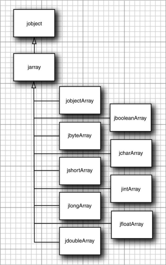

`Java` 编程语言的所有数组类型都有相对应的 `C` 语言类型。

<center>Java 数组类型和 C 数组类型之间的对应关系</center>

| Java 数组类型 | C 数组类型    | Java 数组类型 | C 数组类型   |
| ------------- | ------------- | ------------- | ------------ |
| boolean[]     | jbooleanArray | long[]        | jlongArray   |
| byte[]        | jbyteArray    | float[]       | jfloatArray  |
| char[]        | jcharArray    | double[]      | jdoubleArray |
| int[]         | jintArray     | Object[]      | jobjectArray |
| short[]       | jshortArray   |               |              |

> 注意：在 `C` 中，所有这些数组类型实际上都是 `jobject` 的同义类型。然而，在 `C++` 中它们被安排在如下图所示的继承层次结构中。`jarray` 类型表示一个通用数组。
>
> 

`GetArrayLength` 函数返回数组的长度：

```c
jarray array = ...;
jsize length = (*env)->GetArrayLength(env, array);
```

怎么访问数组元素取决于数组中存储的是对象还是基本类型的数据（如 `bool`、`char` 或数值类型）。可以通过 `GetObjectArrayElement` 和 `SetObjectArrayElement` 方法访问对象数组的元素：

```c
jobjectArray array = ...;
int i, j;
jobject x = (*env)->GetObjectArrayElement(env, array, i);
(*env)->SetObjectArrayElement(env, array, j, x);
```

这个方法虽然简单，但是效率明显低下，当你想要直接访问数组元素，特别是在进行向量或矩阵计算时更是如此。

`GetXxxArrayElements` 函数返回一个指向数组其实元素的 `C` 指针。与普通的字符串一样，当你不再需要改指针时，必须记得要调用 `ReleaseXxxArrayElements` 函数通知虚拟机。这里，类型 `Xxx` 必须是基本类型，也就是，不能是 `Object`，这样就可以直接读写数组元素了。另一方面，由于指针可能会指向一个副本，只有调用相应的 `ReleaseXxxArrayElements` 函数时，你所做的改变才能保证在源数组里得到反映。

> 注意：通过把一个指向 `jboolean` 变量的指针作为第三个参数传递给 `GetXxxArrayElements` 方法，就可以发现一个数组是否是副本了。如果是副本，则改变量被 `JNI_TRUE` 填充。如果你对这个信息不感兴趣，传一个空指针即可。

下面是对 `double` 类型数组中的所有元素乘以一个常量的示例代码：

```c
jdoubleArray array_a = ...;
double scaleFactor = ...;
double* a = (*env)->GetDoubleArrayElements(env, array_a, NULL);
for (i = 0; i < (*env)->GetArrayLength(env, array_a); i++)
{
	a[i] = a[i] * scaleFactory;    
}
(*env)->ReleaseDoubleArrayElements(env, array_a, a, 0);
```

> 注意：`Orcale` 的 `JVM` 实现中，`boolean` 数组是用打包的 32 位字数组表示的。`GetBooleanArrayElements` 方法能将它们复制到拆包的 `jboolean` 值的数组中。

如果要访问一个大数组的多个元素，可以用 `GetXxxArrayRegion` 和 `SetXxxArrayRegion` 方法，它能把一定范围内的元素从 `Java` 数组复制到 `C` 数组中或从 `C` 数组复制到 `Java` 数组中。

可以用 `NewXxxArray` 函数在本地方法中创建新的 `Java` 数组。要创建新的对象数组，需要指定长度、数组元素的类型和所有元素的初始值（典型的是 `NULL`）。下面是一个例子：

```c
jclass class_Employee = (*env)->FindClass(env, "Employee");
jobjectArray array_e = (*env)->NewObjectArray(env, 100, class_Employee, NULL);
```

基本类型的数组要简单一些。只需提供数组长度：

```c
jdoubleArray array_d = (*env)->NewDoubleArray(env, 100);
```

该数组被 0 填充。

> 注意：下面的方法用来操作 "直接缓存" ：
>
> ```c
> jobject NewDirectByteBuffer(JNIEnv* env, void* address, jlong capacity);
> void* GetDirectBufferAddress(JNIEnv* env, jobject buf);
> jlong GetDirectBufferCapacity(JNIEnv* env, jobject buf);
> ```
>
> `java.nio` 包中使用了直接缓存来支持更高效的输入输出操作，并尽可能减少本地和 `Java` 数组之间的复制操作。

