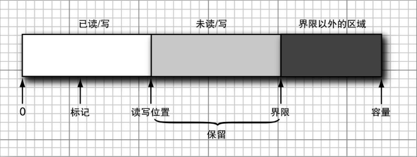

使用内存映射时，我们可以创建一个单一的缓冲区横跨整个文件或我们感兴趣的文件区域。我们还可以使用更多的缓冲区来读写大小适度的信息块。

`Buffer` 类是一个抽象类，它有众多的具体子类，包括 `ByteBuffer`、`CharBuffer`、`DoubleBuffer`、`IntBuffer`、`LongBuffer` 和 `ShortBuffer`。

在实践中，最常用的将是 `ByteBuffer` 和 `CharBuffer`。每个缓冲区都具有：

+ 一个容量，它永远不能改变。
+ 一个读写位置，下一个值将在此进行读写。
+ 一个界限，超过它进行读写是没有意义的。
+ 一个可选的标记，用于重复一个读入或写出操作。



这些值满足下面的条件：

```
0 ≤ 标记 ≤ 位置 ≤ 界限 ≤ 容量
```

使用缓冲区的主要目的是执行 "写，然后读入" 循环。假设我们有一个缓冲区，在一开始，它的位置为 0，界限等于容量。我们不断地调用 `put` 将值添加到这个缓冲区中，当我们耗尽所有的数据或者写出的数据量达到容量大小时，就该切换到读入操作了。

这时调用 `flip` 方法将界限设置到当前位置，并把位置复位到 0。现在在 `remaining` 方法返回正数时，不断地调用 `get`。在我们将缓冲区中所有的值都读入之后，调用 `clear` 使缓冲区为下一次写循环做好准备。`clear` 方法将位置复位到 0，并将界限复位到容量。

如果你想重读缓冲区，可以使用 `rewind` 或 `mark/reset` 方法。

要获取缓冲区，可以调用诸如 `ByteBuffer.allocate` 或 `ByteBuffer.wrap` 这样的静态方法：

```java
ByteBuffer buffer = ByteBuffer.allocate(RECORD_SIZE);
channel.read(buffer);
channel.position(newpos);
buffer.flip();
channel.write(buffer);
```

