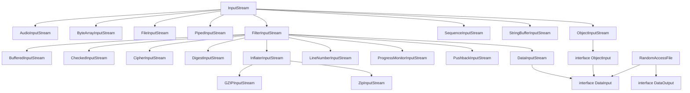
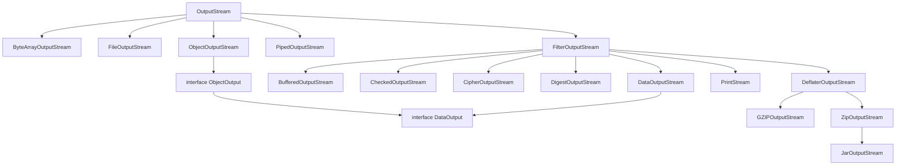
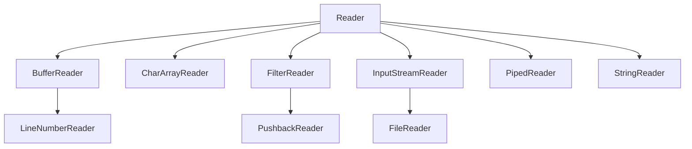
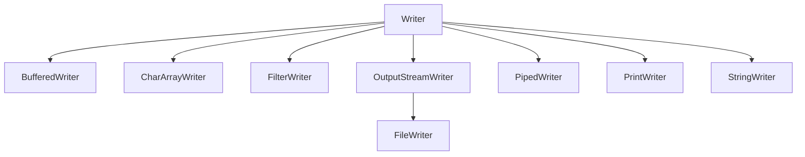

<center><b>输入流与输出流的层次结构</b></center>

`DataInputStream` 和 `DataOutputStream` 可以以二进制格式读写所有的基本 Java 类型。最后，还包含了多个很有用的输入 / 输出流，例如，`ZipInputStream` 和 `ZipOutputStream` 可以以常见的 `ZIP` 压缩格式读写文件。

另一方面，对于 Unicode 文本，可以使用抽象类 `Reader` 和 `Writer` 的子类。`Reader` 和 `Writer` 类的基本方法与 `InputStream` 和 `OutputStream` 中的方法类似。

```java
abstract int read();
abstract void write(int c);
```





<center><b>Reader 和 Writer 的层次结构</b></center>

还有 4 个附加的接口：`Closeable`、`Flushable`、`Readable` 和 `Appendable`。前两个接口非常简单，它们分别拥有下面的方法：

```java
void close() throws IOException
```

和

```java
void flush();
```

`InputStream`、`OutputStream`、`Reader` 和 `Writer` 都实现了 `Closeable` 接口。

> 提示：`java.io.Closeable` 接口扩展了 `java.lang.AutoCloseable` 接口。因此，对任何 `Closeable` 进行操作时，都可以使用 `try-with-resource` 语句。

而 `OutputStream` 和 `Writer` 还实现了 `Flushable` 接口。

`Readable` 接口只有一个方法：

```java
int read(CharBuffer cb);
```

`Appendable` 接口有两个用于添加单个字符和字符序列的方法：

```java
Appendable append(char c);
Appendable append(CharSequence s);
```

