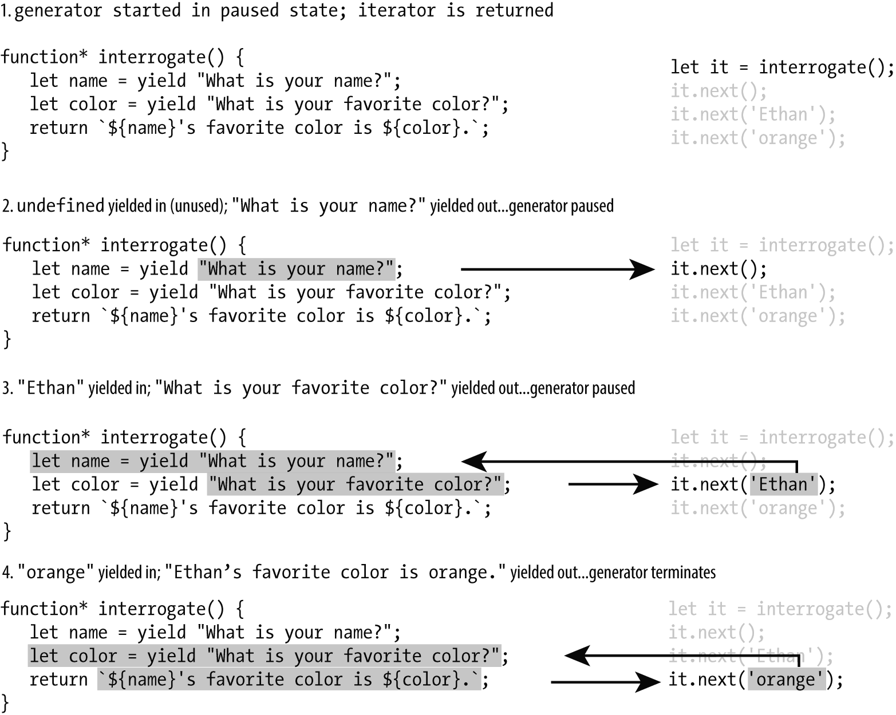

### 12.2.1　yield表达式和双向交流

之前提到过，生成器可以让它和其调用者进行双向交流。这个功能是通过 `yield` 表达式实现的。表达式可以计算出值，而 `yield` 也是一个表达式，所以它一定可以计算出一个值。它计算的是调用方每次在生成器的迭代器上调用 `next` 时提供的参数（如果有的话）。下面是一个可以进行对话的生成器：

```javascript
function* interrogate() {
   const name = yield "What is your name?";
   const color = yield "What is your favorite color?";
   return `${name}'s favorite color is ${color}.`;
} 
```

当调用这个生成器的时候，会得到一个迭代器，而此时这个生成器还没有运行过。调用next的时候，它会先运行第一行。然而由于第一行包含了一个yield表达式，生成器的控制权必须回到调用方。调用方必须在第一行被执行前调用next，此时name就会接收一个准备传给next的值。以下是生成器调用结束时的输出：

```javascript
const it = interrogate();
it.next();       // { value: "What is your name?", done: false }
it.next('Ethan');// { value: "What is your favorite color?", done:false}
it.next('orange');//{value:"Ethan's favorite color is orange.",done:true}
```

图12-1展示了在生成器运行时发生的事件顺序。


<center class="my_markdown"><b class="my_markdown">图12-1　生成器运行时的事件顺序</b></center>

这个例子演示了生成器强大的功能，它能够让函数在执行过程中被调用方控制。同时，由于调用方可以给生成器传递信息，所以生成器甚至可以根据传递来的信息来修改自身的行为。

> 
> 不能通过箭头符号来创建生成器，必须使用function*关键字。

