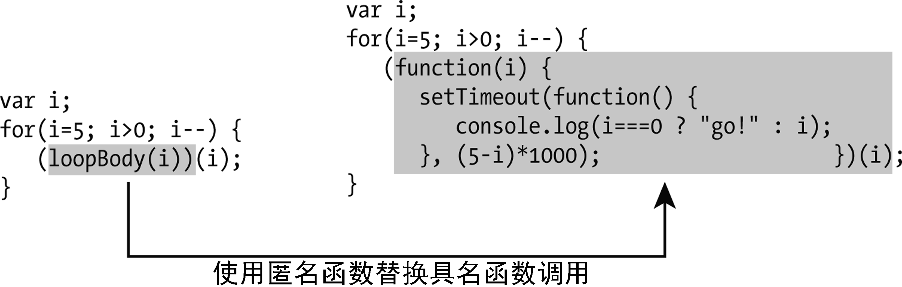

### 13.5　IIEFs和异步代码

第6章已经介绍了IIEFs（即时调用函数表达式），实际上，它们是一种创建闭包的方式。看一个重要的例子（在第14章中会再回头看这个例子），这个例子演示了IIFEs如何用异步代码提供帮助。

IIFEs的一个重要用途是在一个全新的作用域中创建新变量，从而让异步代码正确执行。这里有一个经典的计时器例子：从5秒开始倒计时，到0秒时输出“go！”。这段代码使用了内建函数 `setTimeout` ，该函数会根据第二个参数（毫秒数）设置的时间延迟执行第一个参数（一个函数）。例如，下面的代码会在1.5秒后输出hello。

```javascript
setTimeout(function() { console.log("hello"); }, 1500);
```

有了这些知识储备，就可以编写倒计时代码了：

```javascript
var i;
for(i=5; i>=0; i--) {
   setTimeout(function() {
       console.log(i===0 ? "go!" : i);
   }, (5-i)*1000);
}
```

注意，这里使用了 `var` 而不是 `let` ，此时大家必须要理解IIFEs为什么重要。如果希望这段代码打印 `5`  ,  `4`  ,  `3`  ,  `2`  ,  `1`  ,  `go!` ，结果可能会让你失望。实际上，会看到−1被打印了 `6` 次。为什么会这样呢？因为在这段代码中，传给 `setTimeout` 的函数没有在循环中被调用，它们会在未来的某个时间点被调用。所以循环会正常运行，从 `5` 开始，到 `−1` 结束……而这发生在函数被调用之前。所以，当函数被调用时， `i` 的值已经变成了 `−1` 。

即使块级别的作用域（使用 `let` 变量）能从本质上解决了这个问题，不过如果你对异步编程还比较陌生，那这个例子还是很重要的。大家可能很难一下子完全明白，但理解异步执行（第14章的主题）真的非常重要。

在块作用域变量出现前，要解决这个问题需要借助一个额外函数。使用这个额外的函数创建一个新的作用域，就可以在每一步执行中“捕获”（在闭包中）i的值。先考虑一个具名的函数：

```javascript
function loopBody(i) {
   setTimeout(function() {
      console.log(i===0 ? "go!" : i);
   }, (5-i)*1000);
}
var i;
for(i=5; i>0; i--) {
   loopBody(i);
}
```

在循环的每一步，函数 `loopBody` 都被调用了。回忆一下JavaScript中是如何给函数传参的：通过传值。每一步，传入函数的不是变量i本身，而是i的值。所以第一次传入5，第二次是4，以此类推。可以看到，这里使用了同名变量i，但这没关系，因为实际上，创建了6个不同的作用域，以及6个独立的变量（一个给外部作用域用，其他5个在调用 `loopBody` 时使用）。

为循环创建一个只会被用到一次的具名函数有点多余，可以使用IIFEs。本质上，它们创建了一个等价的匿名函数，这个函数会被立即调用。这是使用了IIFE的版本：

```javascript
var i;
for(i=5; i>0; i--) {
   (function(i) {
      setTimeout(function() {
         console.log(i===0 ? "go!" : i);
     }, (5-i)*1000);
   })(i);
} 
```

括号好多！不过，如果仔细想想，这正是我们想要实现的功能：创建一个只有一个参数的函数，然后在每一次循环中调用该函数（见图13-1）。


<center class="my_markdown"><b class="my_markdown">图13-1　即时调用函数表达式</b></center>

块作用域变量解决了这个问题，省去了用函数创建新作用域的麻烦。使用块作用域变量可以大大简化这个例子：

```javascript
for(let i=5; i>0; i--) {
   setTimeout(function() {
      console.log(i===0 ? "go!" : i);
   }, (5-i)*1000);
} 
```

注意，for循环的参数内部使用了let关键字。如果把它放到循环外部，之前的问题又会出现。这样使用let关键字，是为了告诉JavaScript，在每一次循环中，为变量i生成一个新的、独立的拷贝。所以当 `setTimeout` 中的函数在未来的某个时刻执行时，它们接收的值都是来自自身作用域中的变量。

